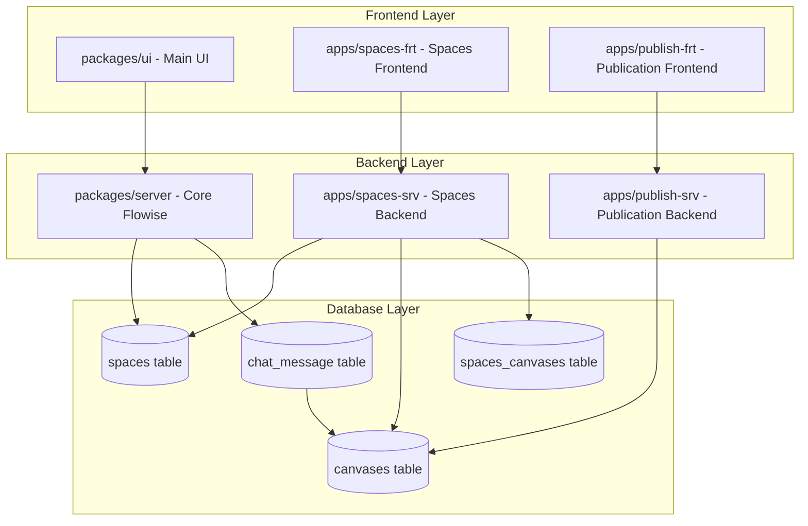
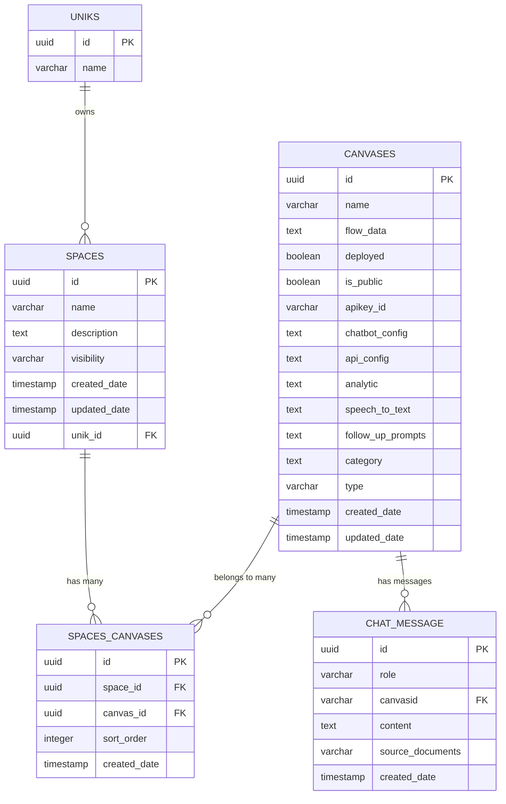

# Дизайн рефакторинга Chatflow → Spaces с множественными холстами (MVP без простоя)

## Обзор

Данный документ описывает архитектурное решение для рефакторинга функционала Chatflow в систему Spaces с поддержкой множественных холстов. Решение основано на анализе текущей архитектуры Flowise 2.2.8 и принципах изоляции приложений в монорепозитории. Особое внимание уделено безостановочной миграции данных и «мягкому» переключению серверных и клиентских компонентов без массового рефакторинга.

Ключевая цель MVP — сохранить работу всех текущих сервисов (узлы, ассистенты, публикации, векторы, апикей‑связки, загрузки и т. д.) при появлении новой модели данных Spaces/Canvases и дать безопасный путь поэтапного перехода UI и API.

ВАЖНО: Вся текстовая документация — на русском; комментарии внутри примерного кода — только на английском.

### Ключевые архитектурные принципы

1. **Минимальные изменения в core Flowise** - сохранение совместимости с будущими обновлениями
2. **Изоляция в приложениях** - новый функционал размещается в `apps/spaces-srv`
3. **Постепенная миграция** - поэтапный перенос функционала без нарушения работы системы
4. **Обратная несовместимость** - полная замена структуры БД (проект в разработке)

5. **Без простоя** — перенос осуществляется так, чтобы существующие API/роуты продолжили работать (совместимость через временный «шунт» ORM).
6. **Управляемый rollout** — вводим флаг среды `FEATURE_SPACES_MODE` с режимами `legacy|compat|strict` для контроля переключения UI/маршрутов.

## Исполнительное резюме (Executive Summary)

- Вводим новые таблицы: `spaces`, `canvases`, `spaces_canvases` и включаем RLS по best‑practice Supabase.
- Мигрируем данные из `chat_flow` так, чтобы:
  - `space.id = chat_flow.id`;
  - создаём первый `canvas` с тем же `id`, что и `chat_flow.id` (главная совместимость);
  - связываем `spaces_canvases(space_id = id, canvas_id = id, sort_order = 1)`.
- Переклеиваем ORM‑сущность `ChatFlow` (в core) на таблицу `canvases` — текущие сервисы продолжают работать «как есть» (минимум правок).
- Параллельно добавляем новый сервис `apps/spaces-srv` с API `/uniks/:unikId/spaces`, UI вкладки Canvas, редиректы `/chatflows → /spaces` (в режиме `compat`).
- После стабилизации: обновляем Swagger, переводим UI на `strict`, удаляем старую таблицу `chat_flow` (последний шаг).

## Архитектура

### Общая схема системы



### Архитектурное решение: Создание apps/spaces-srv

**Обоснование выбора:**
- Создание нового приложения `apps/spaces-srv` вместо размещения в `apps/space-builder-srv`
- Постепенный перенос функционала из `packages/server` в изолированное приложение
- Сохранение принципов модульной архитектуры проекта

**Альтернативы рассмотренные:**
1. **Размещение в `apps/space-builder-srv`** - отклонено, так как это бэкенд билдера, не подходит для общего функционала Spaces
2. **Модификация исходной миграции** - отклонено для сохранения совместимости с Flowise
3. **Создание `apps/spaces-srv`** - выбрано как оптимальное решение

**Преимущества выбранного подхода:**
- Четкое разделение ответственности
- Возможность независимого развития функционала Spaces
- Упрощение будущих обновлений Flowise
- Соответствие архитектурным принципам проекта
- Возможность постепенного переноса функционала без нарушения работы системы

## Стратегия совместимости и режимы

### Стратегия ID (рекомендуемая для MVP)

- `spaceId` := `chatflowId` (старый UUID сохраняется в качестве идентификатора Space).
- `canvasId` := `chatflowId` для первого (главного) холста «Main Canvas».
- Таблица `chat_message.chatflowid` остаётся без изменений — она уже UUID и продолжит указывать на `canvasId` (который совпадает с прежним `chatflowId`). Это устраняет необходимость массового переписывания сообщений/узлов на первом этапе.

Альтернатива (не рекомендуется для MVP): генерировать новые `canvasId` и заводить `mapping` для перепривязки — сложнее, выше риск регрессий.

### Режимы rollout через флаг `FEATURE_SPACES_MODE`

- `legacy` — система работает по старой схеме; новые таблицы могут существовать, но не используются UI/маршрутами.
- `compat` — введены новые таблицы, ORM `ChatFlow` указывает на `canvases`, новые API `/spaces` доступны; UI содержит редиректы `/chatflows → /spaces` и может использовать оба пути.
- `strict` — UI/маршрутизация полностью на `Spaces`, `chatflows` скрыт (оставляем только бэк‑совместимость на сервере до удаления `chat_flow`).

## Компоненты и интерфейсы

### 1. Структура базы данных (производственная схема Postgres/Supabase)

#### Таблица `spaces`

```sql
-- В реальной миграции используем gen_random_uuid(); timestamptz; индексы и RLS
CREATE TABLE spaces (
    id uuid PRIMARY KEY DEFAULT gen_random_uuid(),
    name varchar NOT NULL,
    description text,
    visibility varchar NOT NULL DEFAULT 'private',
    unik_id uuid NOT NULL,
    created_date timestamptz NOT NULL DEFAULT now(),
    updated_date timestamptz NOT NULL DEFAULT now()
);
CREATE INDEX IF NOT EXISTS idx_spaces_unik ON spaces(unik_id);
```

**Изменения относительно `chat_flow`:**
- Переименование таблицы `chat_flow` → `spaces`
- Удаление полей, связанных с содержимым холста (перенесены в `canvases`)
- Добавление поля `description` для описания пространства
- Добавление поля `visibility` для управления доступом

#### Таблица `canvases` (перенос содержимого ChatFlow)

```sql
CREATE TABLE canvases (
    id uuid PRIMARY KEY DEFAULT gen_random_uuid(),
    name varchar NOT NULL DEFAULT 'Canvas 1',
    "flowData" text NOT NULL,
    deployed boolean,
    "isPublic" boolean,
    apikeyid varchar,
    "chatbotConfig" text,
    "apiConfig" text,
    analytic text,
    "speechToText" text,
    "followUpPrompts" text,
    category text,
    type varchar,
    created_date timestamptz NOT NULL DEFAULT now(),
    updated_date timestamptz NOT NULL DEFAULT now()
);
CREATE INDEX IF NOT EXISTS idx_canvases_apikey ON canvases(apikeyid);
CREATE INDEX IF NOT EXISTS idx_canvases_updated ON canvases(updated_date);
```

**Поля из исходной таблицы `chat_flow`:**
- Все поля, связанные с содержимым и конфигурацией холста
- Добавлено поле `name` для названия холста

#### Таблица связей `spaces_canvases`

```sql
CREATE TABLE spaces_canvases (
    id uuid PRIMARY KEY DEFAULT gen_random_uuid(),
    space_id uuid NOT NULL REFERENCES spaces(id) ON DELETE CASCADE,
    canvas_id uuid NOT NULL REFERENCES canvases(id) ON DELETE CASCADE,
    sort_order integer NOT NULL DEFAULT 1,
    created_date timestamptz NOT NULL DEFAULT now(),
    CONSTRAINT uq_space_canvas UNIQUE(space_id, canvas_id),
    CONSTRAINT uq_space_sort UNIQUE(space_id, sort_order)
);
CREATE INDEX IF NOT EXISTS idx_sc_space ON spaces_canvases(space_id);

#### Включение RLS и базовые политики (Supabase best‑practice)

Для «мягкого» включения RLS на этапе MVP вводим простые политики чтения для аутентифицированных пользователей. Позже будут ужесточены до проверок членства в `user_uniks`.

```sql
ALTER TABLE spaces ENABLE ROW LEVEL SECURITY;
ALTER TABLE canvases ENABLE ROW LEVEL SECURITY;
ALTER TABLE spaces_canvases ENABLE ROW LEVEL SECURITY;

DROP POLICY IF EXISTS spaces_select ON spaces;
CREATE POLICY spaces_select ON spaces
  FOR SELECT TO authenticated
  USING ( true );

DROP POLICY IF EXISTS canvases_select ON canvases;
CREATE POLICY canvases_select ON canvases
  FOR SELECT TO authenticated
  USING ( true );

DROP POLICY IF EXISTS sc_select ON spaces_canvases;
CREATE POLICY sc_select ON spaces_canvases
  FOR SELECT TO authenticated
  USING ( true );
```

Строгие политики (пример чтения по членству в Unik):

```sql
DROP POLICY IF EXISTS spaces_member_read ON spaces;
CREATE POLICY spaces_member_read ON spaces
  FOR SELECT TO authenticated
  USING (
    EXISTS (
      SELECT 1 FROM user_uniks uu
      WHERE uu.unik_id = spaces.unik_id
        AND uu.user_id = (select auth.uid())
    )
  );
```
```

**Особенности:**
- Поле `sort_order` для управления порядком холстов
- Уникальные ограничения для предотвращения дублирования
- Каскадное удаление при удалении пространства или холста

### 2. Entities и миграции

#### Создание новых Entity классов (примерный код)

**apps/spaces-srv/base/src/database/entities/Space.ts**
```typescript
// Comments in English only
@Entity('spaces')
export class Space {
    @PrimaryGeneratedColumn('uuid')
    id: string

    @Column()
    name: string

    @Column({ type: 'text', nullable: true })
    description?: string

    @Column({ default: 'private' })
    visibility: string

    @CreateDateColumn()
    createdDate: Date

    @UpdateDateColumn()
    updatedDate: Date

    @ManyToOne(() => Unik, { onDelete: 'CASCADE' })
    @JoinColumn({ name: 'unik_id' })
    unik: Unik

    @OneToMany(() => SpaceCanvas, spaceCanvas => spaceCanvas.space)
    spaceCanvases: SpaceCanvas[]
}
```

**apps/spaces-srv/base/src/database/entities/Canvas.ts**
```typescript
// Comments in English only
@Entity('canvases')
export class Canvas {
    @PrimaryGeneratedColumn('uuid')
    id: string

    @Column({ default: 'Canvas 1' })
    name: string

    @Column({ type: 'text' })
    flowData: string

    @Column({ nullable: true })
    deployed?: boolean

    @Column({ nullable: true })
    isPublic?: boolean

    // ... остальные поля из ChatFlow

    @OneToMany(() => SpaceCanvas, spaceCanvas => spaceCanvas.canvas)
    spaceCanvases: SpaceCanvas[]
}
```

**apps/spaces-srv/base/src/database/entities/SpaceCanvas.ts**
```typescript
// Comments in English only
@Entity('spaces_canvases')
export class SpaceCanvas {
    @PrimaryGeneratedColumn('uuid')
    id: string

    @Column()
    sortOrder: number

    @CreateDateColumn()
    createdDate: Date

    @ManyToOne(() => Space, space => space.spaceCanvases, { onDelete: 'CASCADE' })
    @JoinColumn({ name: 'space_id' })
    space: Space

    @ManyToOne(() => Canvas, canvas => canvas.spaceCanvases, { onDelete: 'CASCADE' })
    @JoinColumn({ name: 'canvas_id' })
    canvas: Canvas
}
```

#### Миграции: структура и перенос данных (без изменения chat_message)

**apps/spaces-srv/base/src/database/migrations/postgres/1743000000000-SpacesCore.ts** — создание таблиц, индексов, включение RLS (см. выше SQL‑блок и TypeORM шаблон ниже).

**apps/spaces-srv/base/src/database/migrations/postgres/1743000000001-SpacesDataMigration.ts** — перенос данных. Важно: первый Canvas получает ТОТ ЖЕ `id`, что и ChatFlow, поэтому перепривязка `chat_message` не требуется.

```typescript
// Comments in English only
import { MigrationInterface, QueryRunner } from 'typeorm'

export class SpacesDataMigration1743000000001 implements MigrationInterface {
  public async up(queryRunner: QueryRunner): Promise<void> {
    // 1) Copy to spaces
    await queryRunner.query(`
      INSERT INTO "spaces"(id, name, description, visibility, unik_id, created_date, updated_date)
      SELECT cf.id, cf.name, NULL, 'private', cf.unik_id, cf."createdDate", cf."updatedDate"
      FROM chat_flow cf
      ON CONFLICT (id) DO NOTHING;
    `)
    // 2) Copy to canvases with the SAME id
    await queryRunner.query(`
      INSERT INTO "canvases"(id, name, "flowData", deployed, "isPublic", apikeyid, "chatbotConfig",
                              "apiConfig", analytic, "speechToText", "followUpPrompts", category, type,
                              created_date, updated_date)
      SELECT cf.id, 'Main Canvas', cf."flowData", cf."deployed", cf."isPublic", cf.apikeyid, cf."chatbotConfig",
             cf."apiConfig", cf."analytic", cf."speechToText", cf."followUpPrompts", cf."category", cf."type",
             cf."createdDate", cf."updatedDate"
      FROM chat_flow cf
      ON CONFLICT (id) DO NOTHING;
    `)
    // 3) Link space↔canvas as order 1
    await queryRunner.query(`
      INSERT INTO "spaces_canvases"(space_id, canvas_id, sort_order)
      SELECT cf.id, cf.id, 1
      FROM chat_flow cf
      ON CONFLICT (space_id, canvas_id) DO NOTHING;
    `)
  }
  public async down(): Promise<void> { /* no-op */ }
}
```

### 3. API интерфейсы (новые и совместимые)

Расположение новых маршрутов: под зонтичным префиксом `/uniks/:unikId/spaces` (согласовано с текущей архитектурой вложенных сервисов). Временная совместимость (`compat`) допустима только на время разработки; в финале спецификации все `chatflows`‑маршруты удаляются из публичного API.

#### Spaces API (apps/spaces-srv)

```typescript
// GET /api/v1/spaces
interface SpacesListResponse {
    spaces: {
        id: string
        name: string
        description?: string
        canvasCount: number
        createdDate: string
        updatedDate: string
    }[]
}

// GET /api/v1/spaces/:id
interface SpaceDetailsResponse {
    id: string
    name: string
    description?: string
    canvases: {
        id: string
        name: string
        sortOrder: number
        deployed: boolean
        isPublic: boolean
    }[]
}

Точки API (черновой перечень):
- GET `/uniks/:unikId/spaces` — список пространств (с количеством холстов)
- POST `/uniks/:unikId/spaces` — создать пространство
- GET `/uniks/:unikId/spaces/:spaceId` — детали (включая canvases в порядке sort_order)
- POST `/uniks/:unikId/spaces/:spaceId/canvases` — создать новый Canvas
- PUT `/uniks/:unikId/canvases/:canvasId` — изменить Canvas
- DELETE `/uniks/:unikId/canvases/:canvasId` — удалить Canvas и перенумеровать порядок
- PUT `/uniks/:unikId/spaces/:spaceId/canvases/reorder` — атомарная смена порядка

Финал спецификации: публичные маршруты/обработчики с префиксом `chatflows` отсутствуют; Swagger и UI не содержат упоминаний «Chatflow».

### Шаблоны (бывший Marketplace) — применение и сохранение

Требования:
- Использование существующих шаблонов после рефакторинга: применяя шаблон, создаём граф на одном из холстов внутри Space.
- Сохранение в шаблоны из активного Canvas.
- Дублирование, импорт и экспорт — уже в терминах Space/Canvas.

Предлагаемая модель:
- Таблица шаблонов и сервисы остаются, формат графа — совместим с `Canvas.flowData`.
- Применение шаблона: создаёт новый Canvas в заданном `Space` (либо новый Space + Canvas, если Space не указан).
- Сохранение шаблона: экспорт активного Canvas (name, flowData, meta) в шаблоны.

Маршруты (черновик):
- GET `/uniks/:unikId/templates` — список шаблонов.
- POST `/uniks/:unikId/templates/apply` — `{ templateId: string; spaceId?: string; name?: string }` → создаёт Canvas.
- POST `/uniks/:unikId/templates/save` — `{ canvasId: string; name: string; description?: string; tags?: string[] }` → сохраняет Canvas как шаблон.
- POST `/uniks/:unikId/templates/import` — загрузка JSON (CanvasExportV1 | SpaceExportV1).
- GET `/uniks/:unikId/templates/:templateId/export` — экспорт JSON.

Дублирование/Импорт/Экспорт:
- POST `/uniks/:unikId/spaces/:spaceId/canvases/:canvasId/duplicate` — дубликат Canvas (sort_order = max+1).
- POST `/uniks/:unikId/spaces/:spaceId/duplicate?mode=withCanvases` — дубликат Space со всеми холстами.
- GET `/uniks/:unikId/canvases/:canvasId/export` — экспорт Canvas.
- POST `/uniks/:unikId/spaces/:spaceId/import` — импорт Canvas в Space.

Форматы экспортов (минимальные):

```typescript
// Comments in English only
interface CanvasExportV1 {
  kind: 'canvas';
  version: 1;
  name: string;
  flowData: string; // raw JSON string as stored
  meta?: { category?: string; type?: string };
}

interface SpaceExportV1 {
  kind: 'space';
  version: 1;
  name: string;
  canvases: Array<{ name: string; flowData: string }>;
}
```

// POST /api/v1/spaces
interface CreateSpaceRequest {
    name: string
    description?: string
    visibility?: 'private' | 'public'
}

// GET /api/v1/spaces/:id/canvases
interface CanvasesListResponse {
    canvases: {
        id: string
        name: string
        sortOrder: number
        flowData: string
        deployed: boolean
        isPublic: boolean
    }[]
}

// POST /api/v1/spaces/:id/canvases
interface CreateCanvasRequest {
    name: string
    flowData?: string
    sortOrder?: number
}

// PUT /api/v1/canvases/:id
interface UpdateCanvasRequest {
    name?: string
    flowData?: string
    deployed?: boolean
    isPublic?: boolean
}

// PUT /api/v1/spaces/:spaceId/canvases/reorder
interface ReorderCanvasesRequest {
    canvasOrders: {
        canvasId: string
        sortOrder: number
    }[]
}
```

### 4. Адаптация системы публикации

#### Изменения в apps/publish-srv

**Новая логика публикации холстов:**

```typescript
// Вместо публикации Chatflow, теперь публикуем Canvas
interface PublicationRequest {
    canvasId: string  // Вместо chatflowId
    templateType: 'arjs' | 'playcanvas' | 'babylonjs' | 'threejs' | 'aframe'
    settings: PublicationSettings
}

interface PublicationResponse {
    publicationId: string
    canvasId: string
    publicUrl: string  // URL содержит canvas ID
    downloadUrl: string
}
```

**Обновление URL структуры:**
- Старый формат: `/published/{chatflowId}`
- Новый формат: `/published/canvas/{canvasId}`

MVP‑компат: так как `canvasId == chatflowId` для основного холста, существующие ссылки остаются валидными; новые ссылки `/published/canvas/:id` могут быть добавлены и работать параллельно.

#### Миграция существующих публикаций

```typescript
// Миграция публикаций при переходе на новую систему
async function migratePublications() {
    const publications = await getExistingPublications()
    
    for (const publication of publications) {
        // Найти первый canvas соответствующего space (бывший chatflow)
        const firstCanvas = await findFirstCanvasBySpaceId(publication.chatflowId)
        
        // Обновить публикацию для использования canvas ID
        await updatePublication(publication.id, {
            canvasId: firstCanvas.id,
            publicUrl: `/published/canvas/${firstCanvas.id}`
        })
    }
}
```

## ORM‑совместимость (критично для безостановочного перехода)

На этапе `compat` выполняется «переклейка» ORM‑сущности `ChatFlow` на таблицу `canvases`. Это означает, что весь текущий серверный код, обращающийся к `ChatFlow`, фактически работает с новой таблицей `canvases`, где содержимое полей и их имена соответствуют прежним. Благодаря стратегии ID (canvasId == chatflowId) ничего не ломается для `chat_message`, загрузчиков, векторов, ассистентов и т. д.

Пример изменения декоратора:

```typescript
// packages/server/src/database/entities/ChatFlow.ts
// BEFORE: @Entity('chat_flow')
// AFTER:  @Entity('canvases')
```

## Модели данных

### Схема связей



### Интерфейсы TypeScript

```typescript
// Основные интерфейсы
interface ISpace {
    id: string
    name: string
    description?: string
    visibility: 'private' | 'public'
    createdDate: Date
    updatedDate: Date
    unikId: string
}

interface ICanvas {
    id: string
    name: string
    flowData: string
    deployed?: boolean
    isPublic?: boolean
    apikeyId?: string
    chatbotConfig?: string
    apiConfig?: string
    analytic?: string
    speechToText?: string
    followUpPrompts?: string
    category?: string
    type?: string
    createdDate: Date
    updatedDate: Date
}

interface ISpaceCanvas {
    id: string
    spaceId: string
    canvasId: string
    sortOrder: number
    createdDate: Date
}

// Расширенные интерфейсы для API
interface ISpaceWithCanvases extends ISpace {
    canvases: (ICanvas & { sortOrder: number })[]
}

interface ICanvasWithSpace extends ICanvas {
    space: ISpace
    sortOrder: number
}
```

## Обработка ошибок

### Стратегии обработки ошибок

1. **Валидация данных**
   - Проверка существования Space перед созданием Canvas
   - Валидация уникальности sortOrder в рамках Space
   - Проверка прав доступа пользователя к Space

2. **Обработка конфликтов сортировки**
   - Автоматическое перенумерование при удалении Canvas
   - Обработка дублирующихся sortOrder
   - Транзакционное обновление порядка

3. **Миграционные ошибки**
   - Откат изменений при неудачной миграции
   - Логирование проблемных записей
   - Возможность повторного запуска миграции

### Коды ошибок

```typescript
enum SpacesErrorCodes {
    SPACE_NOT_FOUND = 'SPACE_001',
    CANVAS_NOT_FOUND = 'CANVAS_002',
    INVALID_SORT_ORDER = 'CANVAS_003',
    DUPLICATE_CANVAS_NAME = 'CANVAS_004',
    INSUFFICIENT_PERMISSIONS = 'SPACE_005',
    MIGRATION_FAILED = 'MIGRATION_001'
}
```

## Пользовательский интерфейс

### Интерфейс управления холстами

#### Компонент вкладок (Tabs Component)

```typescript
interface CanvasTab {
    id: string
    name: string
    sortOrder: number
    isActive: boolean
    isDirty: boolean
}

interface CanvasTabsProps {
    canvases: CanvasTab[]
    onTabSelect: (canvasId: string) => void
    onTabCreate: () => void
    onTabRename: (canvasId: string, newName: string) => void
    onTabDelete: (canvasId: string) => void
    onTabReorder: (canvasId: string, newOrder: number) => void
}
```

#### Функционал вкладок

1. **Добавление холста**
   - Кнопка "+" рядом с вкладками
   - Создание холста с названием по умолчанию "Canvas N"
   - Автоматическое переключение на новый холст

2. **Редактирование названия**
   - Двойной клик на название вкладки
   - Inline редактирование с валидацией
   - Сохранение по Enter или потере фокуса

3. **Контекстное меню**
   - Правый клик на вкладку
   - Опции: Переименовать, Дублировать, Удалить
   - Подтверждение удаления

4. **Перетаскивание**
   - Drag & Drop для изменения порядка
   - Визуальная индикация места вставки
   - Автоматическое обновление sortOrder

### URL структура и роутинг

#### Новые URL паттерны

```typescript
// Старые URL (будут перенаправлены)
/chatflow/:id -> /space/:id
/chatflows -> /spaces

// Новые URL
/spaces -> список пространств
/space/:spaceId -> пространство с первым холстом
/space/:spaceId/canvas/:canvasId -> конкретный холст в пространстве

// Публичные URL
/published/chatflow/:id -> /published/canvas/:canvasId (redirect)
/published/canvas/:canvasId -> опубликованный холст
```

#### Обновление роутинга

```typescript
// packages/ui/src/routes/index.tsx
const routes = [
    // Редиректы для совместимости
    { path: '/chatflow/:id', redirect: '/space/:id' },
    { path: '/chatflows', redirect: '/spaces' },
    
    // Новые роуты
    { path: '/spaces', component: SpacesList },
    { path: '/space/:spaceId', component: SpaceEditor },
    { path: '/space/:spaceId/canvas/:canvasId', component: SpaceEditor }
]
```

### Языковые изменения (i18n)

#### Обновление переводов

```json
// packages/ui/src/i18n/en.json
{
    "spaces": "Spaces",
    "space": "Space",
    "canvas": "Canvas",
    "canvases": "Canvases",
    "createSpace": "Create Space",
    "createCanvas": "Create Canvas",
    "spaceSettings": "Space Settings",
    "canvasSettings": "Canvas Settings"
}

// packages/ui/src/i18n/ru.json
{
    "spaces": "Пространства",
    "space": "Пространство", 
    "canvas": "Холст",
    "canvases": "Холсты",
    "createSpace": "Создать пространство",
    "createCanvas": "Создать холст",
    "spaceSettings": "Настройки пространства",
    "canvasSettings": "Настройки холста"
}
```

#### Обновление компонентов

```typescript
// Замена в компонентах UI
// Старое: t('chatflows') -> Новое: t('spaces')
// Старое: t('chatflow') -> Новое: t('space')

// Обновление меню навигации
const navigationItems = [
    { key: 'spaces', label: t('spaces'), icon: 'spaces' },
    // вместо { key: 'chatflows', label: t('chatflows'), icon: 'chat' }
]
```

### Совместимость с существующим функционалом

#### Адаптация Агентов и Ассистентов

```typescript
// Обновление интерфейсов для работы с Canvas вместо ChatFlow
interface Agent {
    id: string
    name: string
    canvasId: string  // вместо chatflowId
    // ... остальные поля
}

interface Assistant {
    id: string
    name: string
    canvasId: string  // вместо chatflowId
    // ... остальные поля
}
```

#### Миграция настроек и конфигураций

```typescript
// Обновление всех ссылок на chatflowId в конфигурациях
interface ChatbotConfig {
    canvasId: string  // вместо chatflowId
    // ... остальные настройки
}

// Функция миграции настроек
async function migrateConfigurations() {
    // Обновление всех конфигураций для использования canvasId
    const configs = await getAllConfigurations()
    
    for (const config of configs) {
        if (config.chatflowId) {
            const canvas = await findCanvasByOldChatflowId(config.chatflowId)
            config.canvasId = canvas.id
            delete config.chatflowId
            await updateConfiguration(config)
        }
    }
}
```

## Стратегия тестирования

### Unit тесты

1. **Entity тесты**
   - Валидация полей Space, Canvas, SpaceCanvas
   - Тестирование связей между entities
   - Проверка каскадного удаления

2. **Service тесты**
   - CRUD операции для Spaces и Canvases
   - Логика сортировки и перенумерации
   - Валидация бизнес-правил

3. **API тесты**
   - Тестирование всех endpoints
   - Проверка авторизации и прав доступа
   - Валидация входных и выходных данных

### Integration тесты

1. **Миграционные тесты**
   - Тестирование миграции данных из chat_flow
   - Проверка целостности данных после миграции
   - Тестирование отката миграции

2. **Публикационные тесты**
   - Тестирование публикации Canvas
   - Проверка генерации корректных URL
   - Тестирование миграции существующих публикаций

### E2E тесты

1. **Пользовательские сценарии**
   - Создание Space с несколькими Canvas
   - Изменение порядка Canvas
   - Публикация отдельных Canvas

2. **Совместимость**
   - Работа с существующими Агентами и Ассистентами
   - Функционирование chat_message с новой структурой
   - Корректная работа всех зависимых систем

## MVP План реализации

### Фаза 1: Подготовка инфраструктуры (Неделя 1)

**Цель:** Создание базовой структуры без нарушения существующего функционала

**Задачи (обновлено):**
1. Создание приложения `apps/spaces-srv`
2. Создание Entity классов (Space, Canvas, SpaceCanvas)
3. Регистрация entities в центральном реестре
4. Создание базовых API endpoints для Spaces и Canvas
5. Настройка миграций и их регистрация
6. Ввод флага `FEATURE_SPACES_MODE` (env) и режимов `legacy|compat|strict`

**Критерии готовности:**
- Приложение `apps/spaces-srv` создано и собирается
- Новые таблицы создаются в БД
- Базовые CRUD операции работают через API

### Фаза 2: Создание новой структуры БД (Неделя 2)

**Цель:** Создание чистой структуры БД без миграции старых данных

**Задачи:**
1. Создание новых таблиц `spaces`, `canvases`, `spaces_canvases` с нуля
2. Настройка RLS политик для новых таблиц
3. Удаление старой таблицы `chat_flow` (данные не нужны)
4. Создание тестовых данных для разработки
5. Подготовка строгих RLS‑политик с самого начала

**Критерии готовности:**
- Новые таблицы созданы и работают корректно
- RLS политики настроены и протестированы
- Старая таблица `chat_flow` удалена
- Тестовые данные созданы для разработки

### Фаза 3: Адаптация зависимых систем (Неделя 3)

**Цель:** Обеспечение работы Агентов, Ассистентов и публикации с новой структурой

**Задачи (обновлено):**
1. Агенты/Ассистенты/Векторные сервисы продолжают работать через `ChatFlow` (переклеенный на `canvases`)
2. Публикации — сохранить совместимость; добавить новый публичный маршрут `canvas`
3. Обновить документацию для разработчиков: как временно прокидывать `options.chatflowid = canvasId`

**Критерии готовности:**
- Агенты и Ассистенты работают с Canvas
- Публикация Canvas функционирует корректно
- Все существующие публикации мигрированы

### Фаза 4: Пользовательский интерфейс (Неделя 4)

**Цель:** Обновление UI для работы с Spaces и множественными Canvas

**Задачи (обновлено):**
1. Обновление роутинга и URL структуры
2. Реализация компонента вкладок для Canvas
3. Обновление переводов (en/ru)
4. Обновление меню навигации
5. Создание редиректов для старых URL
6. Включить `FEATURE_SPACES_MODE=compat` в dev

**Критерии готовности:**
- Пользователи видят "Spaces" вместо "Chatflows"
- Функционал вкладок работает корректно
- Все переводы обновлены
- Старые URL корректно перенаправляются

### Фаза 5: Множественные Canvas (Неделя 5)

**Цель:** Реализация полного функционала множественных холстов

**Задачи:**
1. Реализация создания/удаления Canvas в Space
2. Функционал перетаскивания и сортировки Canvas
3. Независимое сохранение состояния каждого Canvas
4. Публикация отдельных Canvas
5. Тестирование всего функционала

**Критерии готовности:**
- Пользователи могут создавать несколько Canvas в Space
- Порядок Canvas сохраняется и изменяется
- Каждый Canvas публикуется независимо
- Все функции работают стабильно

### Критические точки и риски

**Риск 1: Потеря данных при миграции**
- Митигация: Полное резервное копирование перед миграцией
- Тестирование на копии продакшн данных
- Возможность отката

**Риск 2: Нарушение работы зависимых систем**
- Митигация: Поэтапное обновление с тестированием каждого компонента
- Сохранение обратной совместимости на уровне API

**Риск 3: Проблемы производительности**
- Митигация: Оптимизация запросов к новым таблицам
- Индексирование критических полей
- Мониторинг производительности

### Метрики успеха MVP

1. **Функциональные метрики:**
   - 100% существующих Chatflow мигрированы в Spaces
   - 0 потерянных данных при миграции
   - Все зависимые системы работают корректно

2. **Пользовательские метрики:**
   - Пользователи могут создавать и управлять Spaces
   - Функционал множественных Canvas доступен
   - Время отклика интерфейса не увеличилось

3. **Технические метрики:**
   - Покрытие тестами > 80%
   - Время выполнения миграции < 30 минут
   - Отсутствие критических ошибок в продакшене
### Метрики качества и проверки (финальные)

- Новая база создана полностью из миграций; в схеме отсутствует таблица `chat_flow`.
- Все публичные API и UI используют термины Spaces/Canvases; префикса `/chatflows` нет в Swagger/UI.
- Валидация RLS: доступ к Space/Canvas ограничен членством в `user_uniks`.
- Шаблоны: применение создаёт Canvas в Space; сохранение из Canvas в шаблоны работает.
- Импорт/экспорт и дублирование: корректно создают ресурсы и сохраняют порядок холстов.

### План отката (на время работ)

- При необходимости вернуться к режиму разработки с временной совместимостью (локально).
- В финальной сборке откат не предполагается, так как база создаётся «с нуля» в новом формате.

### Вопросы/допущения

- В dev используется проект Supabase «UP-test».
- Сервер использует сервисную роль (bypass RLS); RLS включаем для единообразия и будущего REST.
- Массовая замена i18n‑ключей в UI проводится постепенно; на этапе `compat` — алиасы и редиректы.
