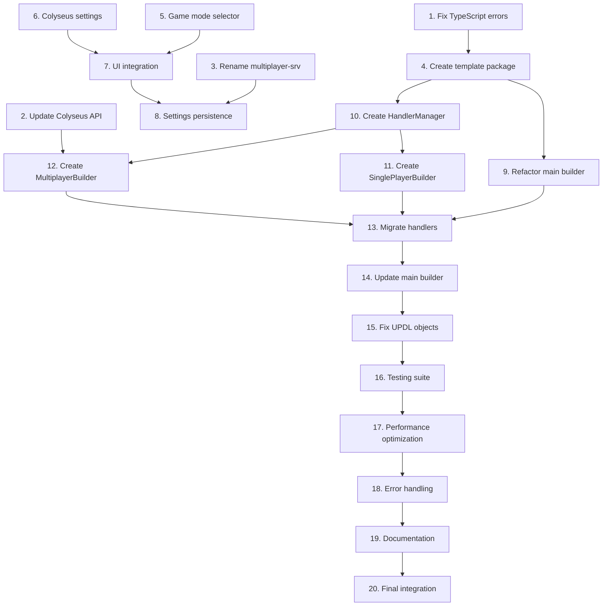

# Implementation Plan

## Overview

Данный план задач описывает пошаговую реализацию завершения рефакторинга MMOOMM шаблона. План разделен на 4 фазы с конкретными задачами, критериями готовности и зависимостями между задачами.

ВНИМАНИЕ!!! При выполнении Tasks общайся с пользователем на русском языке.

## Task List

### Phase 1: Critical Fixes and Infrastructure (Week 1)

-   [x] 1. Fix TypeScript build errors

    -   Fix import resolution for `@universo/template-mmoomm` in current builder files
    -   Update method signatures to match `AbstractTemplateBuilder` interface
    -   Remove versioning from builder names (no "V2" suffixes)
    -   Ensure workspace dependencies are correctly configured
    -   _Requirements: 1.1, 1.2, 1.3_

-   [x] 2. Update Colyseus API to 0.16.x compatibility

    -   Replace deprecated `Colyseus.getStateCallbacks(room)` with `room.state.players.onAdd/onChange/onRemove`
    -   Add UMD script `colyseus.js@0.16.4` to HTML generation
    -   Fix dynamic WebSocket URL resolution based on environment variables
    -   Implement proper error handling for connection failures
    -   _Requirements: 2.1, 2.2, 2.3, 2.4, 2.5_

-   [x] 3. Rename multiplayer server package

    -   Rename `packages/multiplayer-srv` to `packages/multiplayer-colyseus-srv`
    -   Update all import references and dependencies
    -   Update package.json name to `@universo/multiplayer-colyseus-srv`
    -   Update documentation and README files
    -   _Requirements: Architecture Decision 2_

-   [x] 4. Create basic template-mmoomm package structure
    -   Create `packages/template-mmoomm/base/src/playcanvas/` directory structure
    -   Set up package.json with dual build (CommonJS + ESM)
    -   Create basic index.ts exports for PlayCanvas functionality
    -   Configure TypeScript compilation and build scripts
    -   _Requirements: 3.1, 3.4, 3.5_

### Phase 2: UI Integration and Mode Selection (Week 2)

-   [x] 5. Create game mode selector components

    -   Create `GameModeSelector.jsx` component (JSX for Flowise compatibility)
    -   Implement radio button interface: "Single Player" / "Multiplayer (Colyseus)"
    -   Add proper styling and Material-UI integration
    -   Create TypeScript interfaces for component props
    -   _Requirements: 5.1, 5.2, 10.1, 10.2_

-   [x] 6. Create Colyseus settings panel

    -   Create `ColyseusSettings.jsx` component with server configuration fields
    -   Add input fields for host, port, and room name
    -   Implement conditional visibility based on selected game mode
    -   Add validation for server URL format and port ranges
    -   _Requirements: 5.4, 10.3, 10.6_

-   [x] 7. Integrate UI components into PlayCanvas publication interface

    -   Locate and modify PlayCanvas publication settings component
    -   Add game mode selector to publication interface
    -   Integrate Colyseus settings panel with conditional display
    -   Ensure proper state management and data flow
    -   _Requirements: 10.1, 10.2, 10.3_

-   [x] 8. Implement settings persistence
    -   Extend BuildOptions interface to include gameMode and multiplayer settings
    -   Save selected mode and Colyseus settings to publication configuration
    -   Load saved settings when reopening publication interface
    -   Use default values from `packages/flowise-server/.env` when settings not configured
    -   _Requirements: 5.5, 5.6, 10.4, 10.5_

### Phase 3: Architecture Refactoring and Code Migration (Week 3)

-   [x] 9. Refactor monolithic PlayCanvasMMOOMMBuilder

    -   Analyze current 1357-line file and identify extraction candidates
    -   Rename/consolidate builder files to remove "V2" versioning (PlayCanvasMMOOMMBuilderV2.ts → PlayCanvasMMOOMMBuilder.ts)
    -   Create lightweight coordinator class (target: <300 lines)
    -   Extract mode detection logic into separate utility
    -   Implement builder delegation pattern for SP/MP modes
    -   _Requirements: 3.1, 3.2, 3.6_

-   [x] 10. Create HandlerManager for UPDL reuse

    -   Design `IHandlerManager` interface with `processForSinglePlayer` and `processForMultiplayer` methods
    -   Implement `HandlerManager` class that wraps existing UPDL handlers
    -   Create adapter methods for network-specific processing in multiplayer mode
    -   Ensure consistent data processing between SP and MP modes
    -   _Requirements: 4.1, 4.2, 4.3, 4.4, 4.5_

-   [x] 11. Create SinglePlayerBuilder

    -   Extract single-player specific logic from monolithic builder
    -   Implement standard PlayCanvas scene generation
    -   Integrate with HandlerManager for UPDL processing
    -   Ensure backward compatibility with existing functionality
    -   _Requirements: 4.1, 8.1, 8.4_

-   [x] 12. Create MultiplayerBuilder

    -   Extract multiplayer specific logic from monolithic builder
    -   Implement auth screen generation using quiz template pattern
    -   Create Colyseus client integration with proper 0.16.x API usage
    -   Integrate with HandlerManager for UPDL processing with network adaptation
    -   _Requirements: 4.2, 6.2, 6.3, 7.1, 7.2_

-   [x] 13. Migrate all MMOOMM handlers to template package

    -   Copy existing handlers from `publish-frt/templates/mmoomm/playcanvas/handlers/` to template package
    -   Update import paths and dependencies
    -   Ensure all handlers work with new HandlerManager architecture
    -   Remove duplicated handlers from publish-frt after successful migration
    -   Delete `packages/publish-frt/base/src/builders/templates/mmoomm/playcanvas/PlayCanvasMMOOMMBuilderLegacy.ts`, making sure that this file is not used anywhere. Check that it does not contain the required functionality.
    -   _Requirements: 3.3, 8.2_

-   [x] 14. Update main builder to use template package

    -   Consolidate builder files (remove V2 versioning) and modify to delegate to template package
    -   Implement mode detection based on BuildOptions.gameMode
    -   Add proper error handling and fallback mechanisms
    -   Ensure clean separation between coordinator and implementation
    -   _Requirements: 3.2, 3.3, 8.1_

### Phase 4: Testing, Polish, and Documentation (Week 4)

-   [x] 15. Fix UPDL object transmission in multiplayer mode
 
    -   Fix `UPDLProcessor.analyzeSpaceChain` to include entities in spaceData for multi-scene flows
    -   Correct entity data extraction from `entity.data.inputs` instead of `entity.data`
    -   Enhance server-side entity processing with validation and logging
    -   Test complete UPDL Flow → Multiplayer → Objects cycle
    -   _Requirements: 7.1, 7.2, 7.3, 7.4, 7.5_

-   [x] 16. Additional improvements and fixes to the `packages/template-mmoomm` package and its use in singleplayer mode

    - Нужно создать файлы интернационализации в `packages/template-mmoomm` по аналогии с тем, как это сделано в `packages/publish-frt`, для того, чтобы в `packages/template-mmoomm/base/src/playcanvas/config.ts` и возможно в других местах использовать многоязычную поддержку текстов. Можно для примера посмотреть на старый файл `packages/publish-frt/base/src/builders/templates/mmoomm/playcanvas/config.ts`в нём `name:` и `description:` используют языковые ключи, а не хардкоде текст.

    - Исправить, сейчас после рефакторинга, когда пользователь заходит в настройки публикации технологии PlayCanvas, то в поле `Шаблон экспорта` по умолчанию пустой вариант и потом можно выбрать единственный вариант шаблона MMOOMM, это не имеет смысла, так как выбор шаблона экспорта обязательное действие и там должен быть какой-то вариант. До рефакторинга это работало правильно, не было пустого выбора, раз сейчас есть только вариант шаблона MMOOMM он и показывался по умолчанию. Проверь как это раньше было реализовано в `packages/publish-frt` до переноса в отдельный пакет шаблона экспорта MMOOMM.

    - Исправить, в файле `packages/template-mmoomm/base/src/playcanvas/config.ts` указано `version: '0.1.0'`, но пользователь заходит в настройки публикации технологии PlayCanvas, и в поле `Шаблон экспорта` после названия видит версию `1.0.0`.

    - Исправить, полностью сломан функционал одиночного режима. Пользователь в Chatflow http://localhost:3000/uniks/bb0967eb-6924-40aa-b844-1f669b8579f0/chatflows/31dd27c9-8a40-4d68-a20a-e79cceefb164 использует стандартный для нашего теста Flow, вот его сохранённый вариант .cursor/Universo-MMOOMM-Chatflow.json

    Пользователь пользователь заходит в настройки публикации технологии PlayCanvas, выбирает там "Одиночный режим", публикует проект http://localhost:3000/p/31dd27c9-8a40-4d68-a20a-e79cceefb164

    При переходе по ссылке опубликованного проекта, пользователь видит только один белый бокс по центру экрана (возможно корабль игрока), не видит других объектов и не работает управление кораблём.

    Можно предположить, что полностью сломан функционал обработчиков при переносе функционала шаблона экспорта в отдельное приложение. Нужно провести подробную сверку с резервной копией файлов шаблона экспорта .cursor/publish-frt. Нужно проверить, все ли файлы перенесены из шаблона экспорта MMOOMM .cursor/publish-frt/base/src/builders/templates/mmoomm, сделать точную построчную сверку, сделать сверку по функциям. При необходимости, можно новые созданные файлы в `packages/template-mmoomm` удалить и перекопировать файлы из резервной копии, чтобы точно перенести рабочий функционал, и доработать их, чтобы они работали в новом приложении.
    _Requirements: 5.1, 5.2, 5.3

-   [x] 17. Create a spaceship control in multiplayer mode

    - Доработать функционал управления в многопользовательском режиме MMOOMM, используя наработки по реализации управлению в однопользовательском режиме, на данный момент пользователь после подключения в многопользовательском режиме, не может управлять кораблём, но в однопользовательском режиме всё работает правильно.
    - Подробно изучить текущую ситуацию на основе этого проведи дополнительный анализ базы кода, при подтверждении осуществить необходимый рефакторинг, чтобы был одинаковый функционал управления кораблём как в однопользовательской, так и во многопользовательском режиме, по возможности переиспользуя код, при этом при необходимости улучшить архитектуру и модульность кода, не сломав ранее реализованный однопользовательский функционал.
    _Requirements: 6.2, 6.3, 6.4, 6.5

-   [x] 18. Error connecting to Colyseus

    - Исправить, теперь после доработки функционала управления кораблём, теперь при попытке войти в игру, выдаётся ошибка в консоле браузера, ранее такой ошибки не было, пользователь подключался к Colyseus, но не мог управлять кораблём:

    ```
    VM39132 about:srcdoc:8520 [Multiplayer] Connection error: ReferenceError: Colyseus is not defined
        at connectToMultiplayerServer (VM39132 about:srcdoc:8489:17)
        at HTMLButtonElement.<anonymous> (VM39131 about:srcdoc:18:13)
    ```

    При этом, при нажатии на кнопки управления на заднем плане, за окном входа, происходит управление космическим кораблём, это выглядит странно, ведь пользователь ещё не подключился к игре.

    _Requirements: 6.2, 6.3, 6.4, 6.5

-   [ ] 19. Comprehensive testing suite

    -   Create unit tests for HandlerManager UPDL processing consistency
    -   Create integration tests for SP/MP mode switching
    -   Create browser tests for Colyseus client functionality
    -   Test backward compatibility with existing flows
    -   _Requirements: 8.1, 8.2, 8.3, 8.4_

-   [ ] 20. Performance optimization and validation

    -   Ensure single-player mode doesn't load multiplayer scripts
    -   Optimize HTML generation size for both modes
    -   Validate build times don't significantly increase
    -   Test memory usage and cleanup in repeated builds
    -   _Requirements: 11.1, 11.2, 11.3, 11.4_

-   [ ] 21. Error handling and fallback mechanisms

    -   Implement graceful degradation for Colyseus connection failures
    -   Add fallback to default objects when UPDL entities are missing
    -   Create error scenes for template generation failures
    -   Add comprehensive error messages with recovery instructions
    -   _Requirements: 2.5, 7.5, 8.5_

-   [ ] 22. Documentation and migration guide

    -   Create README for `@universo/template-mmoomm` package with API documentation
    -   Update publish-frt documentation to reflect new architecture
    -   Create migration guide for developers working with MMOOMM templates
    -   Add troubleshooting section for common issues
    -   _Requirements: 9.1, 9.2, 9.3, 9.4, 9.5_

-   [ ] 23. Final integration testing and deployment preparation
    -   Perform full monorepo build (`pnpm build` in root) to verify all changes
    -   Test complete user workflow: UI selection → publication → game functionality
    -   Verify both single-player and multiplayer modes work correctly
    -   Test with various UPDL flow configurations
    -   Prepare rollback plan in case of critical issues
    -   _Requirements: All requirements validation_

## Task Dependencies



## Success Criteria

### Phase 1 Success Criteria

-   [ ] Project builds successfully with `pnpm build`
-   [ ] No TypeScript compilation errors
-   [ ] Colyseus client connects without JavaScript errors
-   [ ] Template package structure is created and builds correctly

### Phase 2 Success Criteria

-   [ ] Game mode selector appears in PlayCanvas publication interface
-   [ ] Colyseus settings panel shows/hides based on selected mode
-   [ ] Settings are saved and restored correctly
-   [ ] UI components integrate seamlessly with existing Flowise interface

### Phase 3 Success Criteria

-   [ ] PlayCanvasMMOOMMBuilder reduced to <300 lines
-   [ ] All V2 versioning removed from file names (no PlayCanvasMMOOMMBuilderV2.ts)
-   [ ] UPDL handlers work consistently in both SP and MP modes
-   [ ] All MMOOMM functionality moved to template package
-   [ ] Backward compatibility maintained for existing flows

### Phase 4 Success Criteria

-   [ ] All tests pass (unit, integration, browser)
-   [ ] UPDL objects appear correctly in multiplayer games
-   [ ] Performance meets or exceeds current benchmarks
-   [ ] Comprehensive documentation available
-   [ ] Full user workflow tested and validated

## Risk Mitigation

### High-Risk Tasks

1. **Task 9-14 (Architecture Refactoring)**: Risk of breaking existing functionality

    - Mitigation: Incremental changes with testing after each step
    - Rollback plan: Keep original files until full validation
    - Note: Consolidation of V2 files should be done carefully to preserve functionality

2. **Task 15 (UPDL Object Transmission)**: Risk of multiplayer game world being empty

    - Mitigation: Extensive logging and validation at each step
    - Fallback: Default objects when UPDL data is missing

3. **Task 7-8 (UI Integration)**: Risk of breaking existing publication interface
    - Mitigation: Create components in isolation first, then integrate
    - Testing: Verify all existing publication flows still work

### Dependencies and Blockers

-   **External Dependency**: Colyseus server must be running for multiplayer testing
-   **Build System**: Full monorepo rebuild required for testing integration
-   **Compatibility**: JSX/TSX compatibility must be maintained throughout

## Quality Gates

### Code Quality

-   All TypeScript code must compile without errors
-   ESLint rules must pass for all new code
-   No console.error messages in production builds
-   Memory leaks must be prevented in repeated builds

### Functional Quality

-   Single-player mode must work exactly as before
-   Multiplayer mode must connect and sync properly
-   UPDL objects must appear in generated games
-   UI must be responsive and accessible

### Performance Quality

-   Build time increase must be <20% of current baseline
-   Generated HTML size must be reasonable for both modes
-   Browser loading time must not significantly increase
-   Memory usage must be stable across multiple builds

This implementation plan provides a structured approach to completing the MMOOMM template refactoring while minimizing risks and ensuring quality throughout the process.
