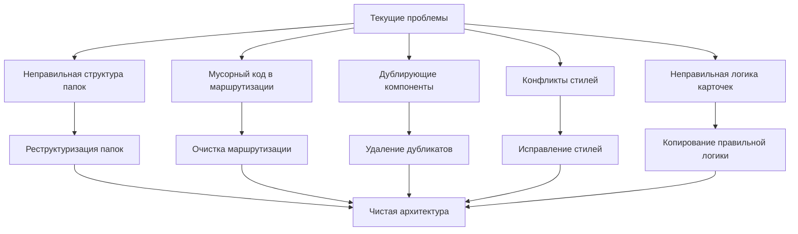

# Документ дизайна

## Обзор

Данный документ описывает техническую архитектуру рефакторинга UI системы Universo Platformo React. Решение направлено на исправление архитектурных проблем, возникших при первоначальной реализации модернизации UI, и правильную реализацию компонентов карточек и списков на основе работающего MUI Dashboard шаблона.

**КЛЮЧЕВОЙ ПРИНЦИП**: Мы НЕ переписываем код с нуля. Мы копируем существующие работающие компоненты из dashboard шаблона и осторожно адаптируем их для нашего функционала, сохраняя оригинальную логику и поведение.

## Архитектура

### Стратегия копирования и адаптации компонентов

**КРИТИЧЕСКИ ВАЖНО**: Мы НЕ создаем компоненты с нуля. Мы копируем работающие компоненты из dashboard шаблона и осторожно их адаптируем.

#### Процесс копирования компонентов:

1. **Идентификация исходного компонента**:
   - `StatCard.tsx` - для компонентов карточек
   - Компоненты таблиц/списков из dashboard - для списков
   - Компоненты с кнопками - для InfoCard

2. **Копирование без изменений**:
   ```bash
   # Пример копирования StatCard.tsx
   cp packages/universo-template-mui/base/src/components/dashboard/StatCard.tsx \
      packages/universo-template-mui/base/src/components/cards/EntityCard.tsx
   ```

3. **Поэтапная адаптация**:
   - Шаг 1: Скопировать файл полностью
   - Шаг 2: Проверить, что копия работает с демо-данными
   - Шаг 3: Осторожно удалить демо-данные графиков
   - Шаг 4: Добавить отображение названия и описания сущности
   - Шаг 5: Тестировать на каждом шаге

4. **Сохранение оригинальной логики**:
   - Responsive поведение ДОЛЖНО остаться точно таким же
   - CSS Grid логика ДОЛЖНА быть сохранена
   - Breakpoints ДОЛЖНЫ остаться неизменными
   - Анимации и переходы ДОЛЖНЫ быть сохранены

#### Что НЕ ДЕЛАТЬ:
- ❌ Переписывать компоненты с нуля
- ❌ Изменять responsive логику
- ❌ Удалять оригинальные файлы до полного тестирования новых
- ❌ Менять структуру CSS Grid или breakpoints

#### Что ДЕЛАТЬ:
- ✅ Копировать существующие работающие компоненты
- ✅ Сохранять оригинальные работающие версии до завершения тестирования
- ✅ Вносить изменения инкрементально
- ✅ Тестировать каждый шаг адаптации

### Текущие проблемы и их решения

#### Конкретные проблемы для исправления:

1. **Проблема с маршрутизацией**:
   - ❌ В `packages/flowise-core-frontend/base/src/routes/index.jsx` создано много мусорного/лишнего кода
   - ✅ **Решение**: Удалить весь мусорный код и сделать простое подключение новой структуры

2. **Проблема с интеграцией**:
   - ❌ `MainRoutesMUI.tsx` и `MainLayoutMUI.tsx` подключены неправильно
   - ✅ **Решение**: Правильное подключение в `packages/flowise-core-frontend/base/src/App.jsx` или нормально в `packages/flowise-core-frontend/base/src/routes/index.jsx`

3. **Проблема с дублирующими компонентами**:
   - ❌ Промежуточные итерации в `packages/flowise-core-frontend/base/src/ui-components` (доработанные для нового дизайна)
   - ❌ Тестовые компоненты в `packages/universo-template-mui/base/src/components/universal`
   - ❌ Неправильный `packages/universo-template-mui/base/src/components/EntityCard.tsx`
   - ✅ **Решение**: Удалить все после создания правильных версий на основе копирования

4. **Проблема с логикой карточек**:
   - ❌ Текущий список Уников использует сетку из 3 карточек (как в Flowise)
   - ❌ Не соответствует логике Униборда (4 карточки → 2 карточки)
   - ✅ **Решение**: Скопировать точную логику из Dashboard.tsx Униборда

5. **Проблема с мобильным отображением**:
   - ❌ В Униборде пропал верхний отступ
   - ❌ Старые компоненты проваливаются под верхний бар
   - ❌ Лишние боковые отступы от старого UI
   - ✅ **Решение**: Следовать стилям нового MUI шаблона, отключить глобальные стили старого UI



### Новая структура папок

```
packages/universo-template-mui/base/src/
├── components/
│   ├── dashboard/              # Перемещено из views/dashboard/components/
│   │   ├── StatCard.tsx        # Базовый компонент карточек
│   │   ├── DataGrid.tsx        # Базовый компонент списков
│   │   └── ...                 # Другие dashboard компоненты
│   ├── cards/                  # Новые компоненты карточек
│   │   ├── EntityCard.tsx      # Универсальная карточка сущности
│   │   ├── InfoCard.tsx        # Карточка с информацией о документации
│   │   └── CardGrid.tsx        # Сетка карточек с responsive поведением
│   ├── lists/                  # Новые компоненты списков
│   │   ├── EntityList.tsx      # Универсальный список сущностей
│   │   ├── EntityTable.tsx     # Таблица сущностей
│   │   └── Pagination.tsx      # Компонент пагинации
│   └── toolbar/                # Компоненты панели инструментов
│       ├── EntityToolbar.tsx   # Универсальная панель инструментов
│       ├── SearchFilter.tsx    # Поиск и фильтрация
│       └── ViewToggle.tsx      # Переключение между видами
├── theme/                      # Перемещено из views/dashboard/theme/
│   ├── index.ts
│   └── ...
├── shared/                     # Перемещено из views/shared/
│   └── ...
├── auth/                       # Перемещено из views/auth/
│   └── ...
├── views/
│   └── dashboard/
│       └── Dashboard.tsx       # Только основной файл вьювера
├── routes/
│   └── MainRoutesMUI.tsx       # Очищенные маршруты
└── layout/
    └── MainLayoutMUI.tsx       # Основной макет
```

## Компоненты и интерфейсы

### Основные компоненты

#### 1. EntityCard (Универсальная карточка сущности)

**ИСТОЧНИК**: Копируется из `packages/universo-template-mui/base/src/components/dashboard/StatCard.tsx`

**ПРОЦЕСС АДАПТАЦИИ**:
1. Скопировать `StatCard.tsx` → `EntityCard.tsx`
2. Сохранить всю responsive логику и CSS Grid поведение
3. Заменить демо-данные графиков на:
   ```typescript
   interface EntityCardProps {
     entity: {
       id: string;
       name: string;
       description?: string;
       metadata?: Record<string, any>;
     };
     onClick?: (entity: any) => void;
     actions?: React.ReactNode;
   }
   ```
4. Сохранить точное поведение: 4 карточки в ряду → 2 карточки → 1 карточка
5. Сохранить все анимации hover и стили из оригинала

**КРИТИЧЕСКИ ВАЖНО**: НЕ менять responsive breakpoints и CSS Grid логику из оригинального StatCard.tsx

#### 2. InfoCard (Карточка с информацией)

**ИСТОЧНИК**: Копируется из карточки с кнопкой "Get insights" в Dashboard.tsx

**ПРОЦЕСС АДАПТАЦИИ**:
1. Найти в Dashboard.tsx карточку с кнопкой "Get insights"
2. Скопировать этот компонент → `InfoCard.tsx`
3. Заменить содержимое на:
   ```typescript
   interface InfoCardProps {
     title: string;
     description: string;
     buttonText: string;
     buttonUrl: string; // https://teknokomo.gitbook.io/up
     icon?: React.ReactNode;
   }
   ```
4. Сохранить все стили кнопки и карточки из оригинала
5. Сохранить responsive поведение в сетке

**СОДЕРЖИМОЕ**: "Больше информации можно получить в документации" с кнопкой на `https://teknokomo.gitbook.io/up`

#### 3. CardGrid (Responsive сетка карточек)
```typescript
interface CardGridProps {
  children: React.ReactNode;
  spacing?: number;
  breakpoints?: {
    xs?: number;
    sm?: number;
    md?: number;
    lg?: number;
    xl?: number;
  };
}

export const CardGrid: React.FC<CardGridProps>
```

#### 4. EntityList (Универсальный список)

**ИСТОЧНИК**: Копируется из компонента таблицы/списка в dashboard шаблоне (видно на скриншоте с пагинацией)

**ПРОЦЕСС АДАПТАЦИИ**:
1. Найти компонент таблицы с пагинацией в dashboard шаблоне
2. Скопировать полностью → `EntityList.tsx`
3. Сохранить всю логику пагинации из оригинала
4. Адаптировать интерфейс для сущностей:
   ```typescript
   interface EntityListProps<T> {
     entities: T[];
     columns: ColumnDefinition<T>[];
     pagination?: PaginationConfig;
     onRowClick?: (entity: T) => void;
     loading?: boolean;
   }
   ```
5. Постепенно заменить демо-данные на реальные данные сущностей
6. Сохранить все стили таблицы и пагинации

**ВАЖНО**: Пагинация должна работать как для списков, так и для карточек

#### 5. EntityToolbar (Панель инструментов)
```typescript
interface EntityToolbarProps {
  title: string;
  searchValue?: string;
  onSearchChange?: (value: string) => void;
  viewMode: 'cards' | 'list';
  onViewModeChange: (mode: 'cards' | 'list') => void;
  actions?: ToolbarAction[];
}

interface ToolbarAction {
  label: string;
  icon?: React.ReactNode;
  onClick: () => void;
  variant?: 'contained' | 'outlined' | 'text';
}

export const EntityToolbar: React.FC<EntityToolbarProps>
```

### Responsive поведение карточек

#### Breakpoints и сетка
```typescript
const cardGridBreakpoints = {
  xs: 1,    // 1 карточка на мобильных
  sm: 2,    // 2 карточки на планшетах
  md: 2,    // 2 карточки на средних экранах
  lg: 4,    // 4 карточки на больших экранах
  xl: 4     // 4 карточки на очень больших экранах
};

// Поведение изменения размера:
// 1. Сначала карточки сужаются по ширине
// 2. При достижении минимальной ширины происходит перенос
// 3. Переход: 4 → 2 → 1 карточка в ряду
```

#### CSS Grid реализация
```css
.card-grid {
  display: grid;
  gap: 16px;
  grid-template-columns: repeat(auto-fit, minmax(280px, 1fr));
  
  @media (min-width: 1200px) {
    grid-template-columns: repeat(4, 1fr);
  }
  
  @media (max-width: 900px) {
    grid-template-columns: repeat(2, 1fr);
  }
  
  @media (max-width: 600px) {
    grid-template-columns: 1fr;
  }
}
```

## Модели данных

### Структура данных сущности
```typescript
interface BaseEntity {
  id: string;
  name: string;
  description?: string;
  createdAt: Date;
  updatedAt: Date;
  metadata?: Record<string, any>;
}

interface Unik extends BaseEntity {
  spacesCount: number;
  agentsCount: number;
  toolsCount: number;
  usersCount: number;
}

interface Metaverse extends BaseEntity {
  clustersCount: number;
  activeUsers: number;
  status: 'active' | 'inactive' | 'maintenance';
}

interface Cluster extends BaseEntity {
  nodesCount: number;
  status: 'running' | 'stopped' | 'error';
  resources: {
    cpu: number;
    memory: number;
    storage: number;
  };
}
```

### Конфигурация отображения
```typescript
interface DisplayConfig {
  entityType: 'unik' | 'metaverse' | 'cluster' | 'tool' | 'credential' | 'variable';
  cardConfig: {
    showDescription: boolean;
    showMetadata: string[];
    actions: string[];
  };
  listConfig: {
    columns: ColumnDefinition[];
    defaultSort: string;
    pageSize: number;
  };
  toolbarConfig: {
    searchPlaceholder: string;
    actions: ToolbarAction[];
  };
}
```

## Обработка ошибок

### Стратегия обработки ошибок

1. **Graceful Fallback**: При ошибке загрузки новых компонентов возврат к старым
2. **Error Boundaries**: Изоляция ошибок на уровне компонентов
3. **Loading States**: Правильные состояния загрузки для всех компонентов
4. **Empty States**: Обработка пустых списков и отсутствующих данных

```typescript
interface ErrorBoundaryState {
  hasError: boolean;
  error?: Error;
  fallbackComponent?: React.ComponentType;
}

class ComponentErrorBoundary extends React.Component<Props, ErrorBoundaryState> {
  static getDerivedStateFromError(error: Error): ErrorBoundaryState {
    return {
      hasError: true,
      error,
      fallbackComponent: LegacyComponent
    };
  }
}
```

## Стратегия тестирования

### Типы тестов

1. **Unit тесты**: Тестирование отдельных компонентов
2. **Integration тесты**: Тестирование взаимодействия компонентов
3. **Visual regression тесты**: Проверка responsive поведения
4. **Accessibility тесты**: Проверка доступности

### Тестовые сценарии

#### Responsive поведение карточек
```typescript
describe('CardGrid responsive behavior', () => {
  test('shows 4 cards per row on large screens', () => {
    render(<CardGrid>{mockCards}</CardGrid>);
    // Проверка CSS Grid свойств
  });
  
  test('shows 2 cards per row on medium screens', () => {
    // Тест с изменением viewport
  });
  
  test('shows 1 card per row on mobile', () => {
    // Тест мобильного отображения
  });
});
```

#### Функциональность панели инструментов
```typescript
describe('EntityToolbar', () => {
  test('filters entities on search input', () => {
    // Тест фильтрации
  });
  
  test('toggles between card and list view', () => {
    // Тест переключения видов
  });
  
  test('executes actions correctly', () => {
    // Тест кнопок действий
  });
});
```

## Миграционная стратегия

### Этапы миграции

#### Этап 1: Архитектурная реструктуризация
1. **Перемещение папок компонентов**:
   - `packages/universo-template-mui/base/src/views/dashboard/components` → `packages/universo-template-mui/base/src/components/dashboard`
   - `packages/universo-template-mui/base/src/views/dashboard/theme` → `packages/universo-template-mui/base/src/theme`
   - `packages/universo-template-mui/base/src/views/auth` → правильное размещение
   - `packages/universo-template-mui/base/src/views/shared` → правильное размещение
   - `packages/universo-template-mui/base/src/views/dashboard/internals` → правильное размещение
2. **Обновление всех импортов и ссылок** в `Dashboard.tsx` и `MainLayoutMUI.tsx`
3. **Очистка маршрутизации** - удаление мусорного кода из `packages/flowise-core-frontend/base/src/routes/index.jsx`
4. **Проверка работоспособности** - убедиться, что все перемещения не сломали текущую работу

#### Этап 2: Создание компонентов карточек (КОПИРОВАНИЕ, НЕ ПЕРЕПИСЫВАНИЕ)
1. **Копирование StatCard.tsx** из `packages/universo-template-mui/base/src/components/dashboard/` в `packages/universo-template-mui/base/src/components/cards/`
2. **Осторожная адаптация StatCard.tsx**:
   - Сохранить всю оригинальную логику responsive поведения
   - Постепенно удалить демо-данные графиков
   - Заменить на отображение названия и описания сущности
   - Сохранить точное поведение: 4 карточки → 2 карточки → 1 карточка
3. **Создание InfoCard** на основе карточки с кнопкой из dashboard
4. **Создание CardGrid** - копирование логики сетки из Dashboard.tsx
5. **Удаление старых тестовых компонентов**:
   - Удалить `packages/universo-template-mui/base/src/components/universal/`
   - Удалить `packages/universo-template-mui/base/src/components/EntityCard.tsx`

#### Этап 3: Создание компонентов списков (КОПИРОВАНИЕ, НЕ ПЕРЕПИСЫВАНИЕ)
1. **Найти и скопировать компонент таблицы/списка** из dashboard шаблона
2. **Осторожная адаптация компонента списка**:
   - Сохранить оригинальную логику пагинации
   - Постепенно заменить демо-данные на реальные данные сущностей
   - Сохранить все стили и поведение из оригинала
3. **Копирование и адаптация пагинации** из dashboard примера
4. **Тестирование совместимости пагинации** с режимом карточек

#### Этап 4: Создание панели инструментов (НА ОСНОВЕ ШАБЛОНА)
1. **Анализ существующих компонентов** в `packages/flowise-core-frontend/base/src/ui-components` для возможного использования
2. **Создание EntityToolbar** на основе паттернов из нового MUI шаблона
3. **Реализация поиска и фильтрации** с соблюдением стилей нового шаблона
4. **Добавление переключения видов** (карточки/список)
5. **Обеспечение полной responsive совместимости** с мобильным макетом

#### Этап 5: Интеграция и развертывание
1. **Исправление интеграции маршрутизации**:
   - Простое и прямое подключение в `packages/flowise-core-frontend/base/src/App.jsx` или `packages/flowise-core-frontend/base/src/routes/index.jsx`
   - Избегание чрезмерной абстракции
2. **Замена существующих компонентов** на всех страницах сущностей
3. **Удаление устаревших компонентов** после создания правильных версий
4. **Финальное тестирование** каждого этапа перед переходом к следующему

### Стратегия тонкого слоя абстракции

#### Правильный подход к `packages/universo-templates/`

**ПРИНЦИП**: `packages/universo-templates/` должен быть тонким переключателем, а НЕ сложной абстракцией.

```typescript
// packages/universo-templates/base/src/index.ts
interface TemplateConfig {
  mainRouter: React.ComponentType;
  mainLayout: React.ComponentType;
  themeName: string;
}

// Простой переключатель тем
export const getActiveTemplate = (): TemplateConfig => {
  // Простая логика определения активного UI пакета
  const activeTheme = process.env.REACT_APP_UI_THEME || 'mui';
  
  switch (activeTheme) {
    case 'mui':
      return {
        mainRouter: MainRoutesMUI,
        mainLayout: MainLayoutMUI,
        themeName: 'mui'
      };
    default:
      return {
        mainRouter: MainRoutesMUI,
        mainLayout: MainLayoutMUI,
        themeName: 'mui'
      };
  }
};
```

#### Интеграция с основным приложением

```typescript
// packages/flowise-core-frontend/base/src/App.jsx - простое подключение
import { getActiveTemplate } from '@universo/templates';

const App = () => {
  const { mainRouter: MainRouter, mainLayout: MainLayout } = getActiveTemplate();
  
  return (
    <MainLayout>
      <MainRouter />
    </MainLayout>
  );
};
```

**ВАЖНО**: 
- Сначала реализовать работу `packages/universo-template-mui/`
- Потом добавить тонкий слой абстракции
- Избегать чрезмерной абстракции

### Стратегия совместимости

```typescript
// Адаптер для обратной совместимости
interface LegacyComponentAdapter {
  wrapLegacyComponent<T>(
    component: React.ComponentType<T>,
    newProps: Partial<T>
  ): React.ComponentType<T>;
}

// Постепенная замена компонентов
const EntityPage: React.FC = () => {
  const useNewUI = useFeatureFlag('new-entity-ui');
  
  return useNewUI ? (
    <NewEntityComponents />
  ) : (
    <LegacyEntityComponents />
  );
};
```

## Производительность

### Оптимизации

1. **Lazy Loading**: Отложенная загрузка тяжелых компонентов
2. **Virtualization**: Виртуализация для больших списков
3. **Memoization**: Кэширование вычислений
4. **Code Splitting**: Разделение кода по компонентам

```typescript
// Lazy loading компонентов
const EntityList = React.lazy(() => import('./components/lists/EntityList'));
const EntityCards = React.lazy(() => import('./components/cards/CardGrid'));

// Memoization для производительности
const MemoizedEntityCard = React.memo(EntityCard, (prevProps, nextProps) => {
  return prevProps.entity.id === nextProps.entity.id &&
         prevProps.entity.updatedAt === nextProps.entity.updatedAt;
});
```

### Метрики производительности

- **First Contentful Paint (FCP)**: < 1.2s
- **Largest Contentful Paint (LCP)**: < 2.0s
- **Cumulative Layout Shift (CLS)**: < 0.1
- **Time to Interactive (TTI)**: < 3.0s

## Стили и темизация

### Интеграция с MUI Theme

```typescript
// Расширение темы для новых компонентов
declare module '@mui/material/styles' {
  interface Theme {
    custom: {
      entityCard: {
        minHeight: number;
        borderRadius: number;
        shadow: string;
      };
      toolbar: {
        height: number;
        backgroundColor: string;
      };
    };
  }
}

const theme = createTheme({
  custom: {
    entityCard: {
      minHeight: 200,
      borderRadius: 12,
      shadow: '0 2px 8px rgba(0,0,0,0.1)'
    },
    toolbar: {
      height: 64,
      backgroundColor: '#ffffff'
    }
  }
});
```

### Responsive дизайн

```css
/* Базовые стили для карточек */
.entity-card {
  min-height: 200px;
  border-radius: 12px;
  box-shadow: 0 2px 8px rgba(0,0,0,0.1);
  transition: all 0.2s ease-in-out;
  
  &:hover {
    box-shadow: 0 4px 16px rgba(0,0,0,0.15);
    transform: translateY(-2px);
  }
}

/* Responsive поведение */
@media (max-width: 600px) {
  .entity-toolbar {
    flex-direction: column;
    gap: 8px;
    
    .search-field {
      width: 100%;
    }
    
    .action-buttons {
      justify-content: stretch;
    }
  }
}
```

## Безопасность

### Меры безопасности

1. **Input Sanitization**: Очистка пользовательского ввода
2. **XSS Protection**: Защита от межсайтового скриптинга
3. **Content Security Policy**: Настройка CSP заголовков
4. **Access Control**: Контроль доступа к компонентам

```typescript
// Безопасная обработка пользовательского ввода
const sanitizeSearchInput = (input: string): string => {
  return input.replace(/[<>\"']/g, '').trim();
};

// Проверка прав доступа
const useEntityAccess = (entityType: string) => {
  const { user } = useAuth();
  return useMemo(() => {
    return user?.permissions?.includes(`${entityType}:read`) ?? false;
  }, [user, entityType]);
};
```

## Мониторинг и логирование

### Система мониторинга

1. **Error Tracking**: Отслеживание ошибок компонентов
2. **Performance Monitoring**: Мониторинг производительности
3. **User Analytics**: Аналитика использования интерфейса
4. **A/B Testing**: Возможность A/B тестирования компонентов

```typescript
// Логирование взаимодействий пользователя
const useAnalytics = () => {
  const trackEvent = useCallback((event: string, data?: any) => {
    analytics.track(event, {
      timestamp: new Date().toISOString(),
      component: 'entity-ui',
      ...data
    });
  }, []);
  
  return { trackEvent };
};

// Мониторинг производительности компонентов
const usePerformanceMonitoring = (componentName: string) => {
  useEffect(() => {
    const startTime = performance.now();
    
    return () => {
      const endTime = performance.now();
      const renderTime = endTime - startTime;
      
      if (renderTime > 100) { // Логируем медленные рендеры
        console.warn(`Slow render detected: ${componentName} took ${renderTime}ms`);
      }
    };
  }, [componentName]);
};
```