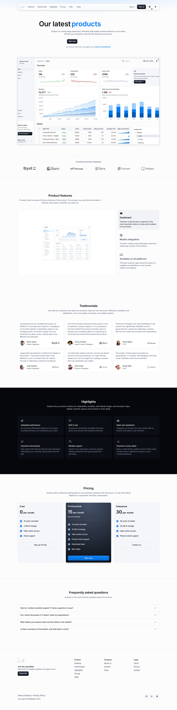

# Entity-backed widgets

Widgets compose a layout and expose the presentation controls registered for that widget. Content-bearing widgets resolve their content from ordinary platform Entity records, normally Objects with Components. This contract does not add a page-builder content store or a new Entity kind.



## Ownership

| Layer                         | Owns                                                                                              | Does not own                                           |
| ----------------------------- | ------------------------------------------------------------------------------------------------- | ------------------------------------------------------ |
| Metahub                       | Entity schemas and records, canonical seed data, source widget placements, and binding selections | Deployment-specific presentation overrides             |
| Application control panel     | Registered presentation options and permitted activation, order, and placement overrides          | Metahub content, source selection, or binding identity |
| Published application runtime | A validated, bounded read projection of the authorized Entity records                             | Authoring or arbitrary Entity-table access             |
| Workspace                     | Runtime-authored content only when a feature explicitly defines that lifecycle                    | A duplicate of source-owned Marketing Page content     |

The widget registry is the cross-package contract. Definitions declare compatible templates and zones, binding slots, source and result cardinality, required Entity capabilities and Component semantics, ordering and visibility roles, record policies, allowed authoring operations, and presentation fields. These declarative slot definitions are separate from the binding instance stored on each placement.

Renderer configuration carries presentation. The versioned binding envelope is stored in reserved neutral layout metadata (<code>\_\_layout.bindings</code>), not as renderer content. Application materialization preserves the trusted source envelope separately from local presentation state.

## Safe selector contract

Bindings use a strict discriminated union with three selector kinds:

| Selector                  | Meaning                                                                     | Persisted selector shape                                             |
| ------------------------- | --------------------------------------------------------------------------- | -------------------------------------------------------------------- |
| <code>semantic-key</code> | Select one record by a registered semantic Component and value              | <code>{"kind":"semantic-key","field":"key","value":"default"}</code> |
| <code>record-set</code>   | Select the bounded record set exposed by one compatible Entity source       | <code>{"kind":"record-set"}</code>                                   |
| <code>relation-set</code> | Select the bounded child set related to the source selected by another slot | <code>{"kind":"relation-set","parentSlot":"tiers"}</code>            |

A binding target identifies an Entity kind and semantic codename. Its projection must match the Component projection declared by the slot registry. Clients cannot supply SQL, physical table or column names, row UUIDs, arbitrary filters, relation predicates, ordering rules, visibility rules, or a renderer-authored projection. The authoring UI presents localized source and record labels rather than binding JSON or storage identifiers.

Compatibility is checked against the slot's required Entity capabilities and Component types, validation rules, and relation target. A declared Entity-kind restriction may narrow compatibility. Built-in Marketing Page codenames identify default seed sources; a compatible source does not require a new entry in a central Marketing codename allowlist.

For current Marketing Page placements, each required slot selects exactly one source target. The selector determines how many rows that source can resolve: a semantic key resolves one record, while a record set or relation set resolves an ordered set. Registry-owned <code>maxResolvedRecords</code> and the shared resolver ceiling bound that result. Registered ordering and visibility Components are applied before the limit; a placement's <code>maxItems</code> can reduce the result further but cannot raise the hard limit. Set-like binding metadata is canonicalized for stable hashes without changing Entity record order.

## Marketing Page slot contract

Before a Marketing snapshot is published, imported, restored, activated, or synchronized, validation checks selected record values against registered Component requirements as well as checking the binding envelope. It verifies required values, data types, field limits and patterns, required English and Russian values for localized Components, safe media/action formats, and every relation-set child reference. Invalid records fail closed before they reach the published runtime.

The built-in template seeds 14 placements. Eleven placements have Entity bindings; the authentication, language, and color-mode controls are host capabilities without editorial source data.

| Placement                                                     | Binding slots                                                                                                                                                | Metahub add and duplicate behavior                               |
| ------------------------------------------------------------- | ------------------------------------------------------------------------------------------------------------------------------------------------------------ | ---------------------------------------------------------------- |
| <code>marketing.brand</code>                                  | <code>site</code>: semantic record in <code>MarketingPageSiteSettings</code>                                                                                 | Seeded singleton                                                 |
| <code>marketing.navigation</code>                             | <code>items</code>: ordered <code>record-set</code>                                                                                                          | Select a compatible source; duplicate shares the binding         |
| <code>marketing.auth</code>                                   | None; host-derived                                                                                                                                           | Singleton                                                        |
| <code>languageSwitcher</code>, <code>colorModeSwitcher</code> | None; host-derived                                                                                                                                           | Existing shared-widget behavior                                  |
| <code>marketing.hero</code>                                   | <code>content</code>: semantic record                                                                                                                        | Create or select a record; duplicate clones the bound record     |
| <code>marketing.image</code>                                  | <code>content</code>: semantic record in <code>MarketingPageImage</code>                                                                                     | Create or select a record; duplicate clones the bound record     |
| <code>marketing.collection</code>                             | <code>section</code>: semantic record; <code>items</code>: <code>record-set</code>                                                                           | Select sources for the chosen variant; duplicate shares bindings |
| <code>marketing.pricing</code>                                | <code>section</code>: semantic record; <code>tiers</code>: <code>record-set</code>; <code>benefits</code>: <code>relation-set</code> over <code>tiers</code> | Select sources; duplicate shares bindings                        |
| <code>marketing.footer</code>                                 | <code>site</code>: semantic record; <code>links</code>: <code>record-set</code>                                                                              | Select sources; duplicate shares bindings                        |

The pricing benefit REF Component (<code>TierRef</code>) points to the authoritative pricing tier record ID. Runtime relation selection uses those record IDs; the tier's semantic key is not a second relation identity.

## Authoring, permissions, and lifecycle

Metahub Add, Edit, Duplicate, and Rebind behavior comes from registry capabilities. Semantic-record slots use a human-readable record picker and may offer create/edit actions. Record-set slots choose an Entity source; rows, order, and visibility are managed through normal Entity record authoring. Relation-set slots declare their parent slot and use the normal REF editing contract for child records. Changing a parent source requires the dependent relation to remain compatible before saving.

After choosing a compatible source, an author can create a separate empty source model for that slot. The server creates a normal Object in the Marketing Page Hub and copies only the registered Component schema and its presentation metadata through the existing Entity services. It does not copy records. For a relation slot, the new REF Component targets the selected parent Object. Records are then authored through the ordinary Entity record workflow.

Hero and Image duplication clone the selected Entity record and bind the new placement to that clone in one backend transaction. The copy uses the ordinary record validation and unique-key rules; if placement creation fails, the record copy rolls back with it. Collection, Navigation, Pricing, and Footer duplication shares their source bindings; it does not clone the source rows. Singleton capabilities do not offer duplication. Removing a widget placement does not delete its Entity records. Registry record policies and Entity integrity checks protect required fields, semantic keys, live bindings, and relation targets.

Metahub layout and content permissions are checked by the authoring UI and revalidated by the server. A visible control is not an authorization boundary. Binding writes validate the complete registered slot set, resolve compatible active Entity metadata under the layout graph lock, and use optimistic layout versions.

Application source-managed Marketing placements are presentation-only: Application writes cannot add or duplicate a required-bound placement, edit its Entity content, or replace its binding. The editor hides Add and Duplicate for these source-owned placements. When a placement has a customized presentation and a source baseline, the editor offers Reset to source. Use Metahub authoring for placement and content changes, then publish and synchronize the already linked application.

Publication, snapshots, restore, and application synchronization preserve the placement binding envelope. Application source state keeps the trusted source config and a complete baseline for editable renderer presentation, activation, sort order, zone, and logical placement. Sync compares these semantic fields and Reset restores the current source baseline while retaining the inherited binding.

Scoped Marketing overlays inherit binding identity from the resolved base placement. Overlay rows and imported snapshots may carry only permitted presentation and placement changes; binding envelopes are rejected at the overlay write and transport boundaries, while materialization and binding-reference checks use the base placement as the single authority.

When a source layout is removed, an Entity-bound placement cannot be copied into application ownership. The diff marks that copy unavailable, and persistence rechecks the rule before writing. Choosing <code>keep_local</code> preserves source lineage, deactivates the removed layout, and tombstones its dependent widgets in the same transaction; a later safe resync can restore them. Choosing <code>skip_source</code> explicitly retains the current application state.

## Runtime DTO boundary

Authenticated and public Marketing runtimes use the same registry validation, selector, relation, ordering, visibility, projection, and hard-limit semantics. They inject different authorized persistence loaders: the authenticated path uses the current application/workspace scope, while the public path reads only the published data allowed by the public runtime boundary.

The resolver hands typed semantic records to Marketing adapters. Strict runtime schemas validate the final DTO. Public DTOs contain only allowlisted content and safe media projections; they omit physical Entity and Component identities, binding envelopes, table metadata, and arbitrary row data. Public ResourceSource media must resolve to an allowed URL. Invalid bindings, missing required sources, invalid relations, or malformed DTOs fail closed.

The public Marketing DTO requires <code>headerPosition</code> and <code>headerWidgets</code>. Layout-copy requests use the strict <code>entityBindingCopyMode</code> field. This is a coordinated clean-cutover contract: deploy the server and bundled clients together; earlier payload and request shapes are not supported, and no compatibility fallback is provided.

Authenticated Marketing runtime responses expose only the effective layout version and content hash needed for stale-layout refresh checks. Physical layout IDs and source-lineage IDs or hashes remain internal to the runtime request and are not serialized.

<code>@universo-react/apps-template-mui</code> consumes the typed <code>data.records</code> view model and renders it without importing persistence or querying Entity tables. It does not read the retired Marketing <code>source</code> or <code>copySource</code> contract.

## Dashboard placement and content ownership

The Dashboard uses the same cross-package registry contract while keeping its shell and responsive MUI 9 layout. The registry defines which widget types can be placed in each zone, the source and copy policy, the supported presentation fields, and whether the widget can contain other placements. A placement stores only its instance identity, zone, order, activation, optional parent/slot, renderer presentation, and neutral source bindings. Content-bearing widgets read normal Entity records or bounded server-owned data sources; host controls receive workspace, route, user, locale, and theme state from the runtime host. Published Dashboard menu links delegate navigation to the application host so the browser address and loaded runtime target stay synchronized; the isolated standalone runtime also supports pathname and <code>#/a/...</code> hash routes. Workspace management routes keep registry-declared host placements in the left, top, and right shell zones while hiding content placements and the Dashboard footer.

Metadata Pages retain their validated Editor.js-compatible <code>blockContent</code> as Page-owned metadata. The Dashboard host renders these blocks through the existing <code>PageBlocksView</code> host-content slot before the persisted placement graph; page text never enters widget configuration and does not change widget placement.

| Data                                                                     | Owner                                                            |
| ------------------------------------------------------------------------ | ---------------------------------------------------------------- |
| Editorial titles, notices, menu entries, resources, and business records | Entity Types and their records, normally Objects with Components |
| Source selection and relation between source slots                       | Validated layout binding metadata                                |
| Widget appearance                                                        | Strict, registry-declared presentation config                    |
| Zone, order, activation, parent, and slot                                | First-class layout placement row                                 |
| Workspace progress or user-authored runtime values                       | Workspace/runtime feature that owns that lifecycle               |
| PlayCanvas, Quiz, and Interpretation Network execution state             | Their specialized typed runtime contracts                        |

Every Dashboard placement has a portable <code>instanceKey</code>. It survives publication, snapshot restore, application synchronization, and Reset; physical UUID v7 row IDs remain persistence details. Copying a placement or a container subtree creates new row IDs and new instance keys as one atomic operation. No widget presentation config stores a second copy of business content or a nested child-widget list.

Containers use ordinary placement rows for their children. The parent stores only its column or tab presentation descriptors; each child stores a parent reference and a semantic slot key. In a metahub overlay, that reference may target an inherited placement in the base layout. Snapshot and authoring boundaries validate the combined effective graph, and application materialization resolves it into one application layout. The following is a schematic fragment showing only the child-to-parent relationship; it is not a complete persisted placement or API payload:

```json
{
    "widgetKey": "detailsTable",
    "instanceKey": "records-table",
    "parentWidgetId": "<snapshot-local-parent-id>",
    "slotKey": "column:main"
}
```

The parent UUID in an exported snapshot is local to that snapshot and is remapped during restore. Semantic hashes use the parent instance key and slot, never physical UUIDs. Server-side graph checks reject missing or foreign parents, self-links, cycles, unknown slots, incompatible child types, and repeated instance keys.

For a source-managed placement, Metahub remains authoritative for source identity, bindings, zone, and nested composition. Application editors may change only the presentation fields and deployment overrides explicitly enabled by registry policy; Reset restores the current source baseline. The UI communicates these limits, and write services enforce them independently of the UI.

Dashboard runtime resolvers read only registered sources, apply server-side access checks and fixed result limits, and return strict allowlist DTOs. Authenticated reads reuse the ordinary owner/shared policy for each source record and for relation-set parent records. Anonymous reads cannot access Objects protected by owner/shared policy; malformed access metadata also fails closed. The isolated app-template renderer receives no table names, SQL fragments, binding envelopes, or physical Entity/Component identifiers. Empty data, permission denial, stale sources, and load failures are represented as distinct localized states.

The built-in Basic, Basic Demo, Empty, 1C-Compatible, LMS, Interpretation Network, and PlayCanvas templates all seed this same placement contract. Basic Demo supplies real Entity-backed records and bounded metric/series sources; other templates seed only their applicable shell and specialized runtime placements. This clean cutover does not add a compatibility reader or increase schema/template versions.

Generated Dashboard navigation projects visible Page entities and groups them by their referenced Hub memberships. Objects stay out of navigation by default; a template may explicitly expose a curated Object as a primary link with `config.runtime.menuVisibility: "primary"`. Metahub Object create/edit forms expose this choice and its semantic icon in the Navigation tab; copying an Object preserves whether it is hidden or selected. This opt-in keeps ordinary data sources and registers from flooding the sidebar. Page, Hub, and selected Object icons use bounded semantic metadata mapped to existing MUI icons, with safe defaults for unknown values. The shared runtime header renders language and color-mode controls once, and theme menu labels use the shared `common` translations.

This is a breaking Dashboard wire contract for the coordinated platform release. The old root-level <code>show\*</code>, <code>defaultViewMode</code>, <code>cardColumns</code>, <code>rowHeight</code>, and <code>enableRowReordering</code> settings are no longer accepted; configure presentation on each placement and shell behavior through <code>sideMenu</code> and <code>objectBehavior</code>. No automatic mapping is provided. Strict validation also rejects embedded child-widget arrays and persisted, imported, or synchronized placements that omit the required semantic identity and explicit parent/slot fields. The server generates each placement's <code>instanceKey</code>. Application placement requests use <code>parentWidgetId</code> (the parent's row UUID), while Metahub authoring uses <code>parentInstanceKey</code> (the parent's semantic key); root placements omit parent and slot, and child placements supply both. Responses include <code>instanceKey</code>, <code>parentWidgetId</code>, and <code>slotKey</code>, with null parent/slot for roots. Deploy the matching backend, Metahub and Application frontends, and isolated app-template runtime together; external REST API clients must update their request and response types to the new contracts. Recreate Dashboard metahubs/applications from the current seeds and regenerate snapshots. The previous Dashboard payloads are not upgraded in place.

## Localization

Localized Entity Components remain the content authority. Slot policies declare required locales; Marketing snapshot validation requires both English and Russian content for localized fields. The Metahub source and record pickers, editor labels, empty/loading states, validation, permission failures, and conflicts use the English and Russian translation resources. Each registered runtime widget selects localized values through its typed, allowlisted DTO contract and the shared locale-selection rules.

## Related documentation

-   [Marketing Page Template](../platform/marketing-page-template.md)
-   [Application Layouts](../guides/application-layouts.md)
