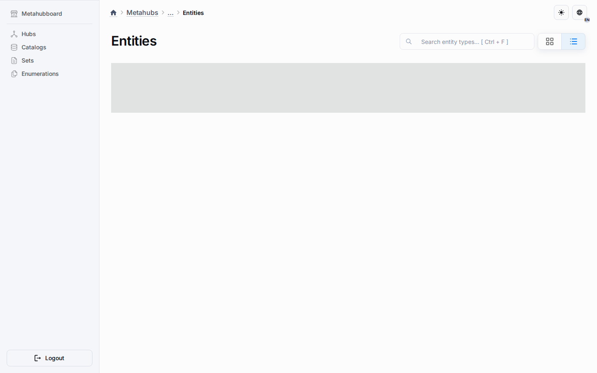
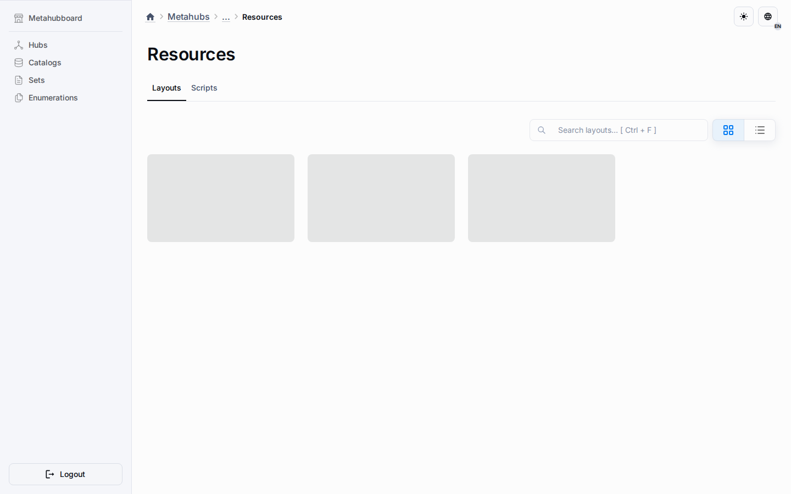

# Entity Systems Architecture

Metahubs now use one entity-first constructor for both platform presets and user-defined metadata types. Hubs, Catalogs, Sets, and Enumerations are not hardcoded product modules anymore. They are built-in entity-type presets shipped by metahub templates and materialized into the same entity-type registry as custom types.

## Core Layers

### Entity Types

An entity type defines:

- its `kindKey`
- localized presentation and codename metadata
- the component manifest that enables schema, records, fixed values, option values, scripts, layouts, runtime behavior, and other capabilities
- UI settings such as icon, sidebar placement, authoring tabs, and resource-surface metadata

Platform presets and custom types use the same storage table and the same validation path.

### Entity Instances

Every design-time object inside a metahub is an entity instance linked to one entity type. Instance CRUD, ordering, copy, delete, publication, and runtime sync all work through generic entity contracts, while the behavior registry can attach specialized flows for platform presets where needed.

### Resource Surfaces

The Resources workspace no longer hardcodes the visible metadata tab titles. Entity types describe resource surfaces through `ui.resourceSurfaces`, which binds a stable key and route segment to one compatible capability:

- `dataSchema` for attributes
- `fixedValues` for constants
- `optionValues` for values

The shared Resources page renders only capabilities that are actually enabled somewhere in the metahub, but the title, stable key, and route segment come from the entity-type contract instead of page-level string maps.

### Templates And Presets

Built-in templates define which optional presets are seeded during metahub creation:

- `basic`: minimal authoring-ready workspace
- `basic-demo`: demo-heavy starter with sample seeded content
- `empty`: no optional entity-type presets; the user starts from the Entities workspace and creates types manually

Each preset can seed:

- one entity-type definition
- optional default instances
- shared metadata defaults
- layouts and widgets

## Runtime And Behavior

The behavior registry still matters, but it is a specialization layer, not the ownership model. Runtime and design-time routes first resolve the entity type and then delegate to specialized handlers only when that kind needs preset-specific behavior. Generic custom types stay inside the shared entity CRUD and publication pipeline.

## Route Shape

Important design-time routes include:

- `/metahub/{metahubId}/entity-types`
- `/metahub/{metahubId}/entity-type/{entityTypeId}`
- `/metahub/{metahubId}/entities`
- `/metahub/{metahubId}/entity/{entityId}`
- `/metahub/{metahubId}/shared-containers`
- `/metahub/{metahubId}/shared-entity-overrides`

The Resources workspace uses shared containers for layouts, attributes, constants, values, and shared scripts. Entity-instance pages use the same capability model but operate on one concrete object.

## Safety Rules

- Entity-type keys and codenames stay unique inside one metahub schema.
- Resource surfaces must use unique keys and unique compatible capabilities.
- A resource surface is rejected when its matching component is disabled.
- Delete flows fail closed when dependent instances still exist.
- Shared authoring keeps sparse override rows instead of destructive duplication of shared metadata.

## Related Reading

- [Frontend Architecture](frontend.md)
- [Backend Architecture](backend.md)
- [Custom Entity Types Guide](../guides/custom-entity-types.md)
- [Metahub Schema](metahub-schema.md)
