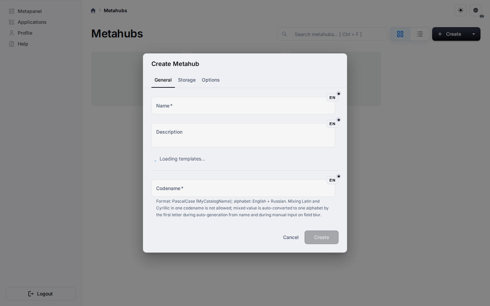

# Quick Start

## Recommended Flow

1. Clone the repository and run `pnpm install` from the root.
2. Add local backend environment variables.
3. Run `pnpm build` from the root.
4. Run `pnpm start` from the root.
5. Open `http://localhost:3000`.

## Why This Flow

The root build validates cross-package dependencies and produces the artifacts
expected by the start command.

The repository also exposes `pnpm dev`, but that mode is resource-intensive and
should be used only when you explicitly need live development servers.

## After Startup

Once the app is running, continue with the Platform section for domain context
or with the Architecture section for implementation details.
