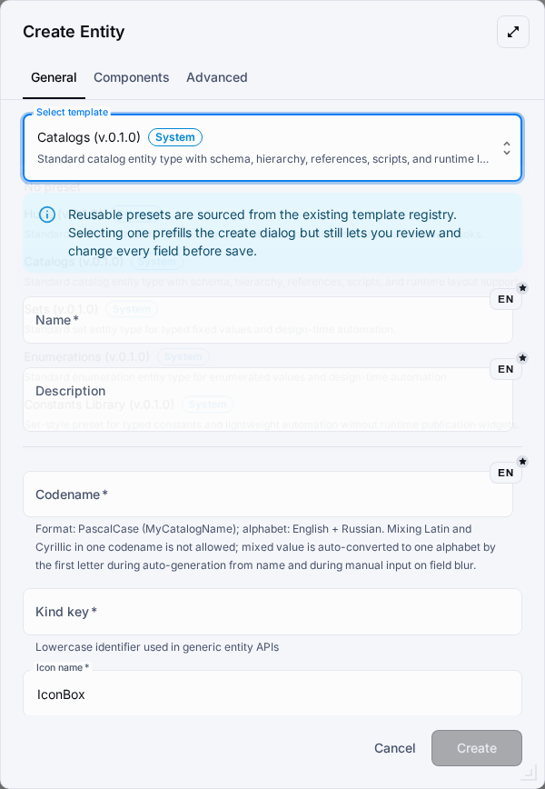

# Custom Entity Types

Custom entity types let a metahub define new authoring and runtime sections on top of the shared entity pipeline. The entity system is a fully generic constructor—Hubs, Catalogs, Sets, and Enumerations are entity type presets defined in metahub templates, not hardcoded types.

## When To Use Them

- Use a custom entity type when the object is metahub-specific and should not become a new fixed platform module.
- Use a reusable preset when the shape should stay consistent across metahubs.
- Use the standard presets for Hubs, Catalogs, Sets, and Enumerations when creating well-known resource types.

## Typical Flow

1. Open the Entities workspace below Common.
2. Start from a preset such as Hubs, Catalogs, Sets, Enumerations, or from an empty type.
3. Fill the kind key, codename, name, and tab configuration.
4. Enable only the components that match the intended behavior.
5. Save the type, open its instances page, and create the first instance before opening automation tabs.
6. Use the edit dialog to configure Scripts, then Actions, then Events for the saved instance.
7. Mark the type as published only when it should become a runtime section.

## Standard Presets

- Hubs reuse the delegated hub surface, nested entity-route ownership, and save-first automation tabs.
- Catalogs reuse the catalog authoring surface and remain the runtime-visible control case after publication sync.
- Sets keep fixed-value authoring plus automation on the shared entity-owned routes.
- Enumerations keep option-value authoring plus action/event automation on the shared entity-owned routes.

## Current Component Set

- Data schema, records, tree assignment, fixed values, and option values cover the current metadata surface.
- Actions and event bindings add object-owned automation hooks.
- Layout, scripting, runtime behavior, and physical table settings extend publication and runtime behavior.
- Component dependencies are validated in the builder, so unsupported combinations should stay disabled.

## Automation Authoring

1. Open a saved instance in edit mode; the Actions and Events tabs stay unavailable before the first save.
2. In the Scripts tab, create or attach the script that should handle the lifecycle behavior.
3. In the Actions tab, create an object-owned action, select the script action type, and link the saved script.
4. In the Events tab, bind a lifecycle event such as beforeCreate, afterCreate, beforeUpdate, or afterUpdate to the action.
5. Use priority and config only when the flow needs ordering or extra payload hints.
6. Re-run the focused browser proof or the direct EntityAutomationTab tests before wider rollout.

## Guardrails

- Prefer presets for parity-heavy flows instead of rebuilding the same manifest by hand.
- Automation authoring on generic custom entity routes follows the manageMetahub contract; standard metadata presets reuse the matching list/detail surface instead of mounting a second generic CRUD shell.
- Publishing affects the dynamic menu and runtime only after publication sync or application sync.
- Standard metadata presets stay on direct kind keys and publish through the entity-owned route tree.
- Runtime sections materialize from published entity metadata and the current runtime adapters after publication sync.
- Generic instance routes now own every entity kind, while the standard metadata presets still render through their dedicated authoring surfaces inside the shared entity-owned route tree.
- Advanced visual composition remains out of scope for the current parity wave.

## Visual References

The current browser proof and generated screenshots use the shared entity workspace and the create dialog shown above.

## Related References

- See the REST API guide for the generic entity and automation endpoints.
- See the Metahub scripting guide for @OnEvent(...) handlers and script capabilities.

## Validation Checklist

- Confirm the type saves with the expected component manifest.
- Confirm the custom instances page opens from the dynamic menu.
- Confirm publication sync materializes the expected runtime sections from the published entity metadata.
- Confirm focused tests or browser flows cover the shipped path before wider rollout.
