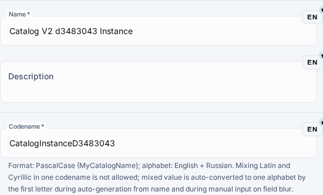

# Custom Entity Types

Custom entity types let a metahub define new authoring and runtime sections on top of the shared entity pipeline instead of adding a one-off built-in object.

## When To Use Them

- Use a custom entity type when the object is metahub-specific and should not become a new fixed platform module.
- Use a reusable preset when the shape should stay consistent across metahubs.
- Keep built-in Catalogs, Sets, and Enumerations for the legacy surfaces that are still authoritative during coexistence.

## Typical Flow

1. Open the Entities workspace below Common.
2. Start from a preset such as Hubs V2, Catalogs V2, Sets V2, Enumerations V2, or from an empty type.
3. Fill the kind key, codename, name, and tab configuration.
4. Enable only the components that match the intended behavior.
5. Save the type, open its instances page, and create the first instance before opening automation tabs.
6. Use the edit dialog to configure Scripts, then Actions, then Events for the saved instance.
7. Mark the type as published only when it should become a runtime section.

## Legacy-Compatible V2 Presets

- Hubs V2 reuses the delegated HubList surface, nested entity-route ownership, and save-first automation tabs.
- Catalogs V2 reuses CatalogList and remains the runtime-visible control case after publication sync.
- Sets V2 reuses SetList and keeps constants authoring plus automation on the shared legacy routes.
- Enumerations V2 reuses EnumerationList and keeps values authoring plus action/event automation on the shared legacy routes.

## Current Component Set

- Data schema, predefined elements, hub assignment, constants, and enumeration values cover the current metadata surface.
- Actions and event bindings add object-owned automation hooks.
- Layout, scripting, runtime behavior, and physical table settings extend publication and runtime behavior.
- Component dependencies are validated in the builder, so unsupported combinations should stay disabled.

## Automation Authoring

1. Open a saved instance in edit mode; the Actions and Events tabs stay unavailable before the first save.
2. In the Scripts tab, create or attach the script that should handle the lifecycle behavior.
3. In the Actions tab, create an object-owned action, select the script action type, and link the saved script.
4. In the Events tab, bind a lifecycle event such as beforeCreate, afterCreate, beforeUpdate, or afterUpdate to the action.
5. Use priority and config only when the flow needs ordering or extra payload hints.
6. Re-run the focused browser proof or the direct EntityAutomationTab tests before wider rollout.

## Guardrails

- Prefer presets for parity-heavy flows instead of rebuilding the same manifest by hand.
- Automation authoring on generic custom entity routes follows the manageMetahub contract; legacy-compatible presets reuse the matching legacy list/detail surface instead of mounting a second generic CRUD shell.
- Publishing affects the dynamic menu and runtime only after publication sync or application sync.
- Catalog-compatible presets can appear as runtime sections after publication sync, while hub-compatible, set-compatible, and enumeration-compatible presets stay filtered out of runtime section navigation.
- Legacy `/hubs`, `/sets`, and `/enumerations` routes keep showing compatible custom rows during coexistence, while each V2 entity route stays filtered to its own custom kind.
- Generic instance routes are for custom kinds; built-in kinds still stay on their legacy routes.
- Advanced visual composition remains out of scope for the current parity wave.

## Visual References

## Related References

- See the REST API guide for the generic entity and automation endpoints.
- See the Metahub scripting guide for @OnEvent(...) handlers and script capabilities.

## Validation Checklist

- Confirm the type saves with the expected component manifest.
- Confirm the custom instances page opens from the dynamic menu.
- Confirm publication sync materializes catalog-compatible sections in runtime and keeps hub/set/enumeration-compatible sections out of runtime navigation.
- Confirm focused tests or browser flows cover the shipped path before wider rollout.