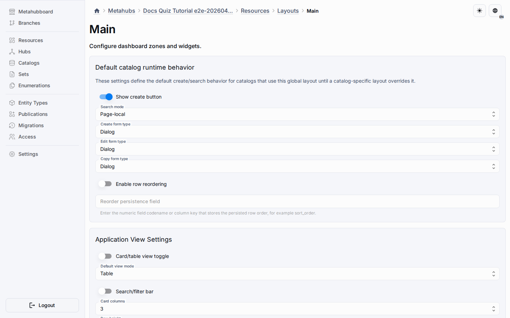
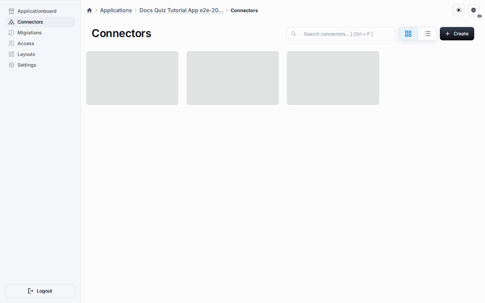

# Entity-Scoped Layouts

Entity-scoped layouts are overlay layouts, not forks.
Each scoped layout points to a global base layout and stores only the differences for one Entity instance, such as a Page, Catalog, or another Entity type whose constructor enables layout customization.

## Overlay Model

- inherited widgets stay linked to the base global layout;
- entity-owned widgets live only inside the scoped layout;
- sparse overrides store visibility, placement, and config changes for inherited widgets;
- inherited widgets keep a `source_base_widget_id` link when materialized into an application;
- persisted inherited runtime widgets receive real UUID v7 identifiers.

## Creating The First Scoped Layout

1. Open the target metahub.
2. Go to Resources -> Layouts for the global context, or open an Entity instance whose type supports custom layouts.
3. Create an entity-scoped layout and choose the base global layout.
4. Reorder, configure, or toggle inherited widgets as needed, or add widgets that belong only to that Entity scope.

## Widget Visibility

The global layout remains the reusable baseline. A scoped layout is created only where the runtime surface needs different widget composition.
For an LMS configuration this means dashboard charts can stay on the Home Page while Catalog, Knowledge, Development, and Report sections use the same application shell without inheriting Home-only charts.

For Catalog-like Entity types, the scoped layout can also own runtime behavior such as create button visibility, search mode, and create/edit/copy surface type.
For other Entity types, the same overlay model applies to widget composition and any behavior exposed by that Entity type's component contract.

## Publication And Runtime

Publication flattens the effective scoped layout into ordinary runtime layout and widget rows.
Applications do not resolve overlay logic on the fly; they consume the already materialized runtime state.
Inherited widgets keep their base link during materialization, and sparse override rows define the scoped placement, active state, and config.
The application runtime selects the default layout for the current `scopeEntityId`; if no scoped layout exists, it falls back to the global default.

## Related Reading

- [Resources Workspace](general-section.md)
- [Metahubs](../platform/metahubs.md)
- [Applications](../platform/applications.md)
