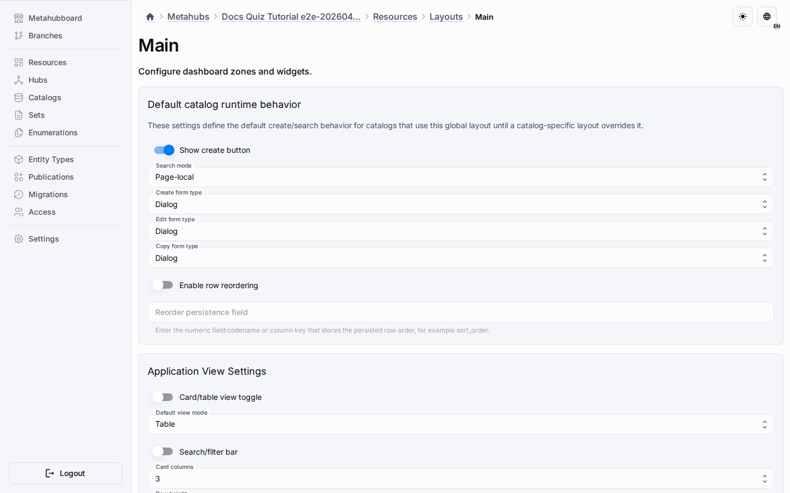
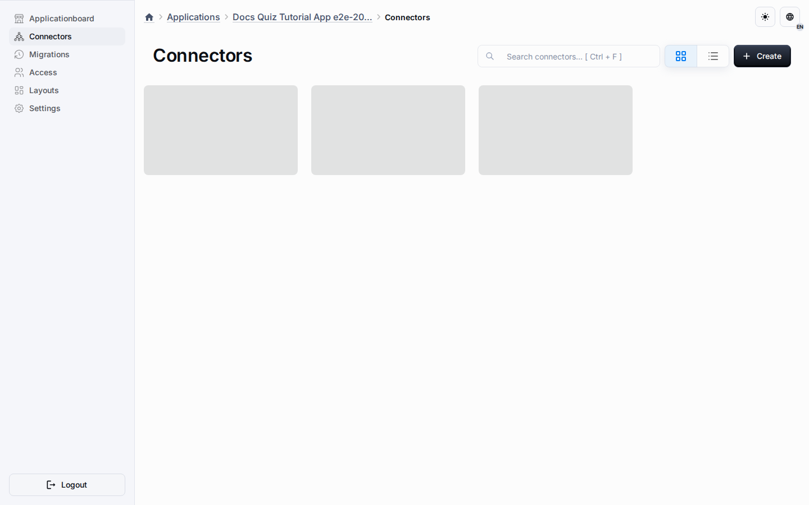

# Entity-Scoped Layouts

Entity-scoped layouts are target-specific layouts for an authorized Page or
Object entity type. They have one of two explicit compositions:

-   **Overlay**: a same-template sparse layout that points to a valid global base
    and stores only inherited-widget overrides.
-   **Independent**: a self-contained layout that may use a different template
    from the global layout. It has no incompatible inherited widgets or physical
    zone merge; `baseLayoutId` is explicitly `null`.

The application runtime selects an active scoped default before the active global
default for the requested target. It never queries the metahub as a hidden
fallback after publication/materialization.

## Composition Model

-   overlay inherited widgets stay linked to the base global layout;
-   independent layouts contain their own widget composition and do not inherit
    widgets from a differently templated global layout;
-   entity-owned widgets live only inside the scoped layout;
-   sparse overlay overrides store visibility, placement, and config changes for
    inherited widgets;
-   inherited widgets keep a `source_base_widget_id` link when materialized into
    an application;
-   every persisted runtime layout/widget identity is a real UUID v7.

## Creating The First Scoped Layout

1. Open the target metahub.
2. Go to Resources -> Layouts for the global context, or open an Entity instance whose type supports custom layouts.
3. Create an entity-scoped layout. Choose the base global layout for a
   same-template overlay, or choose an explicit independent template when the
   target needs a different shell.
4. Reorder, configure, or toggle inherited widgets as needed, or add widgets that belong only to that Entity scope.

## Widget Visibility

The global layout remains the reusable baseline. A scoped layout is created only
where the runtime surface needs different widget composition or a different
template shell.
For an LMS configuration this means dashboard charts can stay on the Home Page while Object, Knowledge, Development, and Report sections use the same application shell without inheriting Home-only charts.

For Object-like Entity types, the scoped layout can also own runtime behavior such as create button visibility, search mode, and create/edit/copy surface type.
For other Entity types, the same overlay model applies to widget composition and any behavior exposed by that Entity type's component contract.

## Publication And Runtime

Publication flattens the effective scoped layout into ordinary runtime layout
and widget rows. Applications do not resolve metahub overlay logic on the fly;
they consume the already materialized and lineage-validated runtime state.
Inherited widgets keep their base link during overlay materialization, while
independent layouts retain only provenance to their source layout.

The application runtime requests the target-aware effective-layout endpoint with
the Page/Object target. If an active scoped default exists, it wins; otherwise
the active global default is used. Invalid, stale, or ambiguous materialization
returns a typed error instead of silently rendering the global template.

## Related Reading

-   [Resources Workspace](general-section.md)
-   [Metahubs](../platform/metahubs.md)
-   [Applications](../platform/applications.md)
