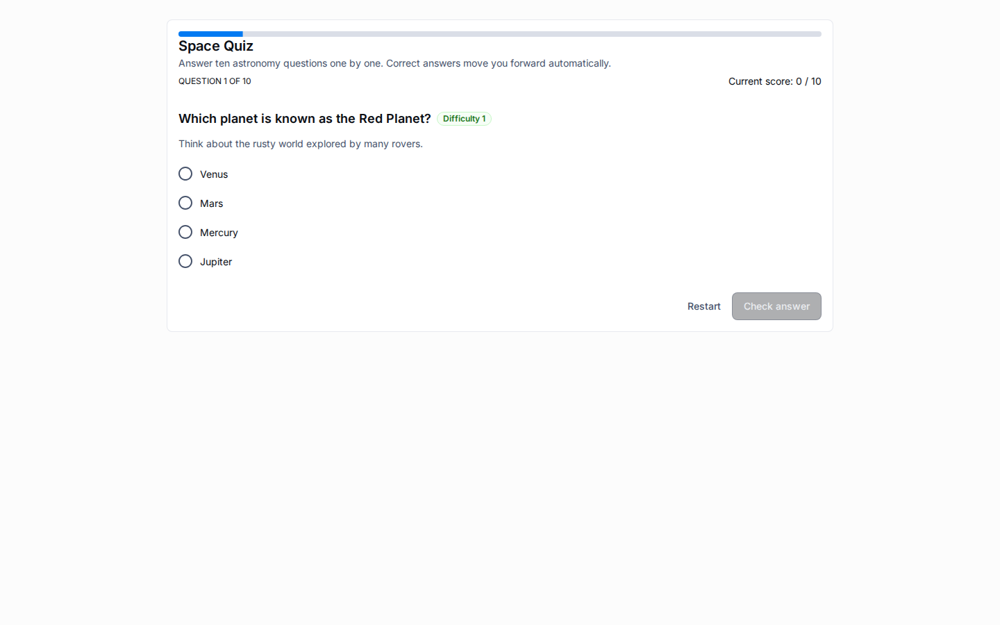

# LMS Overview

The current LMS surface on Universo Platformo is implemented as metahub configuration plus generic application runtime capabilities.
It is not a hardcoded vertical inside `packages/apps-template-mui`, and the shipped fixture now keeps LMS behavior in entities, layouts, and public learning links rather than in global demo widgets.

## What The MVP Covers

- Classes and student directories as ordinary metahub entities.
- Learning modules stored as runtime rows with structured content items.
- Quiz catalogs and quiz-response tracking.
- Workspace-aware collaboration for teachers or operators inside the same application.
- Public access links that let a guest enter a name, open a module or quiz, and submit progress without a registered platform account.
- Curated primary navigation that exposes the main product sections directly in the sidebar.

## What Stays Out Of Scope For This MVP

- AI tutor and content-generation flows.
- Full reporting and analytics packages.
- Complex grading policies, certificates, or timetable automation.
- Custom LMS-only frontend packages outside the shared MUI app template.

## Core Building Blocks

1. The `lms` built-in metahub template defines the canonical entity structure: classes, students, modules, quizzes, access links, progress, enrollments, and supporting enumerations.
2. The applications backend exposes workspace management and a public runtime surface for guest access.
3. The shared MUI template renders the same dashboard primitives used by other published applications: menu, header, details title, details table, columns containers, and workspace switching.
4. The committed generator plus snapshot contract ship a bilingual dataset with multiple classes, modules, quizzes, seeded progress, and two guest-access routes.
5. Removed global `moduleViewerWidget`, `statsViewerWidget`, and `qrCodeWidget` bindings are intentionally absent from the default LMS layout; contextual learning content is reached through runtime rows and public links.

## Runtime Model

Authenticated users work in the normal application runtime at `/a/:applicationId`.
Guests use the public route `/public/a/:applicationId/links/:slug`, enter a display name, receive a guest session token, and continue without platform login.
When workspaces are enabled, public applications start with the owner's personal `Main` workspace only.
The public runtime resolves data through the workspace that owns the access link or the current guest session instead of creating a separate automatic `Published` workspace.
The browser client keeps guest-session state in session storage for the current tab or browser session rather than as durable shared-device local storage.

## Verified Browser Surface

The shipped LMS browser suite covers workspace management, public-link negative cases, clean dashboard rendering without removed global widgets, the EN guest journey, and an RU guest route using localized module, quiz, and access-link copy.

## Related Reading

- [LMS Setup](lms-setup.md)
- [LMS Guest Access](lms-guest-access.md)
- [Workspace Management](workspace-management.md)
- [LMS Entities](../architecture/lms-entities.md)
