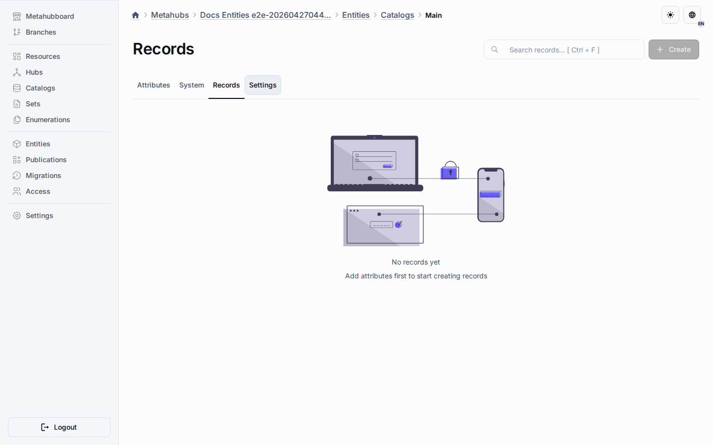

# LMS Reports

LMS reports are configuration records in the existing `Reports` Object.
The platform does not add a report-only widget or LMS-specific report table for V1.

## Definition Shape

Each report record stores:

- localized name,
- report type,
- generic runtime datasource descriptor,
- columns,
- filters,
- aggregations,
- saved filter presets.

The current fixture includes `LearnerProgress` and `CourseProgress` definitions.
Both use `records.list` datasources so they can be rendered by existing `detailsTable`, chart, and overview-card widgets.

## Safe Runner

The backend report runner validates the report definition with shared schemas from `@universo/types`.
Runtime API calls do not send a raw report definition.
They send exactly one saved report reference, either `reportId` or `reportCodename`, and the backend loads the JSON `Definition` from the published `Reports` Object in the current workspace.

The runner receives table and column identifiers only from resolved published metadata.
API payloads may reference saved report records, but they must not provide raw SQL identifiers or inline datasource definitions.

SQL values are parameterized, dynamic identifiers go through identifier helpers, unsupported fields fail closed, and JSON/TABLE fields are not exposed to filter/sort/report column SQL.
Registrar-only ledger Objects are excluded from report target discovery, so reports operate on ordinary runtime record Objects and not on internal fact ledgers.
Configured aggregations are executed by the same safe field map and are returned in the `aggregations` object using the report definition aliases.
