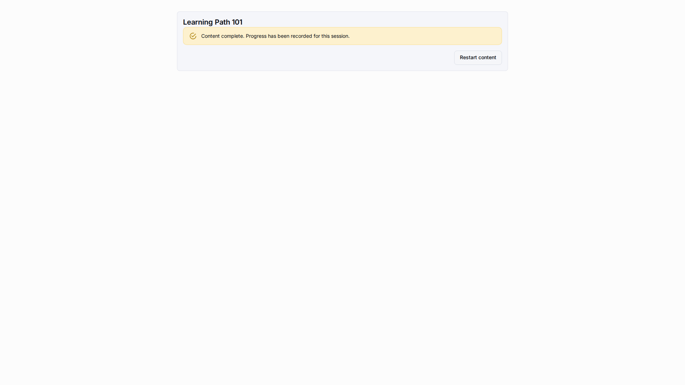

# LMS Setup

This guide describes the supported workflow for the built-in LMS template and its canonical Learning Portal fixture.

## 1. Create Or Regenerate The Canonical Fixture

1. Use the generator spec at `tools/testing/e2e/specs/generators/metahubs-lms-app-export.spec.ts`.
2. Keep `tools/testing/e2e/support/lmsFixtureContract.ts` as the source of truth for the seeded dataset.
3. Regenerate `tools/fixtures/metahubs-lms-app-snapshot.json` only through that end-to-end export flow.

## 2. Review The Shipped Seeded Surface

The canonical fixture ships a bilingual Learning Portal dataset with these entities:

-   `LearnerHome` Page
-   `Classes`
-   `Students`
-   `ContentProjects`
-   `LearningResources`
-   `Courses`
-   `CourseSections`
-   `CourseItems`
-   `LearningTracks`
-   `TrackStages`
-   `TrackSteps`
-   `ContentStars`
-   `RecentContentViews`
-   `ContentAccessEntries`
-   `TrashEntries`
-   `Quizzes`
-   `QuizResponses`
-   `ContentProgress`
-   `AccessLinks`
-   `Enrollments`

It also ships the LMS enumerations, a curated working runtime menu, Editor.js-compatible landing-page blocks, workspace-aware seeded rows, and multiple guest-access routes.

## 3. Keep The Product Fixture Contract Stable

The imported LMS layout must stay free of removed global dashboard widgets and removed metahub widget modules. The executable fixture contract and no-fork guard enforce that the current runtime uses metadata-defined Learning Content widgets instead of retired dashboard/module shortcuts.

Do not hand-edit exported snapshot payloads. Update the generator or fixture contract, then re-export through Playwright or mechanically rewrite the snapshot with a recomputed `snapshotHash` only for deterministic fixture maintenance tasks.

## 4. Publish The Imported Or Generated Metahub

1. Create a publication for the LMS metahub.
2. Add a version with the workspace policy that matches the target runtime.
   The LMS fixture should normally use `Require workspaces` because learner progress, class data, and public links must stay isolated by workspace.
3. Sync until the publication becomes ready.

## 5. Create The Linked Application

Create the application with the required visibility and link it to the LMS publication through a connector.
Workspace mode is no longer selected in the application create dialog.

After the connector is linked to the publication, open schema sync:

-   `Require workspaces` creates or keeps application workspaces and requires an irreversible acknowledgement.
-   `Optional workspaces` allows the connector schema sync dialog to choose whether workspaces are created.

After sync, the linked app clones the seeded LMS rows into the user's Main workspace when the effective workspace mode is enabled.

## 6. Do Not Manually Rebuild The Demo Rows

The shipped fixture already contains the classes, learning resources, quizzes, access links, progress rows, and workspace seed data required for the MVP scenario.

If the dataset must change, update the generator and fixture contract first instead of reseeding runtime tables by hand.

## 7. Verify Both Runtime Surfaces

1. Open `/a/:applicationId` and verify that EN and RU authenticated runtime starts from the `LearnerHome` Page, has no duplicate `Workspaces` entry, and every visible menu item either opens a real section or a real route.
2. Open `/public/a/:applicationId/links/:slug` and verify the EN and RU guest-learning flows.

## User Guide Link

For day-to-day work inside the published LMS application, use the [LMS User Guide](../lms/README.md).

## Related Reading

-   [LMS Overview](lms-overview.md)
-   [LMS Learning Content](lms-learning-content.md)
-   [LMS Guest Access](lms-guest-access.md)
-   [Quiz Application Tutorial](quiz-application-tutorial.md)
