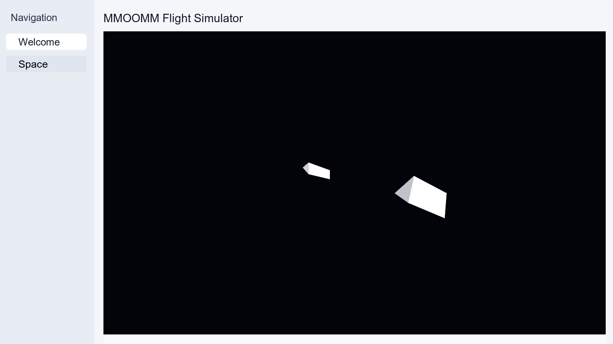

# MMOOMM Flight Simulator

The MMOOMM flight simulator fixture is a product metahub configuration, not a
new MMOOMM-specific package. Generate it with the Playwright generator
`metahubs-mmoomm-flight-app-export`; the output is
`tools/fixtures/metahubs-mmoomm-flight-app-snapshot.json`.

The generated metahub attaches three generic wrapper packages:
`@universo-react/playcanvas-engine`, `@universo-react/colyseus-client`, and
`@universo-react/colyseus-server`. The world, ship, station, movement runtime,
and canvas widget are represented through metahub Objects, Modules, and the
generic `playcanvasCanvas` application-layout widget.

After importing the snapshot, publish the metahub as an application and open the
published runtime. The center dashboard widget renders a bounded PlayCanvas
canvas with a white ship and a white station, plus visible move, stop, zoom, and
camera rotation controls.
