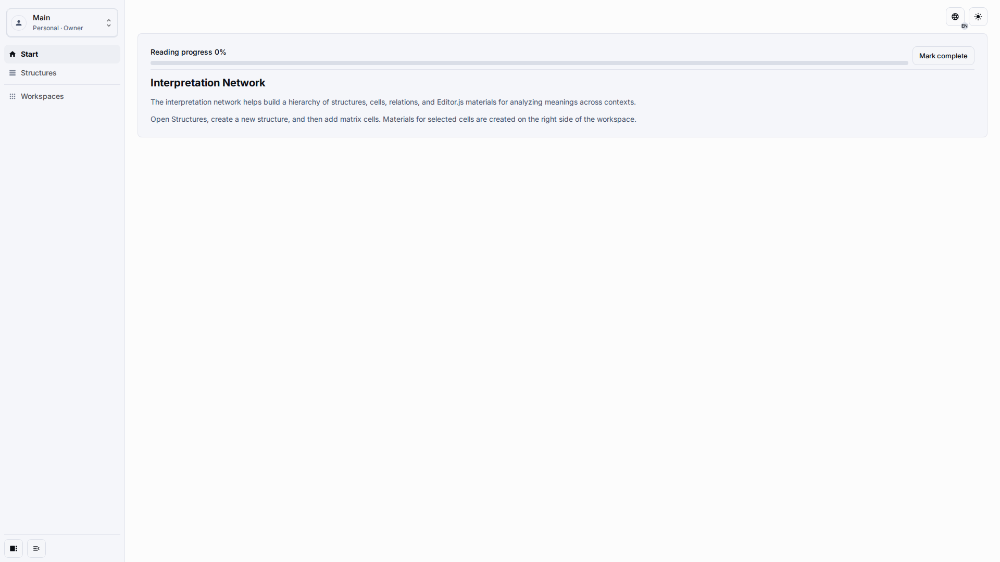
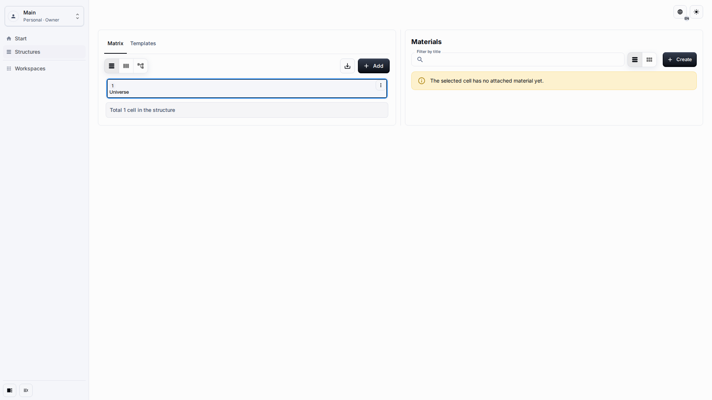

# Interpretation Network User Guide

The Interpretation Network is a workspace for building a hierarchy of concepts, comparing interpretations, and attaching source materials to the cells that explain each concept. Use this guide when you need a working application, not only the technical data model.

## Role And Goal

This page is for an application owner or editor who needs to open the published application, find the Matrix workspace, and understand where each main workflow starts.

## Prerequisites

-   You can sign in to Universo Platformo.
-   You have access to an application created from the Interpretation Network template or from the demonstration snapshot.
-   Your role allows content editing when you need to create cells, materials, or templates.

## Workflow

1. Open the published application and check the left navigation.

2. Open **Structures**. In the default single-system setup, the Matrix opens directly and the root cell is ready for selection.

## Expected Result

You see the normal application shell, the **Start**, **Structures**, and **Workspaces** navigation items, and a Matrix workspace with **Matrix** and **Templates** tabs. The Materials pane is available next to the Matrix after a cell is selected.

## What To Check

-   The page uses the same application shell as other published apps.
-   The Matrix shows human-readable cell labels.
-   The application does not ask you to copy technical identifiers or edit hidden placement fields.

## Related Pages

-   [Getting Started](getting-started.md)
-   [Workspace And Matrix](workspace-and-matrix.md)
-   [Cells And Materials](cells-and-materials.md)
-   [Interpretation Network data model](../architecture/interpretation-network-data-model.md)
