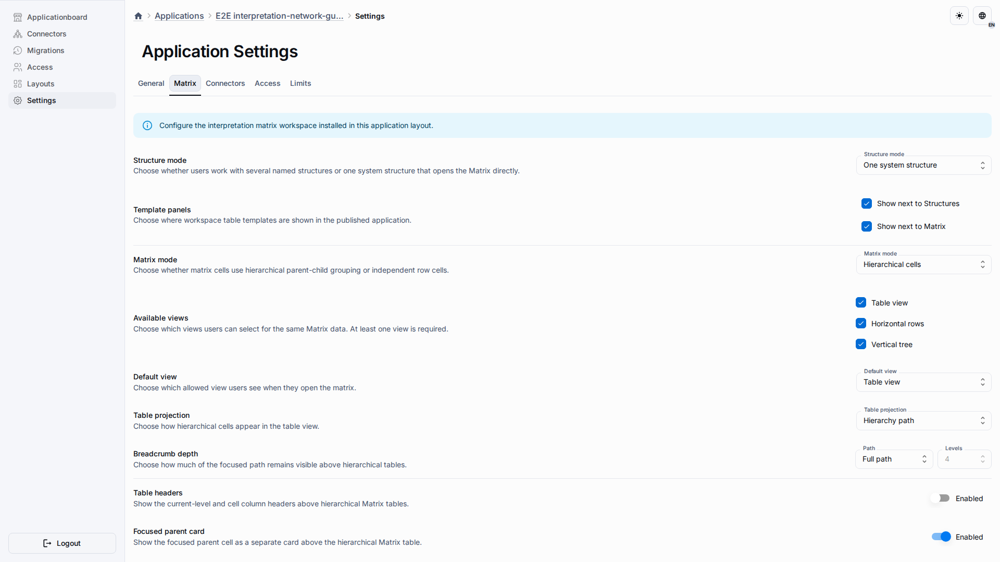
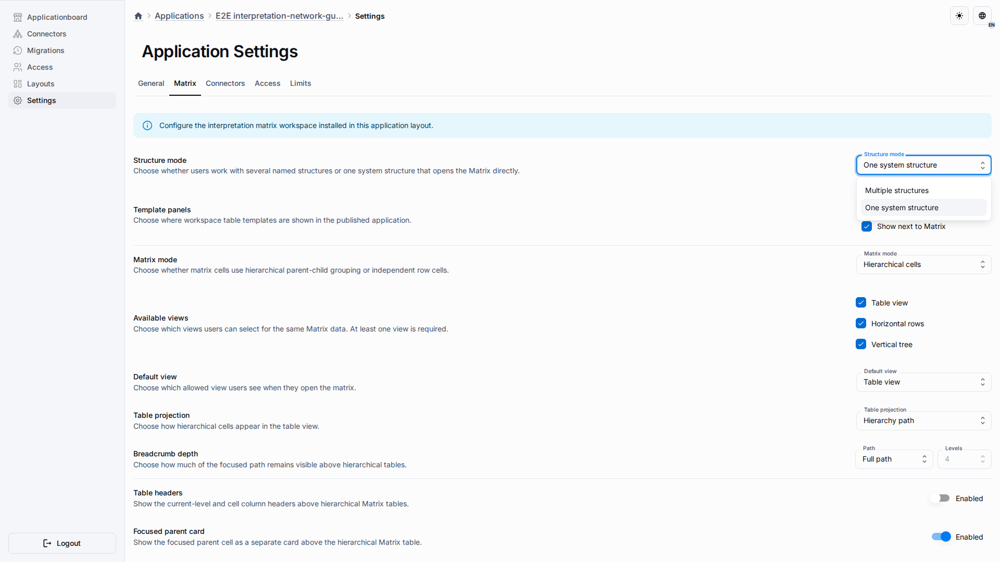

# Application Settings

Application Settings let an owner tune the Matrix experience for one deployed application without changing the source metahub.

## Role And Goal

This page is for an application owner or administrator who controls Structure mode, allowed Matrix views, template placement, and pane resizing.

## Prerequisites

-   You can open the application administration area.
-   The application is linked to an Interpretation Network publication.
-   You understand whether users should work in one shared system Matrix or in several named Structures.

## Workflow

1. Open **Application Settings** and select the **Matrix** tab.

2. Choose the Structure mode and the Matrix views that should be available to users.

3. Save the override or reset the Matrix settings back to the source publication when the application should return to the template defaults.

## Expected Result

The published application reflects the saved settings. In one-system mode, users go directly to the Matrix. In multiple-Structure mode, users first choose or create a Structure.

## What To Check

-   The Matrix tab shows product controls, not configuration documents.
-   The default view is included in the allowed views.
-   Template placement matches the authoring workflow you want to expose.
-   Reset is available only when the application has a real override to discard.

## Related Pages

-   [Workspace And Matrix](workspace-and-matrix.md)
-   [Templates](templates.md)
-   [Application Template View Settings](../guides/app-template-views.md)
