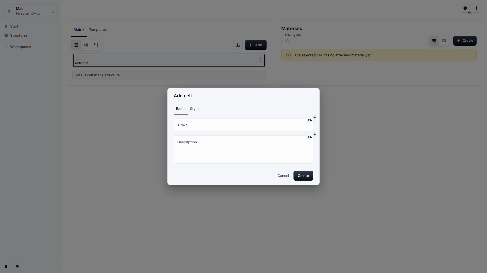
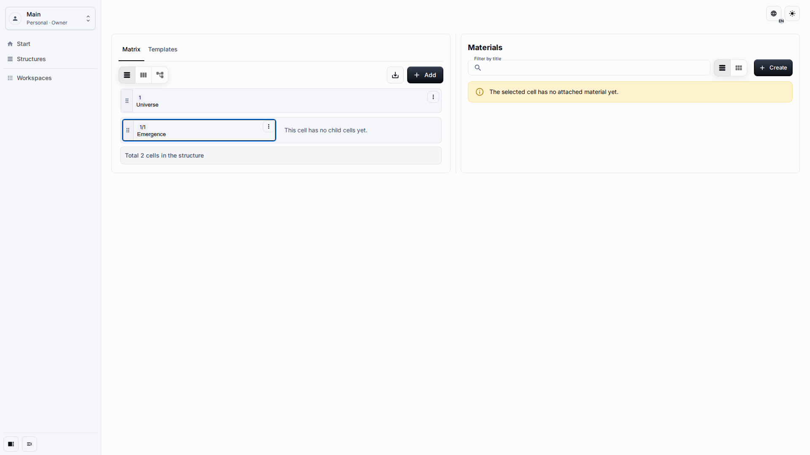
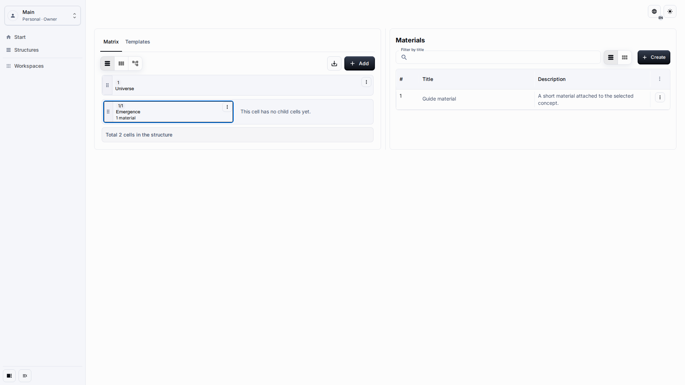
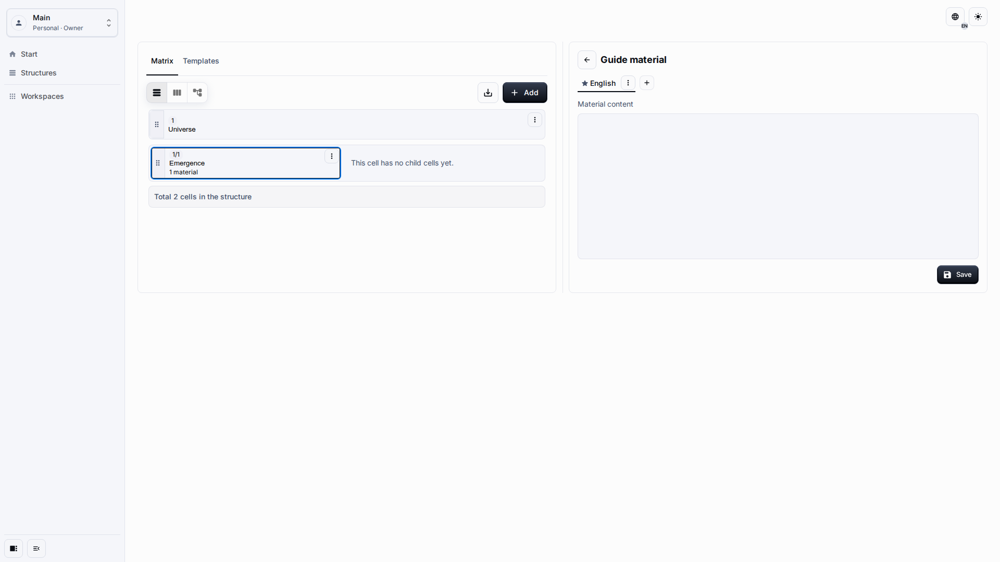

# Cells And Materials

Cells describe concepts or interpretations. Materials add authored notes and source content to the selected cell.

## Role And Goal

This page is for an editor who creates child cells, styles them, and attaches Materials without touching placement internals.

## Prerequisites

-   You can open the Matrix.
-   Your role allows content creation and editing.
-   The cell that should receive the new child or Material is selected.

## Workflow

1. Select a parent cell and click **Add** to open the child-cell dialog.

2. Enter the Title and optional multiline Description, then save the cell.

3. In the Materials pane, click **Create** to attach a Material to the selected cell.

4. Open the Material editor when you need to author longer block content.

## Expected Result

The new child cell appears under the selected parent, and the Material appears in the Materials pane for that cell. The Material body is edited through the block editor and is not shown as technical text in tables or cards.

## What To Check

-   Description fields are multiline.
-   Placement fields are not visible in the dialog.
-   Materials show titles and descriptions, not stored block data.
-   Validation messages are localized for the active language.

## Related Pages

-   [Workspace And Matrix](workspace-and-matrix.md)
-   [Templates](templates.md)
-   [Interpretation Network data model](../architecture/interpretation-network-data-model.md)
