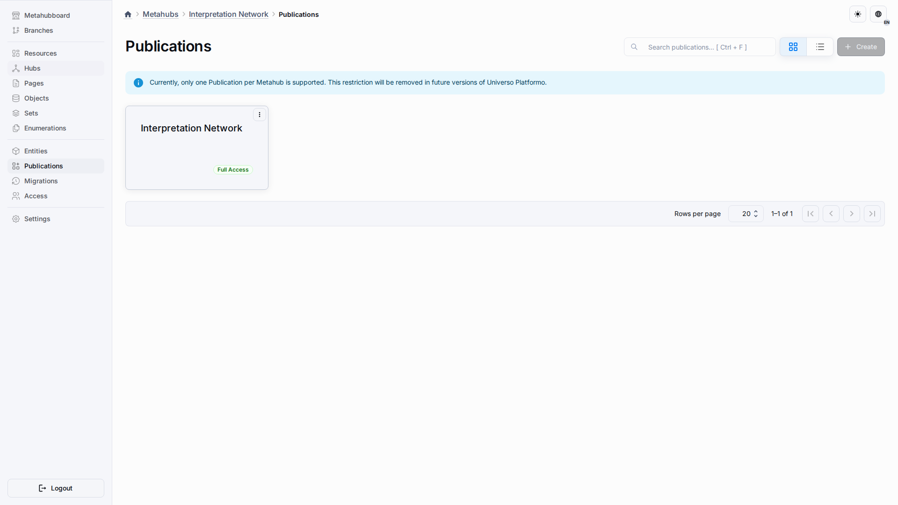
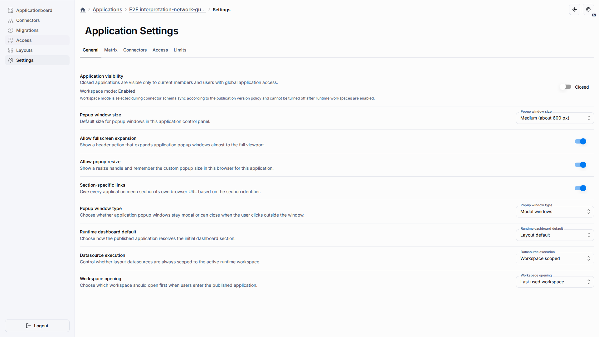
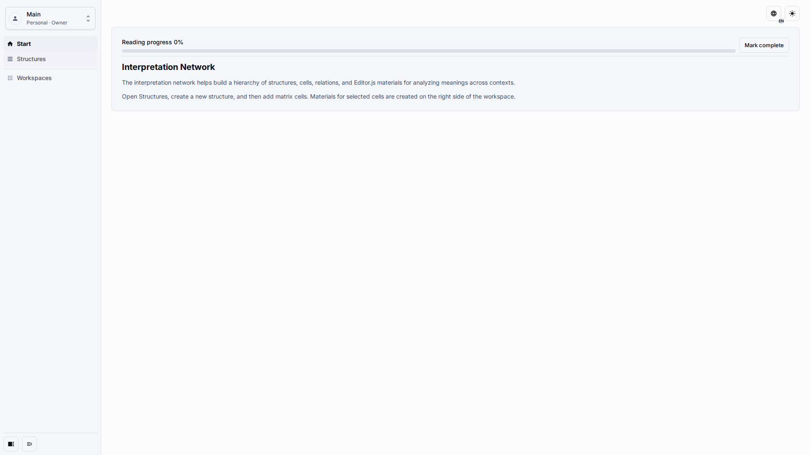

# Create And Publish

Use this workflow to create a stable MVP application that can be opened by editors and checked through the same route as production users.

## Role And Goal

This page is for an owner who prepares the application shell, synchronizes the schema, and publishes the first workspace.

## Prerequisites

-   You can create metahubs and applications.
-   You know whether you are starting from the built-in template or from the prepared demonstration snapshot.
-   You can grant application membership to the users who will author content.

## Workflow

1. Create the metahub from the Interpretation Network template, or import the prepared demonstration snapshot when you need the exact verification baseline.

2. Create a linked application from the publication, open its settings from the application list, and verify that the application is ready.

3. Confirm that the Start page, workspace switcher, and Structures navigation are visible before inviting editors.

## Expected Result

Editors open one application URL, choose a workspace, and work in the Matrix. The source configuration remains owned by the template and publication, while user content is authored inside the application workspace.

## What To Check

-   The application opens through the normal published app route.
-   The Structures item leads to the Matrix workspace.
-   No setup screen asks editors to edit technical configuration.

## Related Pages

-   [Application Settings](application-settings.md)
-   [Application layouts](../guides/application-layouts.md)
-   [Snapshot Export & Import](../guides/snapshot-export-import.md)
