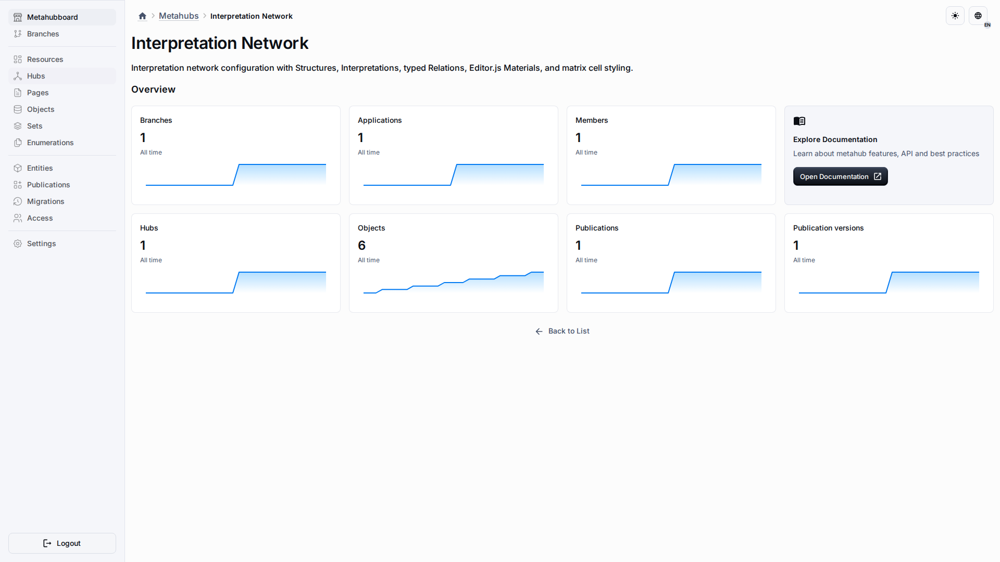

# Getting Started

Start here when you need to confirm that the template, publication, linked application, and published workspace are connected.

## Role And Goal

This page is for the owner who prepares the first usable application and for the editor who receives access to it.

## Prerequisites

-   The Interpretation Network template is available in the metahub catalog.
-   You can create or import a metahub and create a linked application from its publication.
-   For the demonstration path, use the prepared snapshot file supplied with the repository.

## Workflow

1. Create or import the Interpretation Network metahub and open it after the import finishes.

2. Open the linked application and wait for the workspace switcher and navigation to load.

## Expected Result

The published application opens with the Start page and the Structures navigation item. The application is workspace-aware, so users work in the active workspace selected in the application header.

## What To Check

-   The imported metahub title matches the Interpretation Network template.
-   The linked application opens without a separate development server.
-   Users see only normal product navigation and localized labels.

## Related Pages

-   [Create And Publish](create-and-publish.md)
-   [Snapshot Export & Import](../guides/snapshot-export-import.md)
-   [Creating Applications](../guides/creating-application.md)
