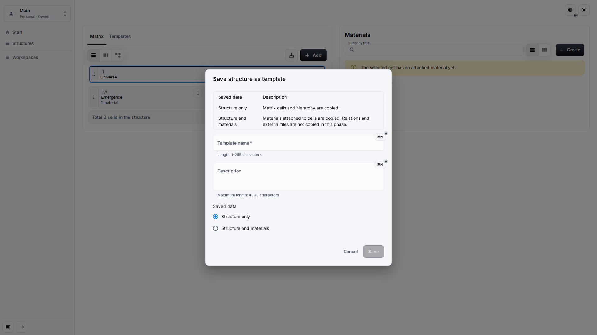
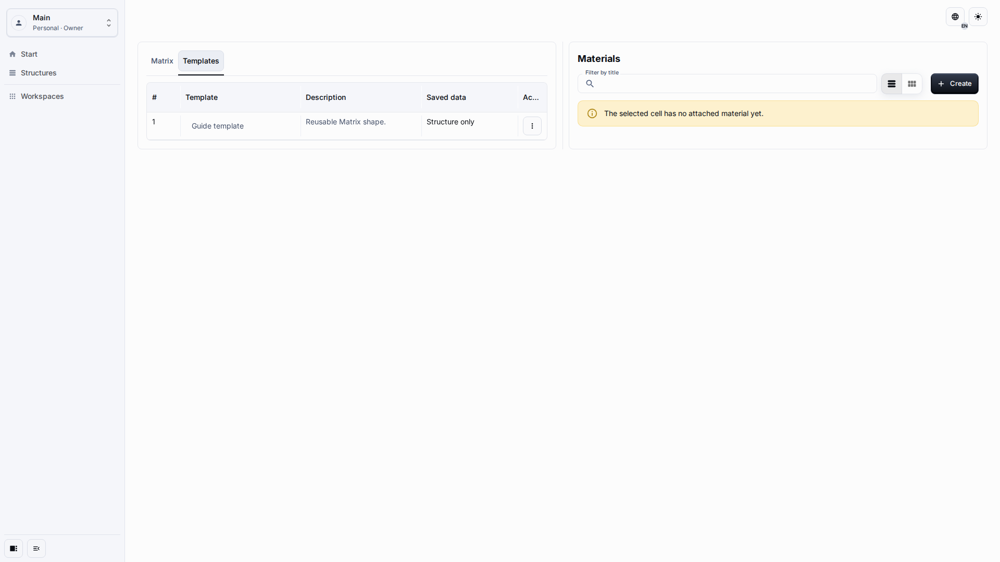
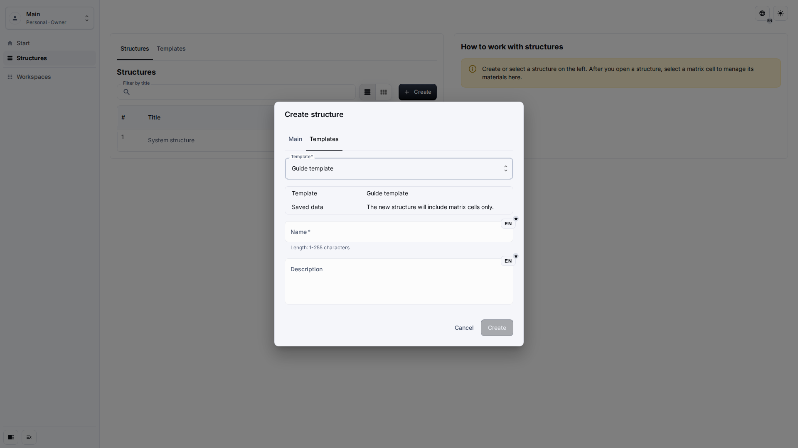

# Templates

Templates let editors reuse a Matrix structure inside the same application workspace. A template can copy only the structure or copy the structure together with its Materials.

## Role And Goal

This page is for an editor who needs to save a useful Matrix shape and create another Structure from it later.

## Prerequisites

-   You can edit the Matrix that should become a template.
-   Template panels are enabled in Application Settings.
-   Your role allows both content creation and content editing.

## Workflow

1. Open the Matrix and click **Save as template**.

2. Open the **Templates** tab to review available templates and their saved data policy.

3. In multiple-Structure mode, create a Structure and choose the **Templates** tab in the create dialog.

## Expected Result

The saved template is available only in the current application workspace. Creating a Structure from it produces a new visible Structure without changing the source Matrix or the saved template.

## What To Check

-   The saved data policy matches your intention.
-   The template list shows readable names and descriptions.
-   One-system mode hides creation of an additional Structure from a template, while still allowing the current Matrix to be saved.

## Related Pages

-   [Application Settings](application-settings.md)
-   [Workspace And Matrix](workspace-and-matrix.md)
-   [Cells And Materials](cells-and-materials.md)
