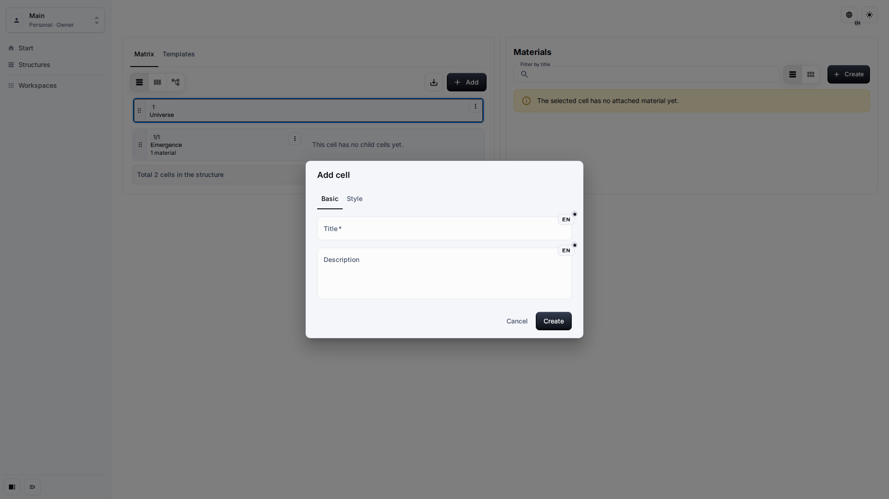
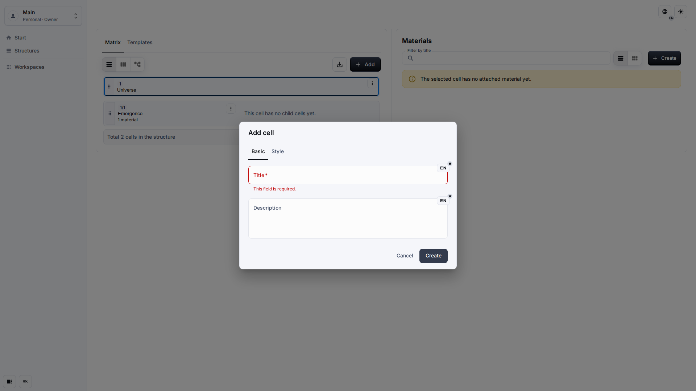
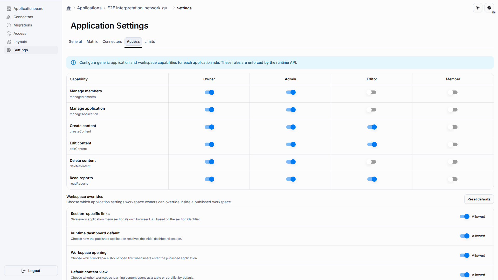

# Troubleshooting

Most Interpretation Network issues are resolved by checking permissions, the active workspace, and whether application settings have been overridden from the source publication.

## Role And Goal

This page is for owners and editors who need to understand a failed save, missing action, hidden template panel, or settings reset conflict.

## Prerequisites

-   You know which workspace is active.
-   You know the user's application role.
-   You can open Application Settings when settings changes are involved.

## Workflow

1. If a form does not save, read the localized validation message and correct the visible field.

2. If an action is missing, check whether the role includes content creation, editing, or deletion for the active workspace.

3. If the Matrix does not match the expected layout, open Application Settings and check whether Matrix settings were customized or need a reset.

## Expected Result

The user can identify whether the problem is a visible validation issue, a permission issue, or a deployment setting issue. Errors should remain user-facing and should not require knowledge of backend field names.

## What To Check

-   The active workspace is the workspace where the content was created.
-   The user's role allows the action they are trying to perform.
-   Matrix settings show the expected Structure mode and template placement.
-   A reset conflict is resolved before retrying the reset.

## Related Pages

-   [Application Settings](application-settings.md)
-   [Cells And Materials](cells-and-materials.md)
-   [Runtime UI UX Quality Gate](../contributing/runtime-ui-ux-quality-gate.md)
