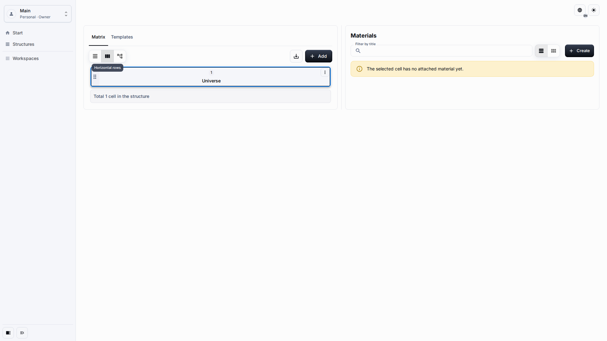
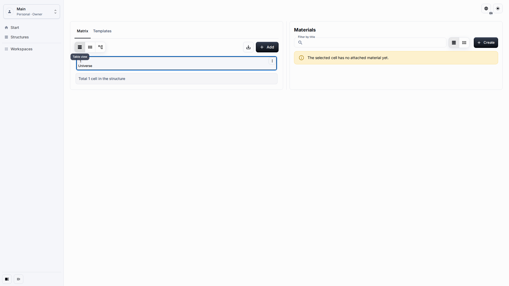
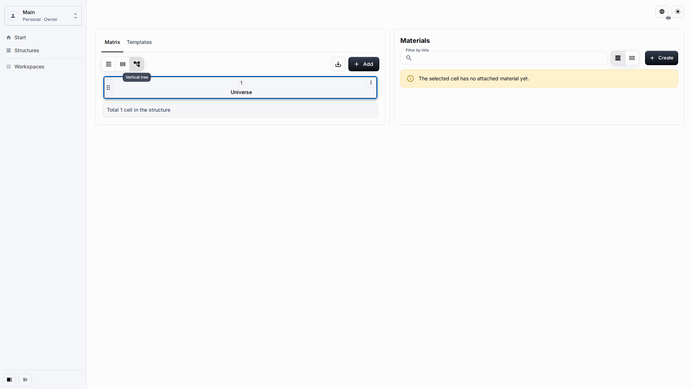

# Workspace And Matrix

The Matrix is the main authoring surface. It starts from the root **Universe** cell and lets users move between hierarchy levels while keeping Materials visible beside the selected cell.

## Role And Goal

This page is for an editor who needs to navigate the Matrix, select cells, and switch views without changing the underlying data.

## Prerequisites

-   The published application is open.
-   You are in a workspace where you can read the Matrix.
-   If you need to author content, your role allows content creation and editing.

## Workflow

1. Open **Structures**. In one-system mode, the Matrix opens directly.

2. Select the root cell or another visible cell to focus the Materials pane and enable child-cell actions.

3. Switch between the available Matrix views when you need a table, horizontal hierarchy, or vertical hierarchy.

## Expected Result

The selected cell remains visible, the Materials pane follows the selection, and view changes do not create separate copies of the Matrix.

## What To Check

-   Cell names are readable and can be selected by keyboard.
-   Horizontal scrolling, when needed, stays inside the Matrix area.
-   The page itself does not gain sideways scrolling on desktop, tablet, or mobile widths.

## Related Pages

-   [Cells And Materials](cells-and-materials.md)
-   [Application Settings](application-settings.md)
-   [Runtime UI UX Quality Gate](../contributing/runtime-ui-ux-quality-gate.md)
