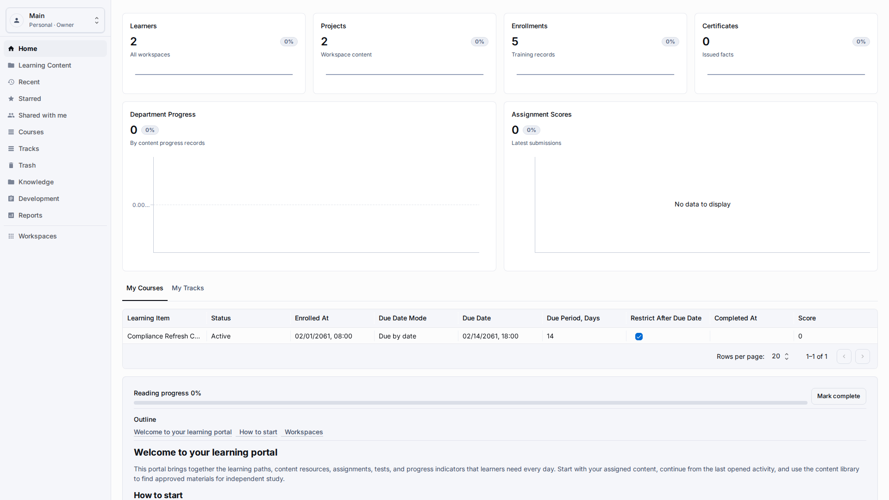
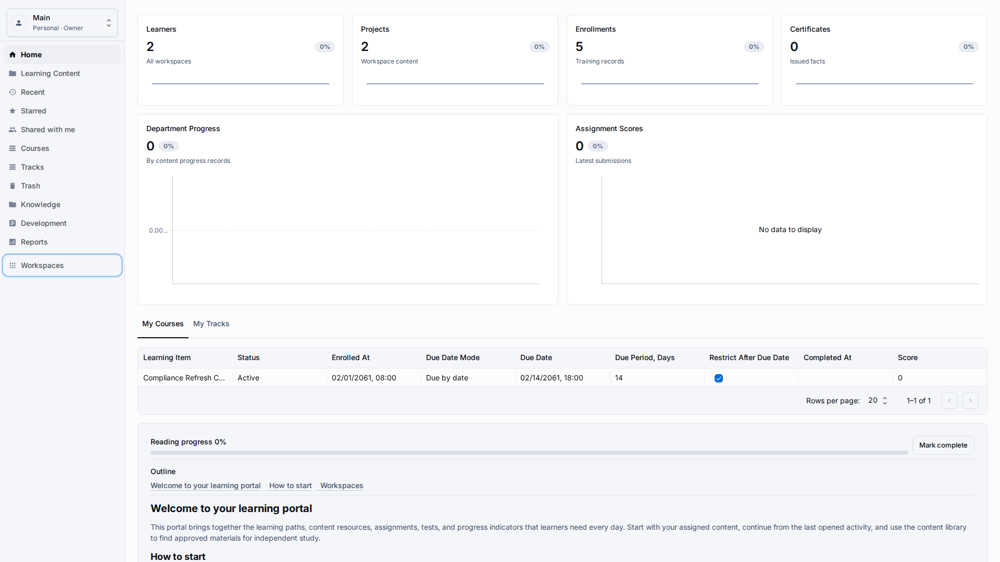
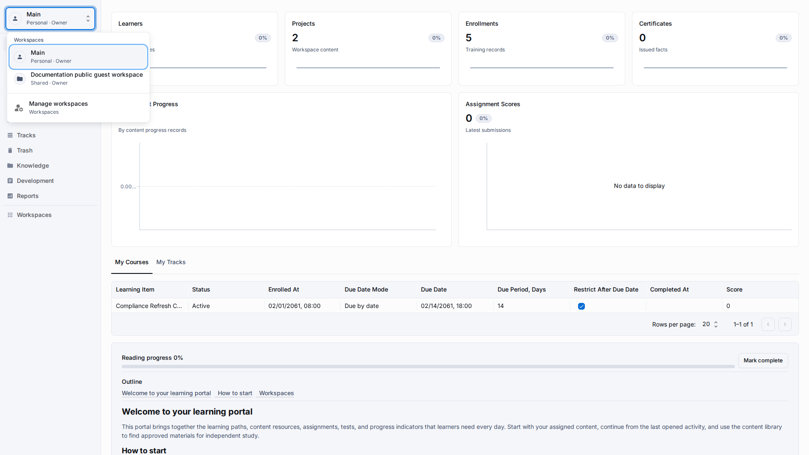
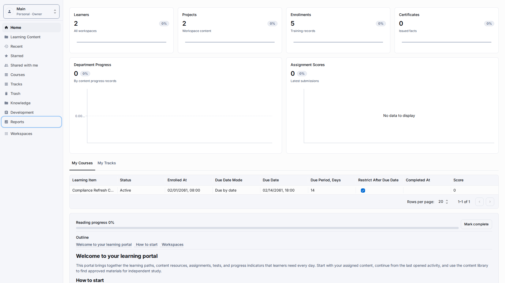

# LMS User Guide

**Role:** Workspace owner, teacher, learner, or guest depending on the task.

**Goal:** Understand where everyday LMS work happens and which guide page to open next.

## What You Need

-   Open the published LMS application prepared by an administrator.
-   Select a workspace where your role allows the action you want to complete.
-   Use the application sidebar, not the setup screens, for day-to-day LMS work.

## Workflow

1. Open the LMS application and confirm that the left sidebar shows Dashboard, Learning Content, Courses, Tracks, Knowledge, Development, Reports, and Workspaces.
   
2. Check the workspace menu near the top of the sidebar before creating or editing content.
   
3. Open the page that matches your task: Learning Content for authoring, Courses or Tracks for builders, Reports for analysis, or Guest Access for public links.
   
4. Use the related links at the bottom of each page when you need more detail.
   

## Screen Details

| Area              | How to use it                                                                                                                                                                                                   |
| ----------------- | --------------------------------------------------------------------------------------------------------------------------------------------------------------------------------------------------------------- |
| Dashboard numbers | Use the dashboard cards as a quick health check before opening a detailed area. The cards count learners, projects, assignments, certificates, progress records, and task grades for the active workspace.      |
| Workspace menu    | The menu in the sidebar defines where new records and reports are read from. Change it before authoring content when a team uses separate workspaces.                                                           |
| Sidebar modules   | Dashboard, Learning Content, Courses, Tracks, Knowledge, Development, Reports, and Workspaces are the main entry points. Open the module that matches the task instead of editing records from unrelated lists. |
| Quality check     | If a page shows unreadable technical values or incorrectly formatted dates, clipped controls, or an unexpected language, stop and report the visible screen before changing production content.                 |

## Result

You know that the LMS setup is prepared separately, while authors and learners work inside application workspaces.

## What To Check

You should not need technical values, administrator-only setup details, or administrator screens for normal learning-content work.

## Related Pages

-   [Getting Around](getting-around.md)
-   [Learning Content Library](learning-content-library.md)
-   [Courses](courses.md)
-   [Reports](reports.md)
