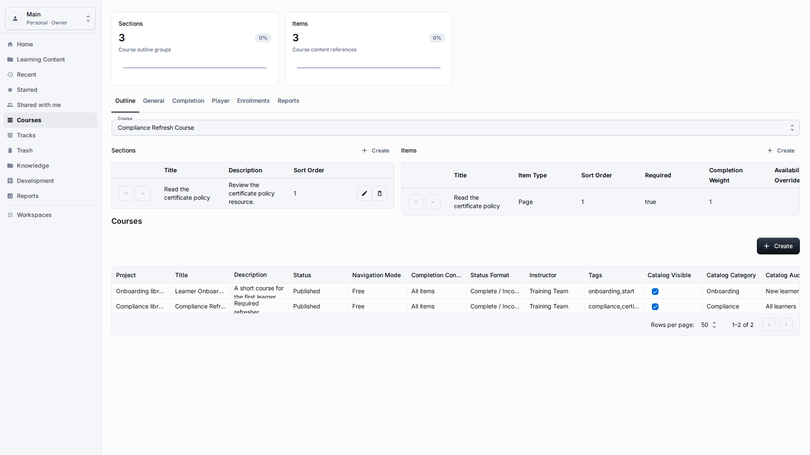
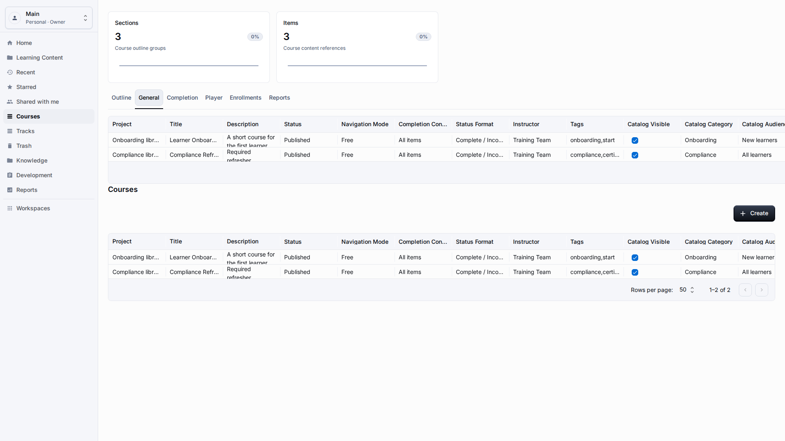
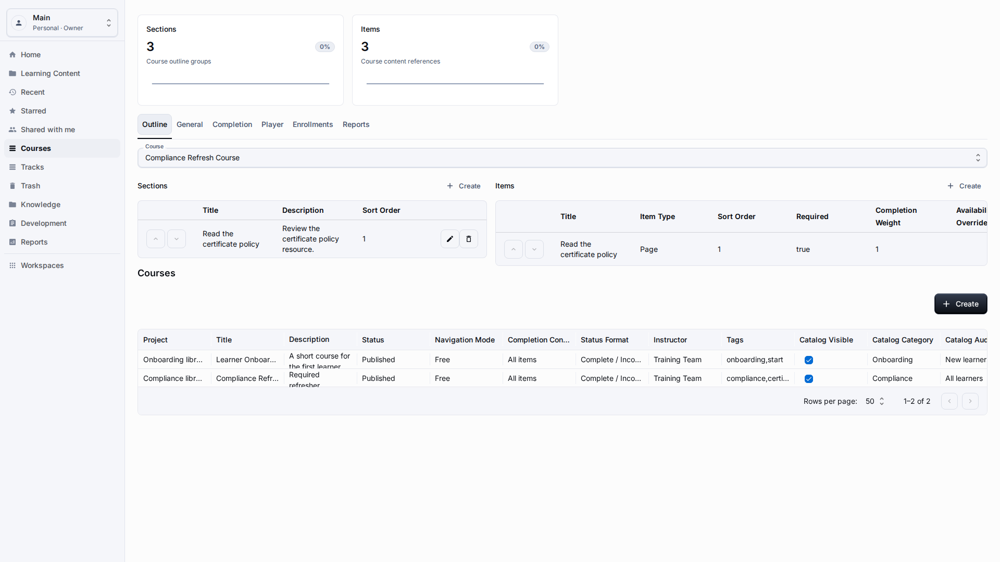
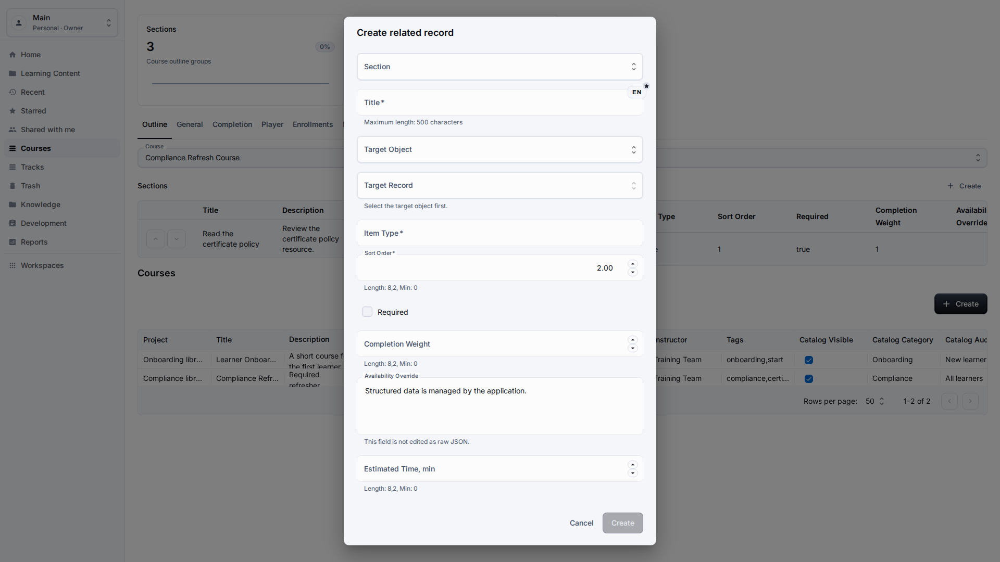
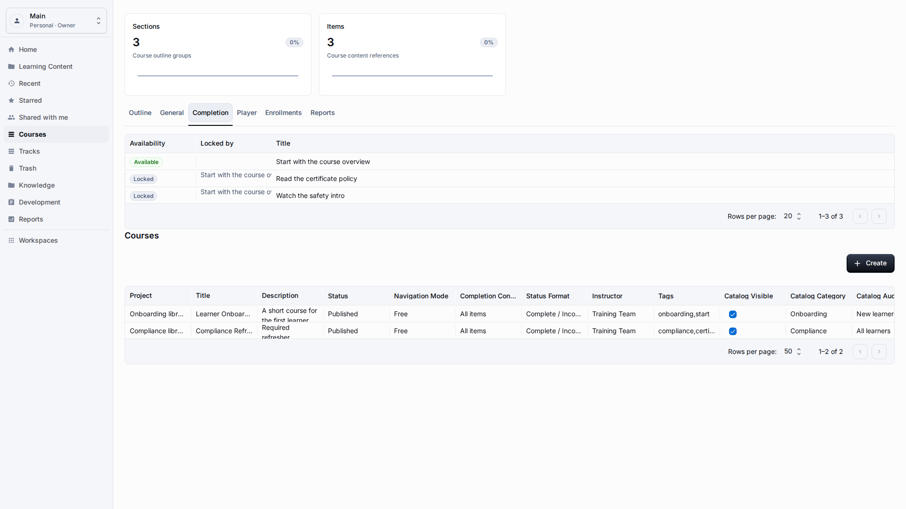
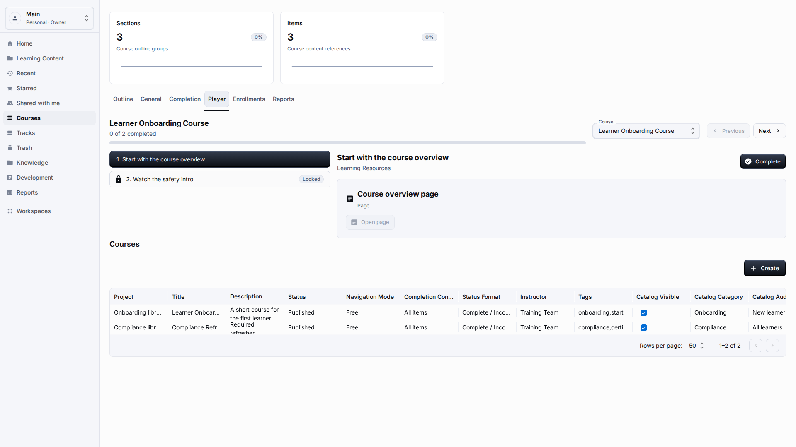

# Courses

**Role:** Teacher, content author, or workspace owner.

**Goal:** Build a course outline from existing content and review how learners will open it.

## What You Need

-   Create or find the page and link resources that belong in the course.
-   Open Courses from the sidebar or create a course from Learning Content.
-   Confirm that you can edit course outline records in the workspace.

## Workflow

1. Open Courses, select an existing course, and review General settings: title, description, instructor, publication status, and due-date behavior.
   
2. Open Outline, check that sections appear in the learner order, and use the section Create action when you need a new block in the outline.
   
3. Add an item from the Items area, choose the target section, and select the learning resource by its visible title rather than by an internal identifier.
   
4. Open Completion and confirm the rules that mark the course complete, including required items, score rules, and any due-date limits.
   
5. Open Player, start the learner preview, move through the first item, and verify that progress and the completion action are understandable.
   

## Screen Details

| Area          | How to use it                                                                                                                             |
| ------------- | ----------------------------------------------------------------------------------------------------------------------------------------- |
| Course shell  | The course shell stores the title, description, status, instructor, and player settings. Review these fields before adding outline items. |
| Outline order | Sections and items should follow the learner path. Put prerequisites before practice or assessment content.                               |
| Relations     | Relation pickers must show readable content titles. If you only see technical values, stop and report the screen.                         |
| Completion    | Completion settings define when a course is considered done. Check due dates and score requirements before publishing.                    |
| Preview       | Use the learner preview after major edits. Confirm the first item, navigation, quiz entry point, and final completion message.            |

## Result

The course outline is stored as workspace content. A learner should see the same item order that the author reviewed in Outline, and an author with sufficient rights can return to the same course to change sections, items, completion rules, or player settings.

## What To Check

Course builders should keep toolbar controls aligned and should not create page-level horizontal scrolling.

## Related Pages

-   [Page and Link Resources](resources-pages-links.md)
-   [Learner Experience](learner-experience.md)
-   [Reports](reports.md)
