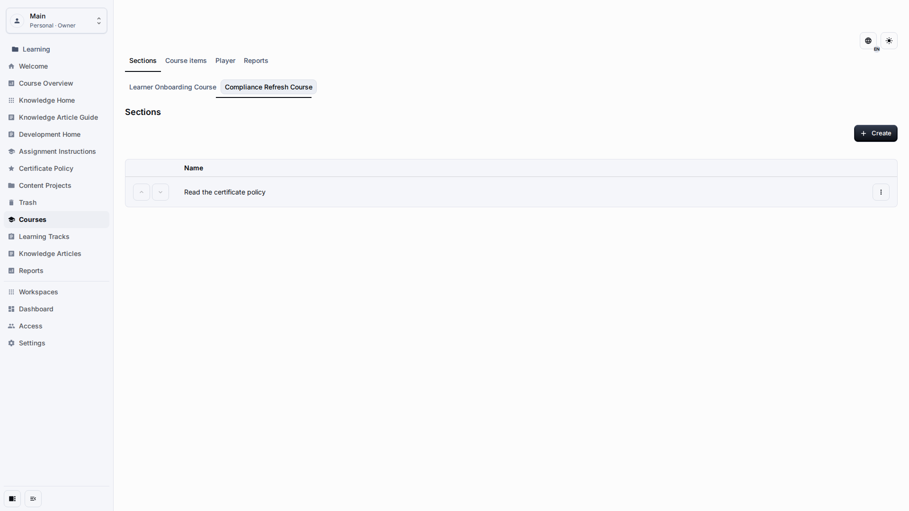
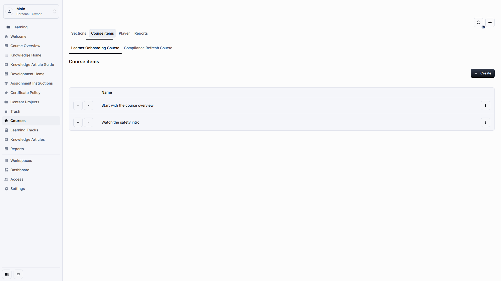
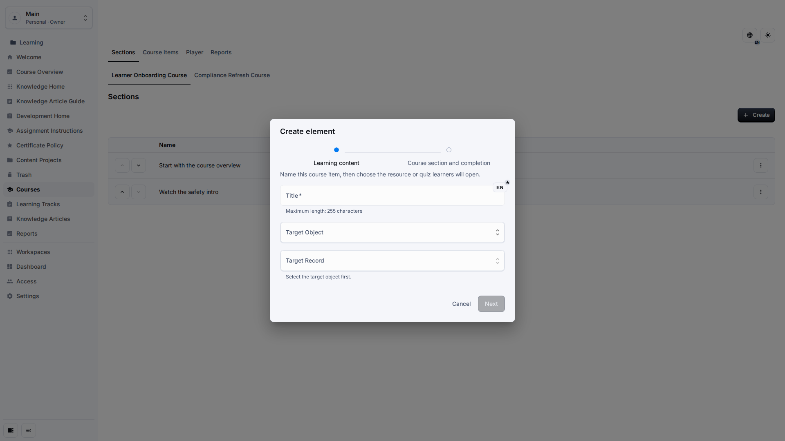
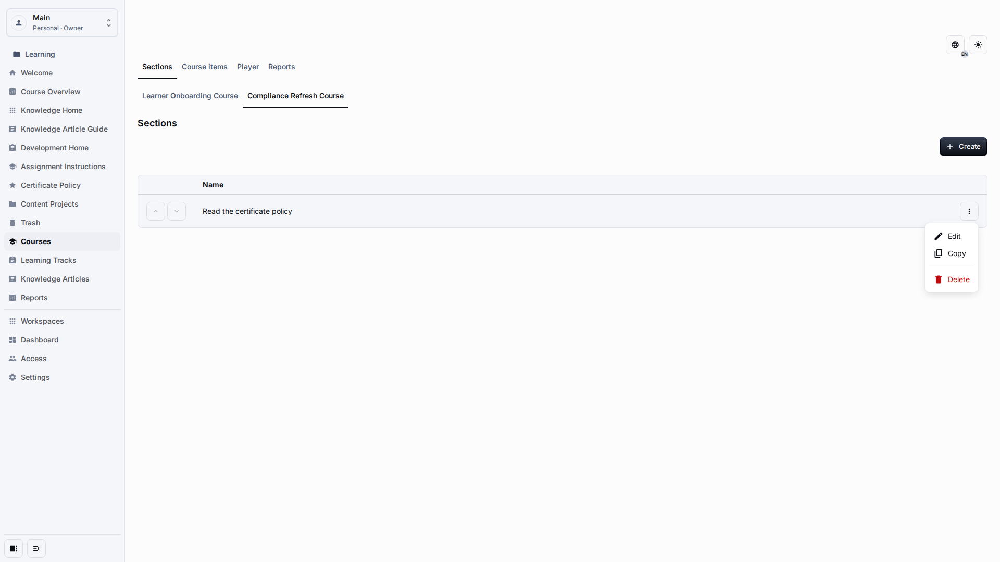
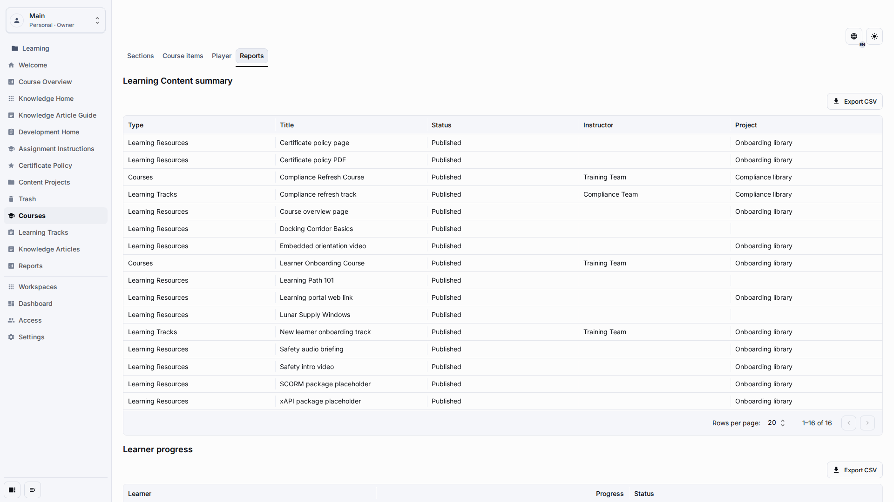

# Courses

**Role:** Teacher, content author, or workspace owner.

**Goal:** Build a course outline from existing content and review how learners will open it.

## What You Need

-   Create or find the page and link resources that belong in the course.
-   Open Courses from the sidebar or create a course from a content project.
-   Confirm that you can edit course outline records in the workspace.

## Workflow

1. Open Courses, select Compliance Refresh Course, and confirm its certificate-policy section appears.
   
2. Open Course items to review the items attached to the selected course.
   
3. Use Create in Course items to open the item form. Choose related content by its visible title, and cancel if you are only reviewing the available fields.
   
4. In Sections, open a section's action menu to review its options without changing the course.
   
5. Open Reports to review the selected course's activity.
   

## Screen Details

| Area               | How to use it                                                                                                                          |
| ------------------ | -------------------------------------------------------------------------------------------------------------------------------------- |
| Course selection   | The selected course scopes the related Sections and Course items shown in the builder. Use its visible title to confirm the context.   |
| Sections           | Review section order and use the available actions to maintain the course structure.                                                   |
| Course items       | Review or create the items attached to the selected course. Relation controls should show readable titles rather than raw identifiers. |
| Player and Reports | Use Player to inspect the learner experience and Reports to review available course activity.                                          |

## Result

Course sections and items are stored as workspace content. The builder exposes the selected course's related records, the learner Player, and available Reports in separate tabs.

## What To Check

Course builders should keep toolbar controls aligned and should not create page-level horizontal scrolling.

## Related Pages

-   [Page and Link Resources](resources-pages-links.md)
-   [Learner Experience](learner-experience.md)
-   [Reports](reports.md)
