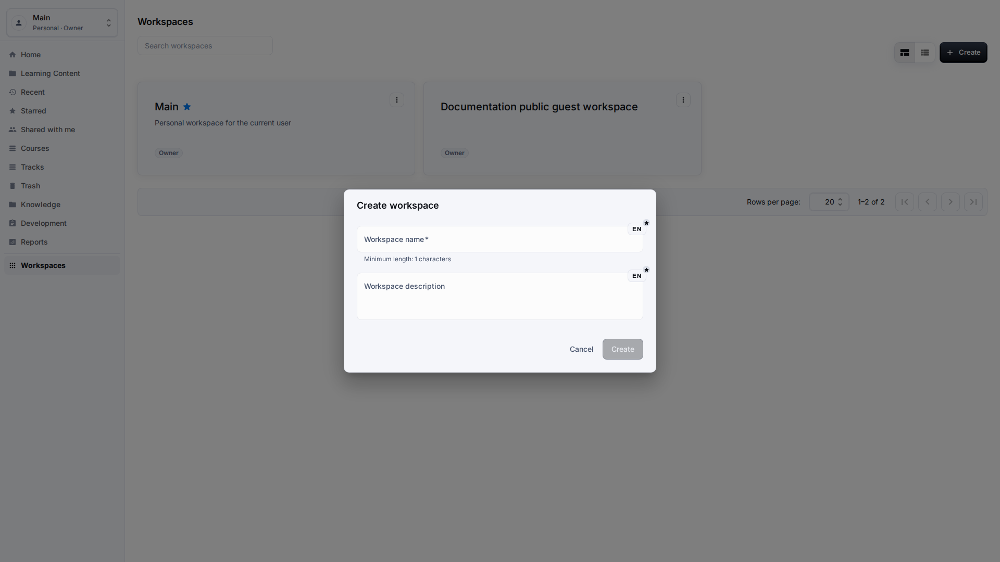
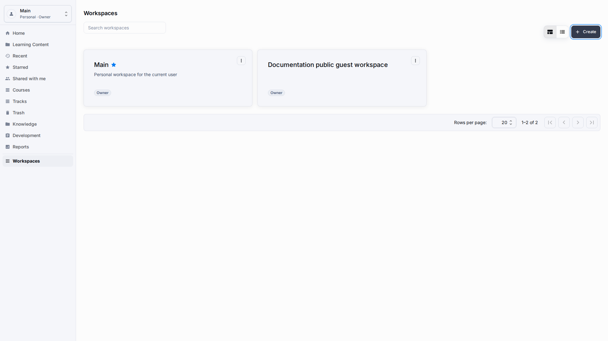
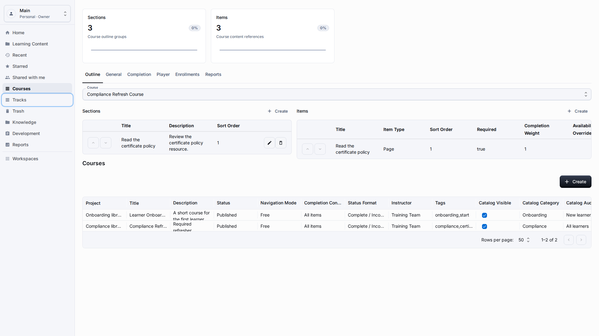
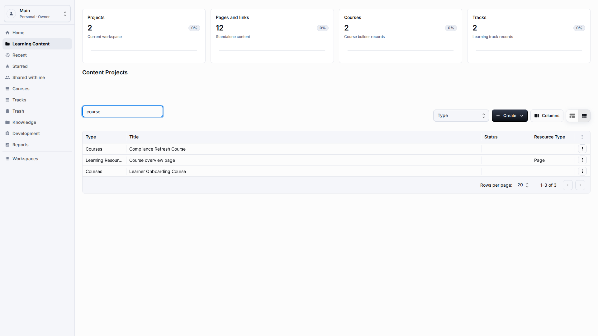
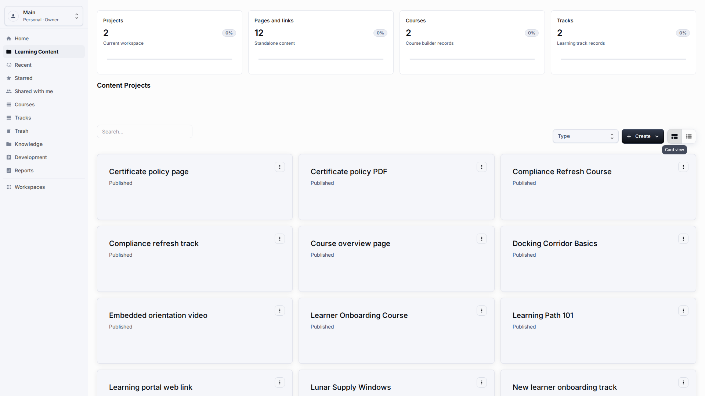
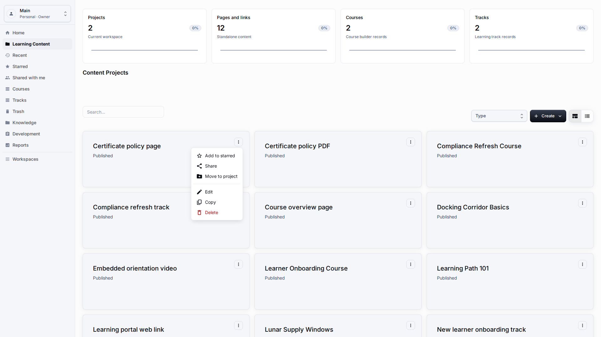

# Getting Around

**Role:** Any authenticated LMS user.

**Goal:** Find the correct section, workspace, list controls, and view mode before starting a task.

## What You Need

-   You are signed in and can see the LMS sidebar.
-   Your browser uses the language you want documented or tested.
-   The selected workspace is the one where you expect data to change.

## Workflow

1. Use the workspace menu to confirm the current workspace before creating, editing, deleting, or restoring records.
   
2. Use sidebar entries to move between Dashboard, Learning Content, Courses, Tracks, Knowledge, Development, Reports, and Workspaces.
   
3. Use search and type filters before changing columns when the table contains many rows.
   
4. Use the table/card toggle to switch between dense scanning and visual review.
   
5. Open item actions menu from the action button at the end of a row when you need Edit, Copy, Share, Move, Delete, or Restore.
   

## Screen Details

| Area               | How to use it                                                                                                                                                                         |
| ------------------ | ------------------------------------------------------------------------------------------------------------------------------------------------------------------------------------- |
| Workspace first    | Always confirm the workspace before changing rows. The same content title can exist in different workspaces with different sharing and reporting rules.                               |
| Navigation pattern | Use the sidebar for primary movement and the browser back button only when returning to the immediately previous screen. This keeps authoring context predictable.                    |
| Search and filters | Search should use the visible business title. Type filters are safer than column changes when you need to narrow a large list quickly.                                                |
| Views and actions  | Table view is best for scanning many records. Card view is useful for visual review. The item actions menu is the entry point for edit, copy, share, move, delete, and restore tasks. |
| Responsive check   | At narrow widths, controls should wrap instead of creating page-level horizontal scrolling. If scrolling appears on the whole page, treat it as a defect.                             |

## Result

You can reach each LMS section from the published application.

## What To Check

Navigation labels, validation messages, and table cells should be localized and user-facing.

## Related Pages

-   [Learning Content Library](learning-content-library.md)
-   [Sharing, Recent, Starred, and Trash](sharing-recent-favorites-trash.md)
-   [Troubleshooting](troubleshooting.md)
