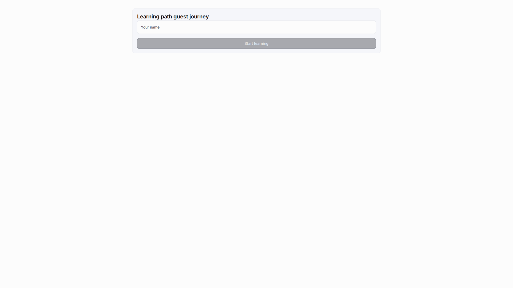
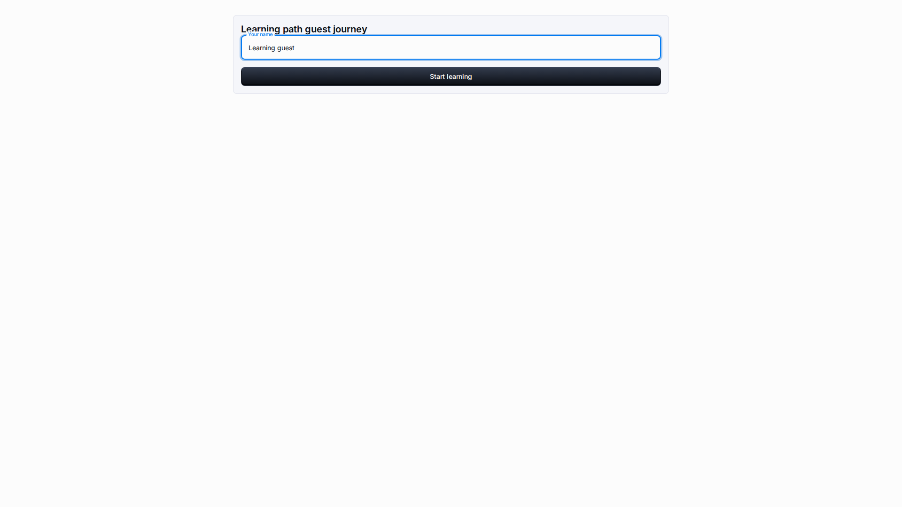
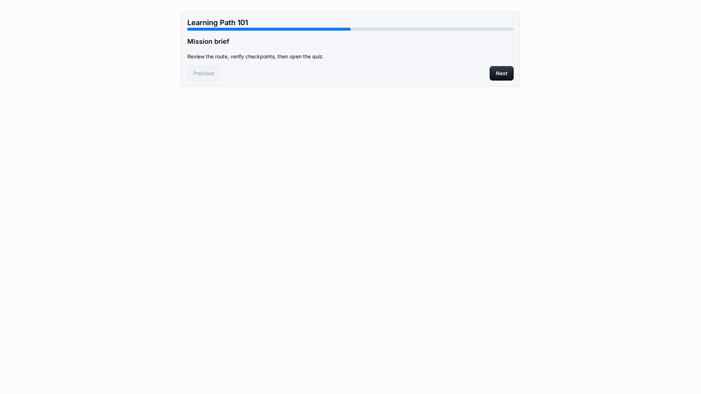
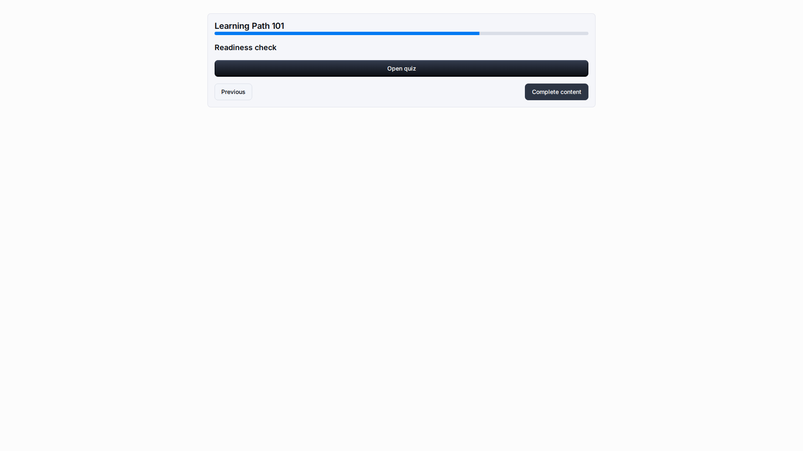
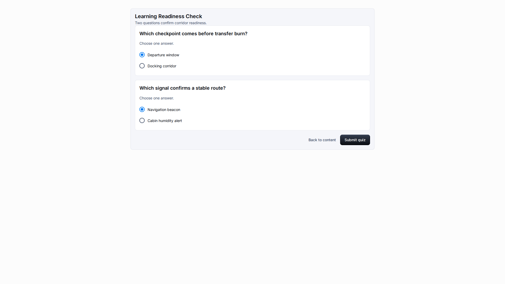

# Guest Access

**Role:** Guest learner or teacher checking a public link.

**Goal:** Start a public learning session without a platform account and record completion safely.

## What You Need

-   Open the public LMS access link provided by a teacher or administrator.
-   Use the language option or URL locale when a localized guest path is needed.
-   Enter a recognizable guest display name.

## Workflow

1. Open the public link and enter your display name.
   
2. Choose Start learning to create a guest session for the browser tab.
   
3. Read each content item and use Next to move through the sequence.
   
4. Open and submit the quiz if the content includes one.
   
5. Choose Complete content and confirm that completion is recorded.
   

## Screen Details

| Area               | How to use it                                                                                                            |
| ------------------ | ------------------------------------------------------------------------------------------------------------------------ |
| Display name       | The guest name identifies progress for the current public session. Use a real training name when testing with a teacher. |
| Session start      | Start learning creates a guest session for the browser tab. Do not share session URLs after starting.                    |
| Content navigation | Use Next only after reading the current item. The next item should show a readable title and body.                       |
| Quiz submission    | Answer all visible questions before submitting. The result screen should show a localized score summary.                 |
| Completion         | Complete content records progress for this session. The final message should confirm that progress was saved.            |

## Result

The guest can complete the assigned path without logging in as a platform user.

## What To Check

Guest pages should show only the public learning path, learner progress, and clear completion messages.

## Related Pages

-   [Learner Experience](learner-experience.md)
-   [Troubleshooting](troubleshooting.md)
