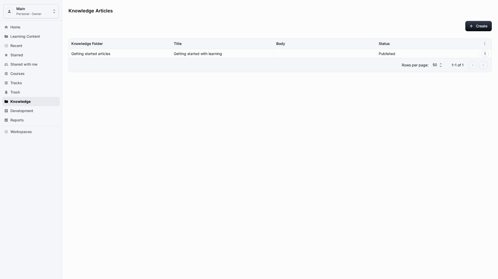
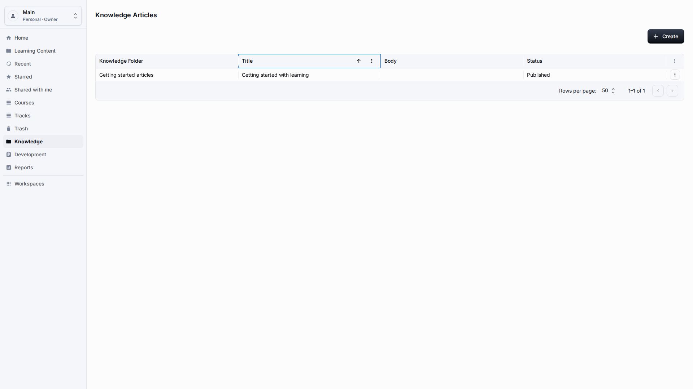
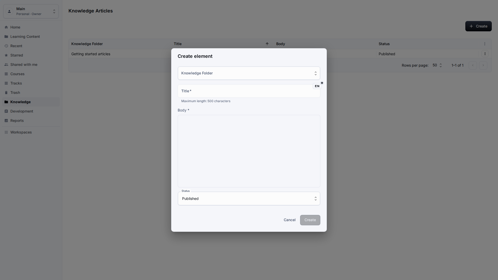
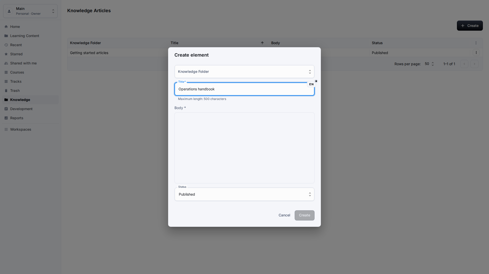
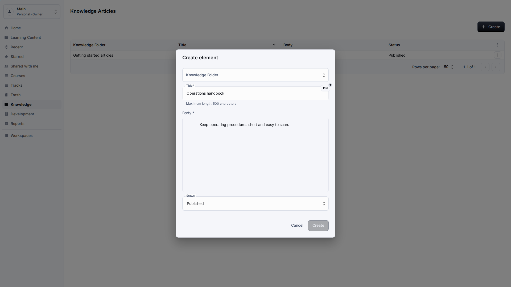
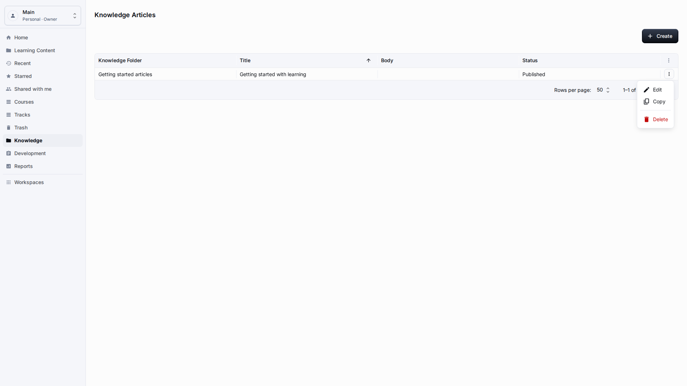

# Knowledge

**Role:** Teacher, knowledge author, or workspace owner.

**Goal:** Create and maintain knowledge articles that support courses and tracks.

## What You Need

-   Open Knowledge from the sidebar.
-   Choose the folder where the article belongs.
-   Prepare article title and body content.

## Workflow

1. Open Knowledge and sort or review existing folders and articles by a readable title.
   
2. Choose Create when you need a new article.
   
3. Select a folder by readable name and enter the localized title.
   
4. Write the body in the block editor and save the article.
   
5. Use Edit when the article needs an update after publication.
   

## Screen Details

| Area             | How to use it                                                                                                                    |
| ---------------- | -------------------------------------------------------------------------------------------------------------------------------- |
| Knowledge scope  | Use Knowledge for reference articles that support learning but are not necessarily part of a formal course path.                 |
| Article creation | Create articles with a localized title, folder, and learner-facing body. Avoid internal implementation notes in visible content. |
| Folders          | Folders should be named by topic or audience. Select them by visible name and keep the structure shallow enough to browse.       |
| Editing          | Use Edit for corrections, policy updates, and content refreshes. Confirm the updated article is still easy to find by title.     |
| Quality check    | Knowledge pages should not expose raw record IDs, object names, or editor data structures in the published view.                 |

## Result

Knowledge articles become workspace content that can support onboarding, compliance, and reference scenarios.

## What To Check

Article body fields should use the block editor and should not show technical editor data in normal lists.
The published article should read like learner support material, with clear paragraphs, visible folder placement, and a title that other authors can recognize when they update linked courses later.

## Related Pages

-   [Page and Link Resources](resources-pages-links.md)
-   [Learning Content Library](learning-content-library.md)
