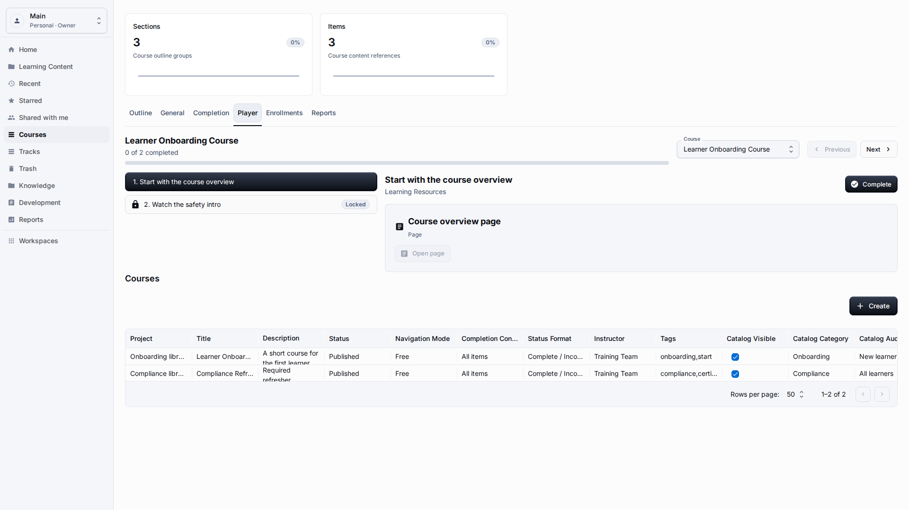
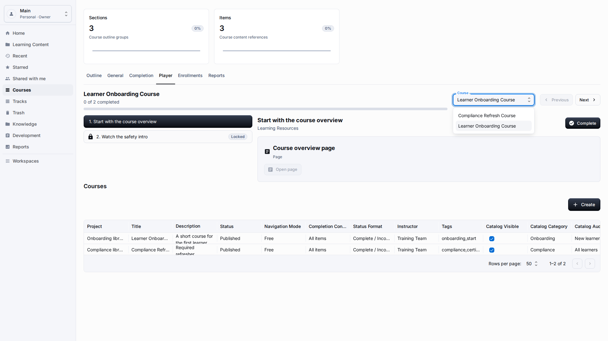
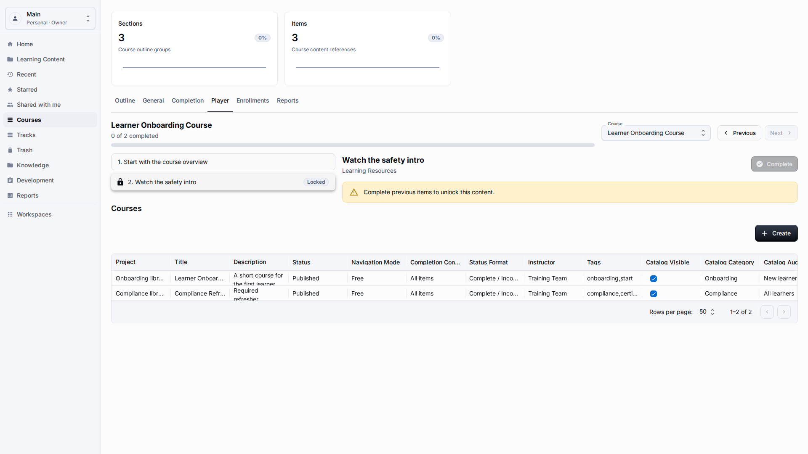
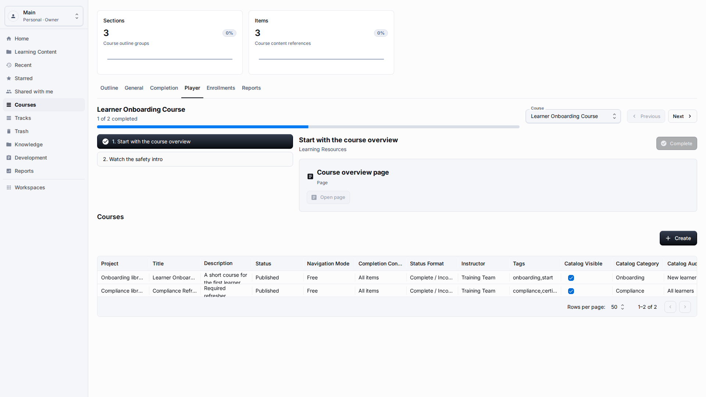
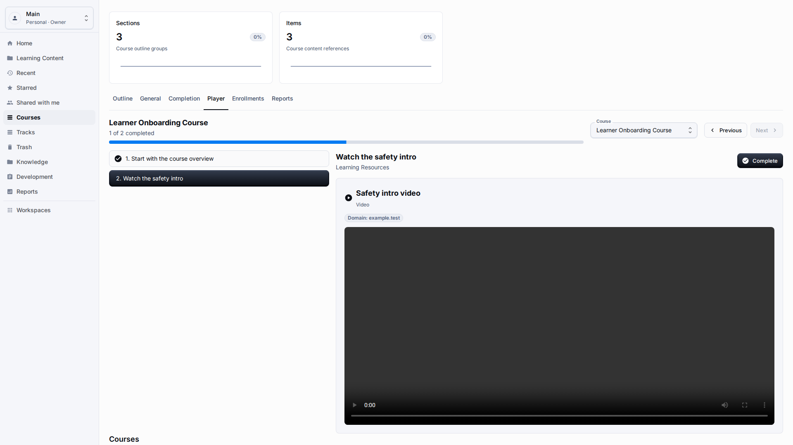
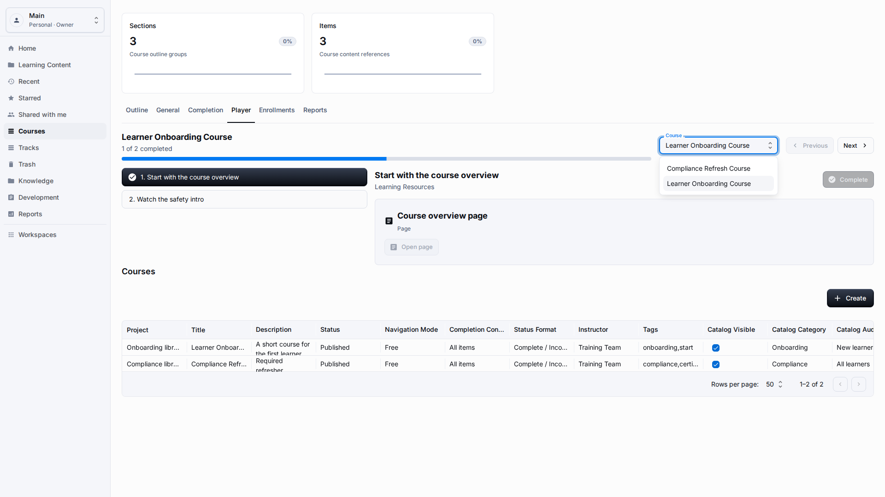

# Learner Experience

**Role:** Learner or teacher checking the learner path.

**Goal:** Open assigned content and verify progress without seeing authoring-only controls.

## What You Need

-   Open the application as a user who can view the content.
-   Choose the correct workspace or follow the assigned link.
-   Use the player controls rather than changing the authoring version of the content.

## Workflow

1. Open Courses and select the Player tab for an assigned course.
   
2. Read the selected content item and use the outline when the player shows one.
   
3. Select Complete for the current item when the learner has finished it.
   
4. Use Next or the outline to continue to the next available item.
   
5. Reload the page and confirm that the progress remains visible.
   

## Screen Details

| Area              | How to use it                                                                                                                      |
| ----------------- | ---------------------------------------------------------------------------------------------------------------------------------- |
| Entry points      | Learners can start from Dashboard, Learning Content, Courses, Tracks, Recent, or a public link depending on access.                |
| Player content    | The player should show the current item title, body content, and visible navigation without requiring hidden platform knowledge.   |
| Progress          | Progress should update after meaningful actions such as moving to the next item, submitting a quiz, or completing content.         |
| Completion action | Use the visible completion button only after the learner has reviewed the required item. The confirmation message should be clear. |
| Persistence       | Reload the page or return through Recent when checking persistence. Completion should remain visible for the same session or user. |

## Result

Learner progress is recorded by the application instead of being typed by the learner.

## What To Check

Learner pages should show progress and content labels, not hidden workspace values or storage details.

## Related Pages

-   [Courses](courses.md)
-   [Learning Tracks](learning-tracks.md)
-   [Guest Access](guest-access.md)
