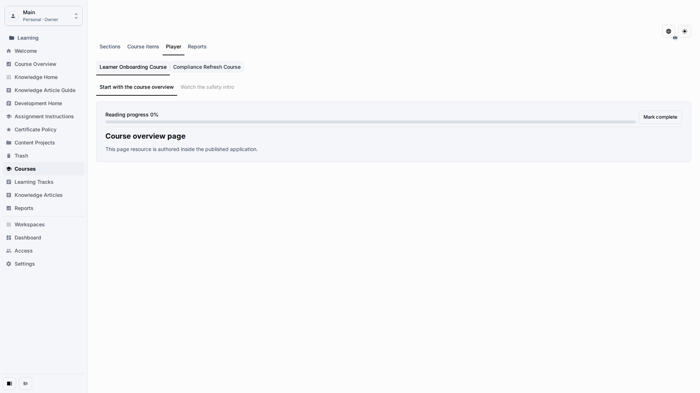
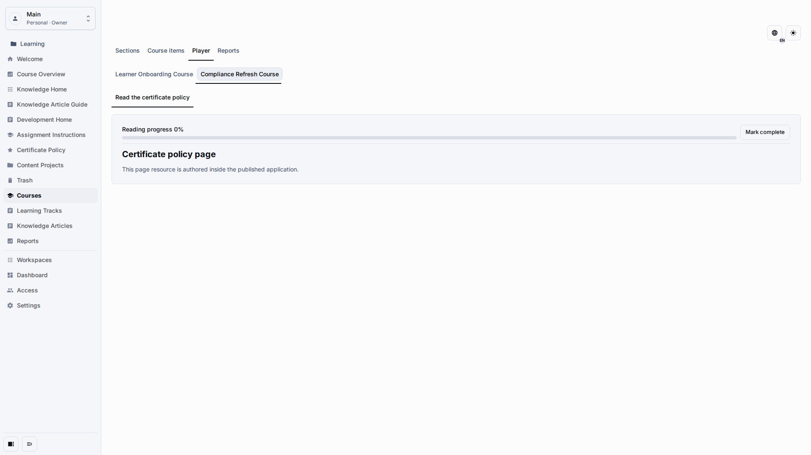
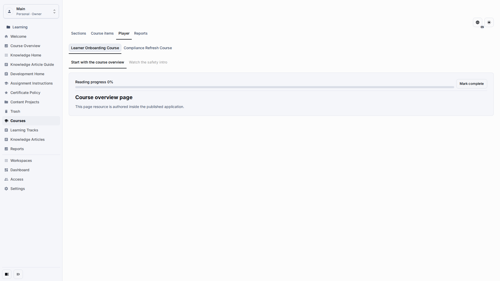
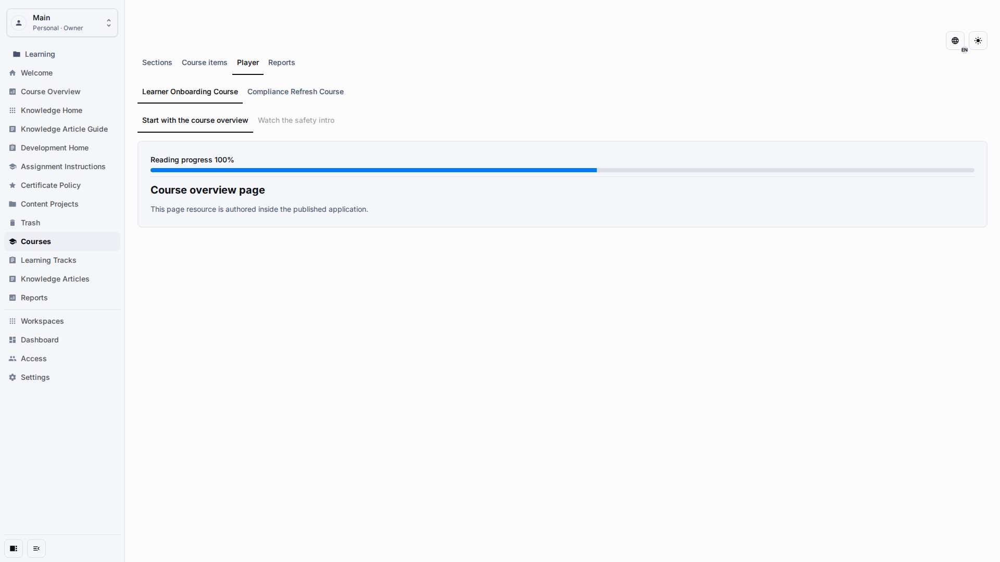
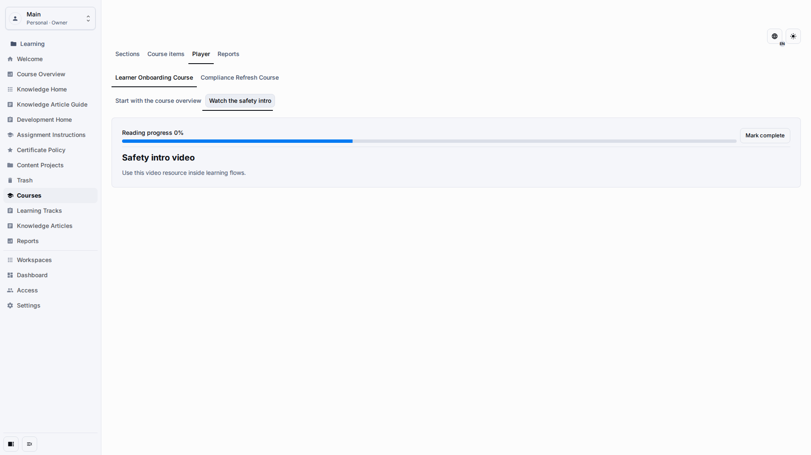
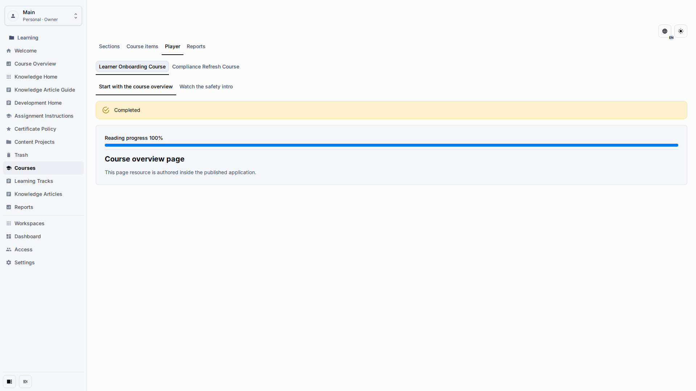

# Learner Experience

**Role:** Learner or teacher checking the learner path.

**Goal:** Open assigned content and verify progress without seeing authoring-only controls.

## What You Need

-   Open the application as a user who can view the content.
-   Choose the correct workspace or follow the assigned link.
-   Use the player controls rather than changing the authoring version of the content.

## Before You Start

-   Confirm that the course is available in the Player course tabs. If it is missing, ask the course owner to check your access.
-   Learning items can have prerequisites. A disabled next item means that an earlier required item still needs to be completed.
-   Wait for the progress status to update before refreshing or leaving the page.

## Workflow

1. Open Courses, select Player, and use the course tabs to inspect an available course.
   
2. Select the assigned Learner Onboarding Course. Confirm that its first item is available and the next item stays locked until completion.
   
3. Select Mark complete when the learner has finished reading the item.
   
4. Reopen Player after completion and select the now available next learning item.
   
5. Reload the page and confirm that the progress remains visible.
   

## Screen Details

| Area              | How to use it                                                                                                    |
| ----------------- | ---------------------------------------------------------------------------------------------------------------- |
| Entry points      | Learners can open assigned Courses or Tracks, or follow a public link when one is available.                     |
| Player content    | The player shows the selected course or track, its learning items, and the current item's content.               |
| Progress          | Completing a required item updates its progress and unlocks the next item when the sequence requires it.         |
| Completion action | Use Mark complete only after the learner has reviewed the required item. The visible progress should reach 100%. |
| Persistence       | Reload the player and confirm the completed state remains visible and the next required item stays available.    |

## Result

Learner progress is recorded by the application instead of being typed by the learner.

## What To Check

Learner pages should show progress and content labels, not hidden workspace values or storage details.

## Related Pages

-   [Courses](courses.md)
-   [Learning Tracks](learning-tracks.md)
-   [Guest Access](guest-access.md)
