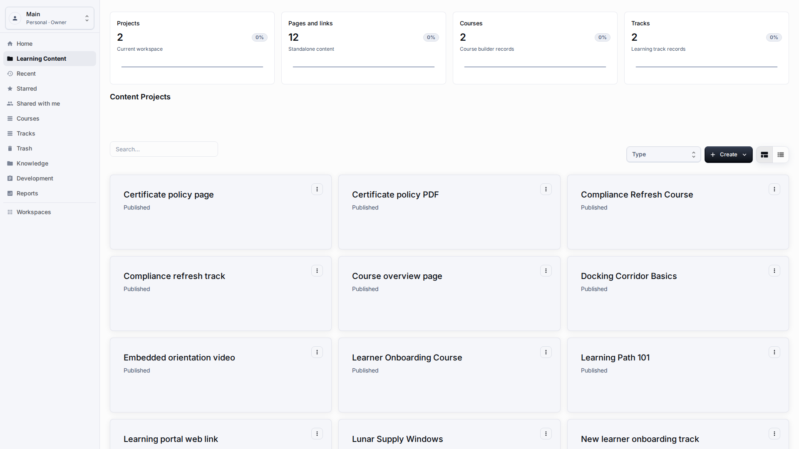
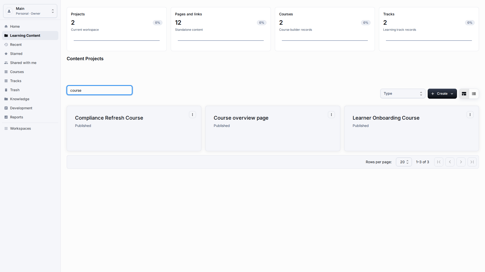
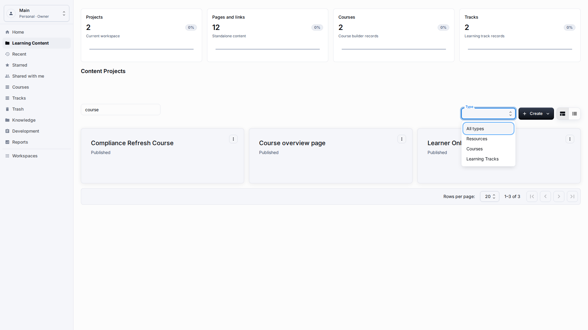
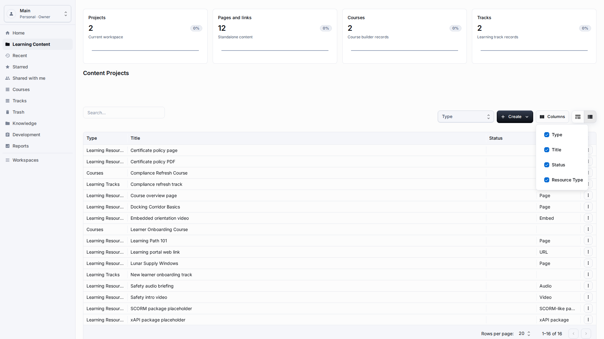
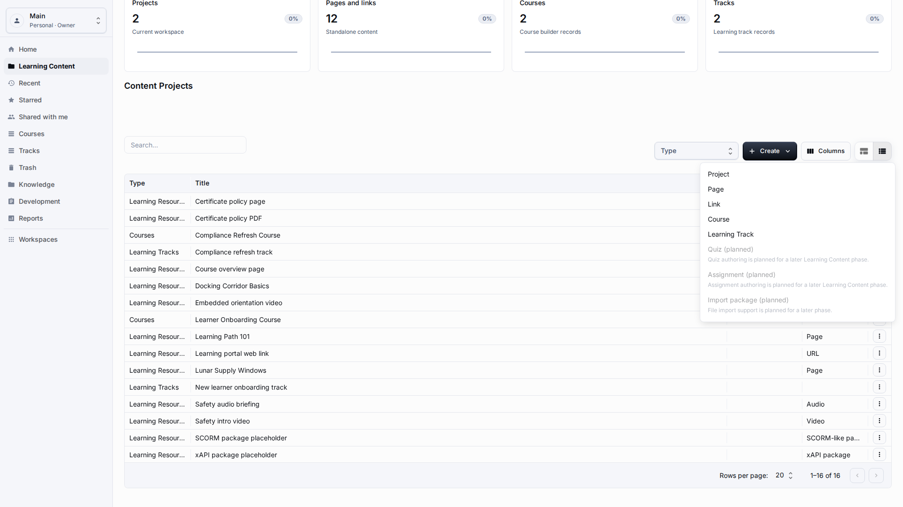
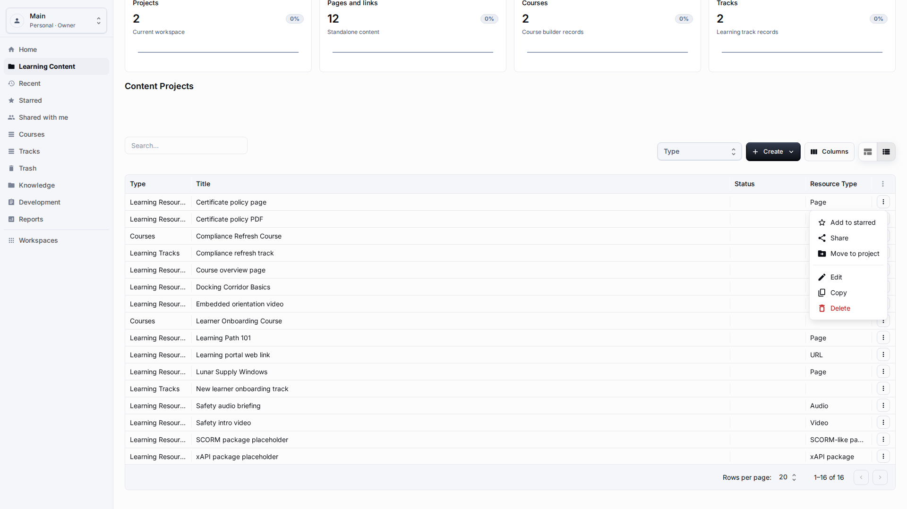

# Learning Content Library

**Role:** Teacher, content author, or workspace owner.

**Goal:** Find, filter, create, and manage resources, courses, and learning tracks from one library.

## What You Need

-   Open the Learning Content section from the sidebar.
-   Confirm that you are in the workspace where content belongs.
-   Make sure you have permission to create and edit content.

## Workflow

1. Use Search to find a resource, course, track, or project by visible title.
   
2. Use the Type filter to narrow the unified list to resources, courses, or learning tracks.
   
3. Use Columns when you need to show or hide user-facing business fields.
   
4. Use Create to add a project, page, link, course, or learning track from the same toolbar.
   
5. Use item actions menu for edit, copy, share, move to project, delete, or restore workflows.
   

## Screen Details

| Area            | How to use it                                                                                                                                                               |
| --------------- | --------------------------------------------------------------------------------------------------------------------------------------------------------------------------- |
| Unified list    | The library combines projects, standalone resources, courses, and learning tracks in one operational list. Use Type and title together to avoid opening the wrong record.   |
| Search behavior | Search is intended for visible titles, not internal codes. Clear the search before creating a new item so you can confirm the saved row appears.                            |
| Columns         | Column settings should expose business fields only. Hide columns you do not need for the current task instead of dragging the page horizontally.                            |
| Create menu     | Create opens the available content types for the current workspace. Pick the target type first, then fill the localized fields in the dialog.                               |
| Item lifecycle  | Use item actions menu for edit, copy, share, move to project, delete, and restore. Each action should keep readable titles visible and should not require technical values. |

## Result

The library becomes the main daily workspace for Learning Content authors.

## What To Check

The table should show titles and labels, not unreadable technical values, incorrectly formatted dates, or internal field names.

## Related Pages

-   [Projects](projects.md)
-   [Page and Link Resources](resources-pages-links.md)
-   [Courses](courses.md)
-   [Learning Tracks](learning-tracks.md)
