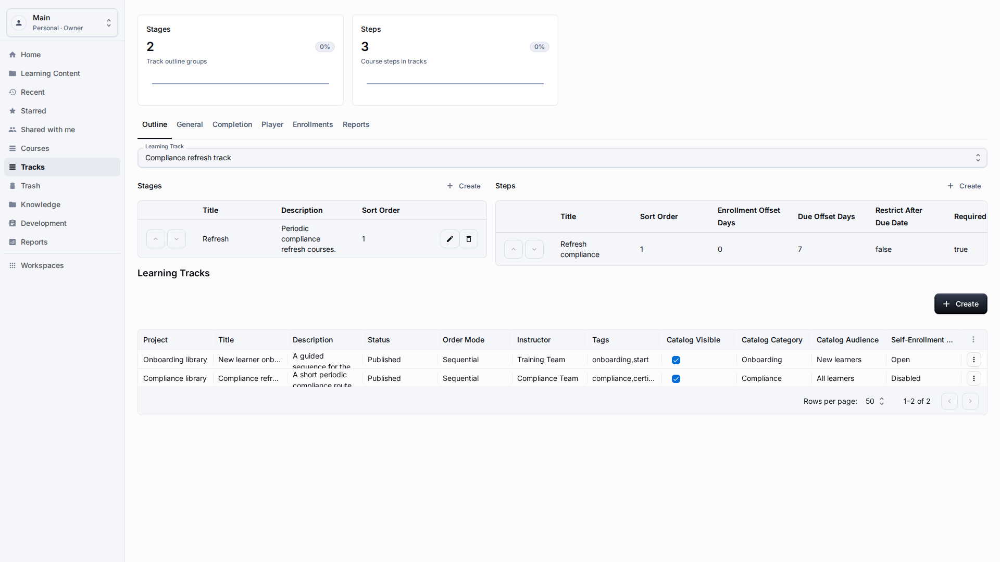
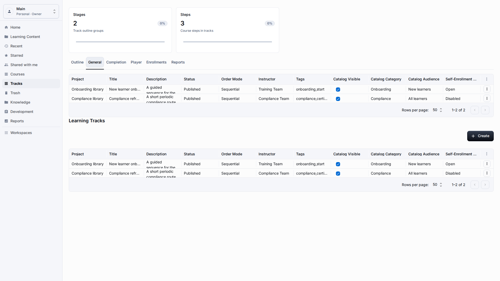
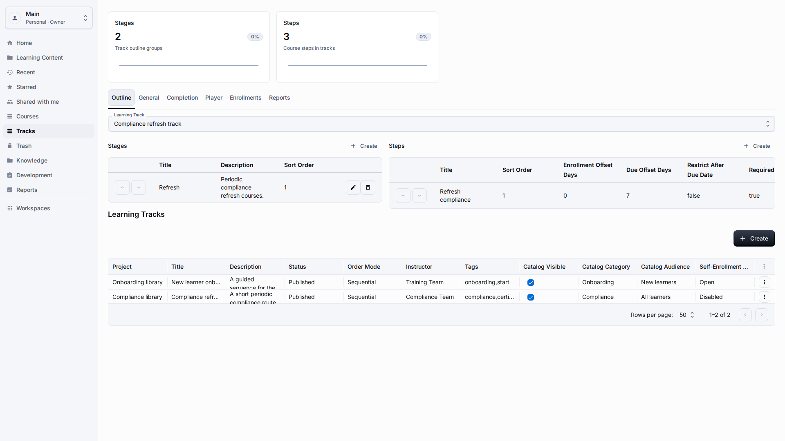
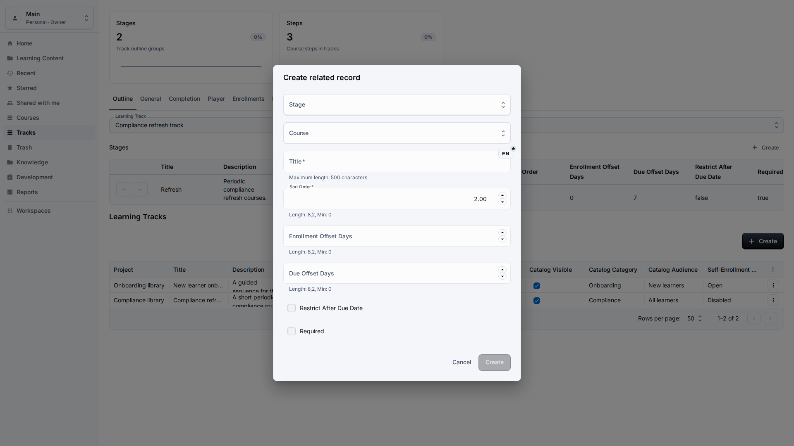
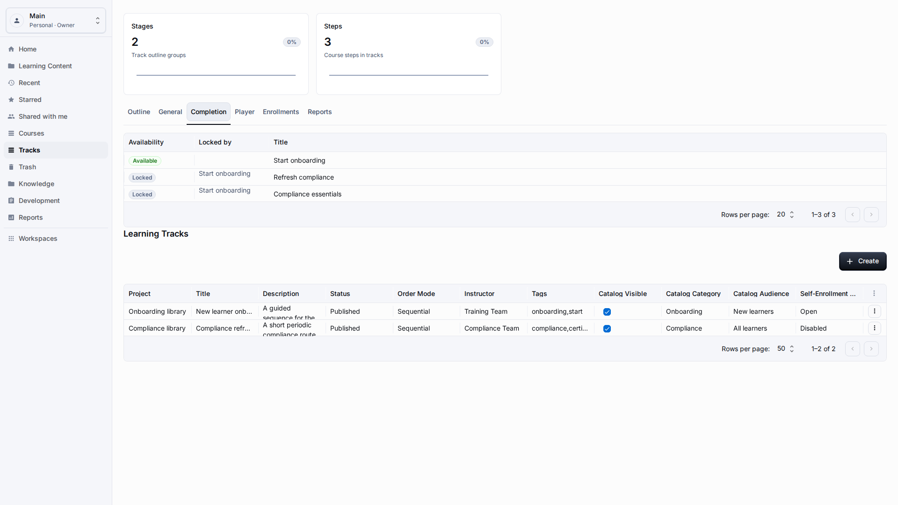
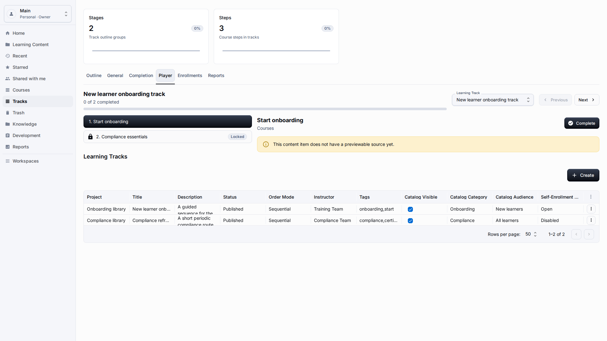

# Learning Tracks

**Role:** Teacher, content author, or workspace owner.

**Goal:** Create an ordered learning path with stages, steps, and learner progress.

## What You Need

-   Prepare the courses or resources that belong in the track.
-   Open Tracks from the sidebar or create a track from Learning Content.
-   Choose whether learners follow the track in a fixed or flexible order.

## Workflow

1. Open Tracks, select a track, and review General settings: title, description, status, owner, and whether the path should be fixed or flexible.
   
2. Open Outline and create stages for the major milestones learners should recognize, such as onboarding, practice, and final review.
   
3. Add track steps inside the selected stage, choose the content type, and select the course or resource by visible title.
   
4. Open Completion and check the rules that decide when the whole track is complete, including required steps and scoring expectations.
   
5. Open Player, run the learner view, and confirm that stage names, step order, progress, and final completion behavior are clear.
   

## Screen Details

| Area             | How to use it                                                                                                                       |
| ---------------- | ----------------------------------------------------------------------------------------------------------------------------------- |
| Track shell      | A track represents a longer path across several learning items. Keep the title outcome-oriented so learners understand the purpose. |
| Stages           | Stages group steps into milestones. Use them for onboarding phases, compliance blocks, or skill levels.                             |
| Steps            | Each step should reference content by title and appear in the intended order. Review the list after reordering.                     |
| Completion rules | Completion settings should match the path design. Avoid publishing a track until required steps and scoring rules are clear.        |
| Learner check    | Open the learner view to verify that stage names, step order, and progress indicators are understandable.                           |

## Result

The learning track guides learners through a multi-step path inside the current workspace. Authors can return to the same track to adjust stage order, replace steps, or update completion rules before learners start the path.

## What To Check

Track step pickers should display titles and statuses, not relation IDs.

## Related Pages

-   [Courses](courses.md)
-   [Learner Experience](learner-experience.md)
-   [Reports](reports.md)
