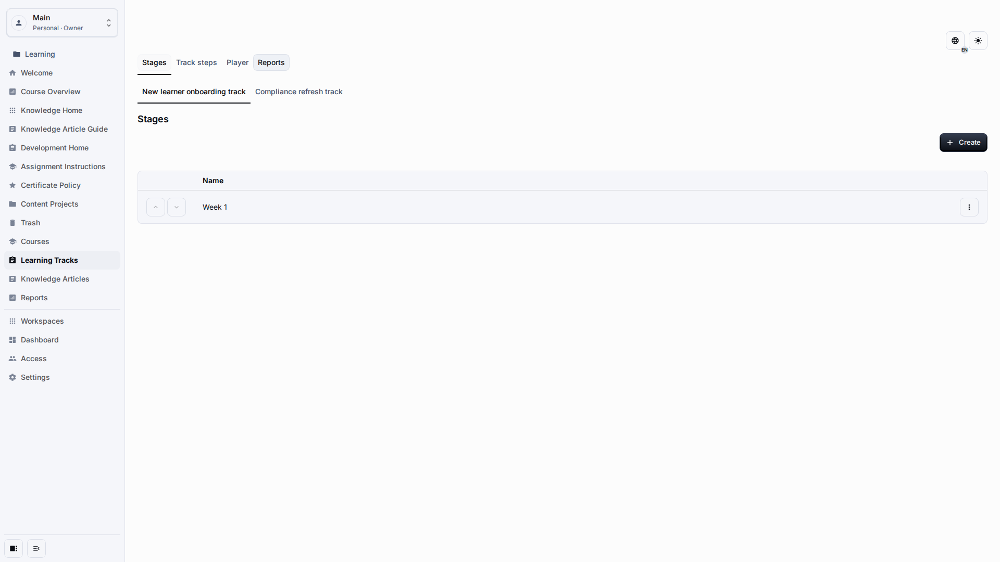
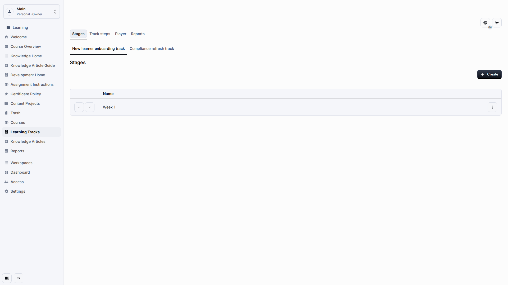
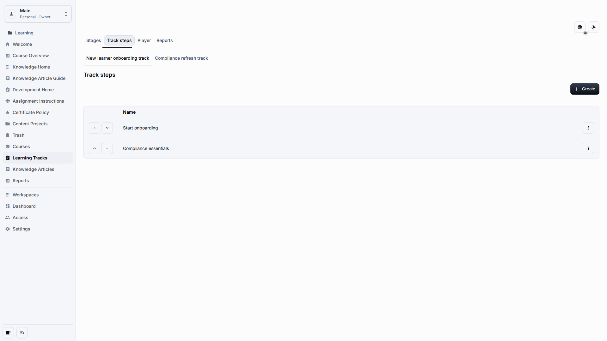
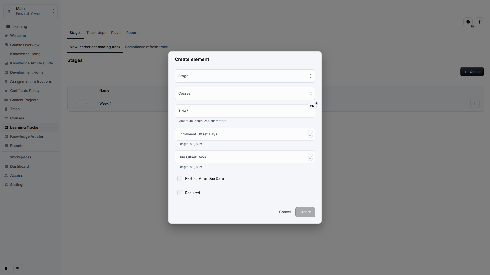
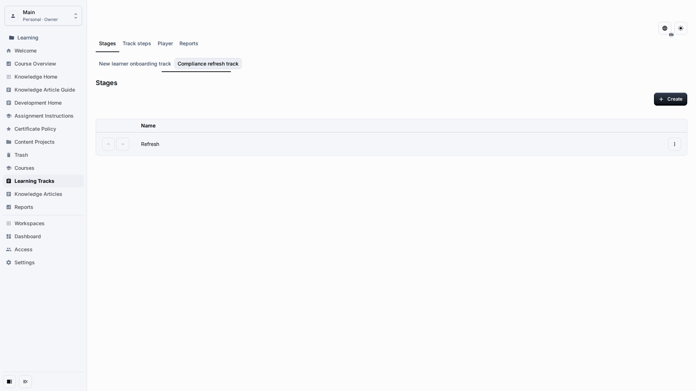
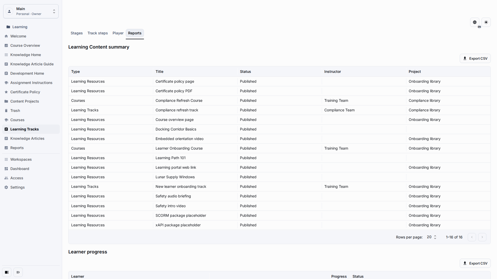

# Learning Tracks

**Role:** Teacher, content author, or workspace owner.

**Goal:** Create an ordered learning path with stages, steps, and learner progress.

## What You Need

-   Prepare the courses or resources that belong in the track.
-   Open Learning Tracks from the sidebar or create a track from a content project.
-   Choose whether learners follow the track in a fixed or flexible order.

## Workflow

1. Open Learning Tracks and select a track. The Stages view shows the selected track and its ordered stages.
   
2. Open Track steps to review the steps attached to the selected track.
   
3. Use Create in Track steps to open the step form. Choose related content by its visible title, and cancel if you are only reviewing the available fields.
   
4. Select another track by its title to review that track's stages or steps without leaving the builder.
   
5. Open Reports to review activity for the selected track.
   

## Screen Details

| Area               | How to use it                                                                                                                         |
| ------------------ | ------------------------------------------------------------------------------------------------------------------------------------- |
| Track selection    | The selected track scopes the related Stages and Track steps shown in the builder. Use its visible title to confirm the context.      |
| Stages             | Review stage order and use the available actions to maintain the learning path.                                                       |
| Track steps        | Review or create the steps attached to the selected track. Relation controls should show readable titles rather than raw identifiers. |
| Player and Reports | Use Player to inspect the learner experience and Reports to review available track activity.                                          |

## Result

Track stages and steps are stored as workspace content. The builder exposes the selected track's related records, the learner Player, and available Reports in separate tabs.

## What To Check

Track step pickers should display titles and statuses, not relation IDs.

## Related Pages

-   [Courses](courses.md)
-   [Learner Experience](learner-experience.md)
-   [Reports](reports.md)
