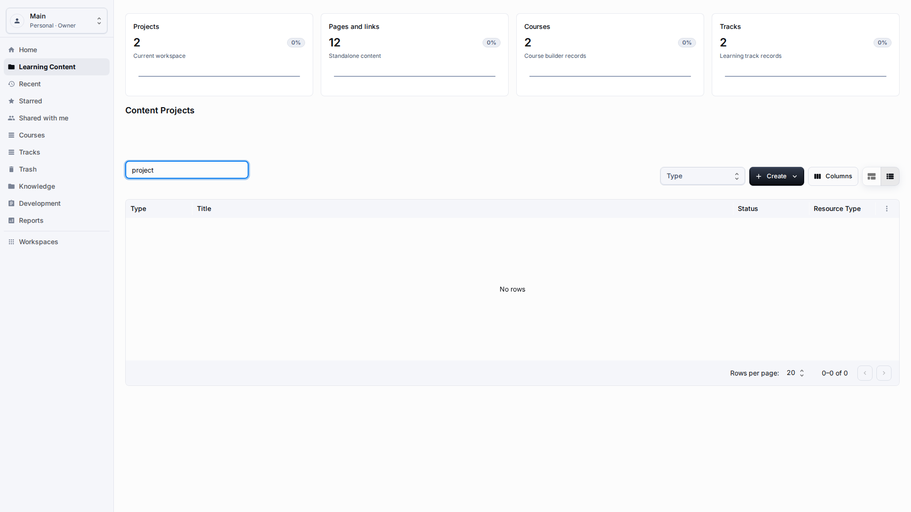
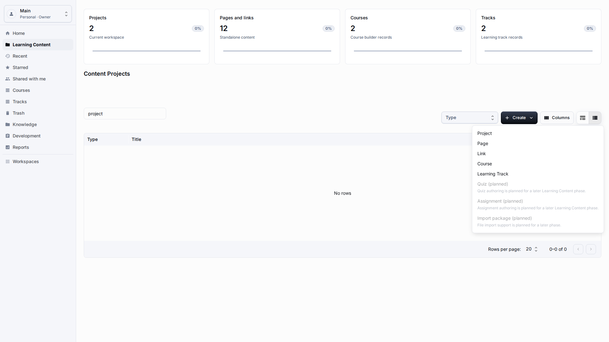
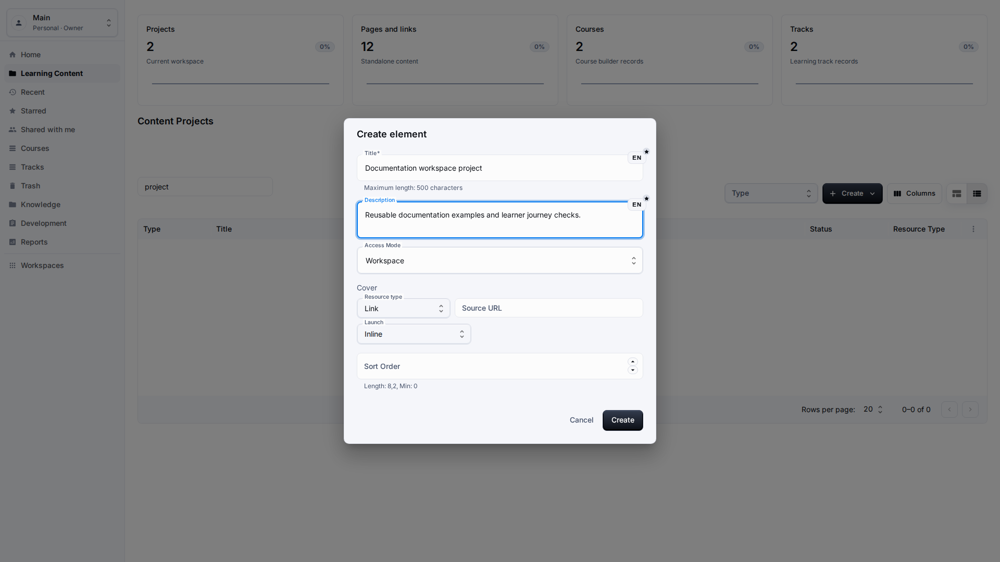
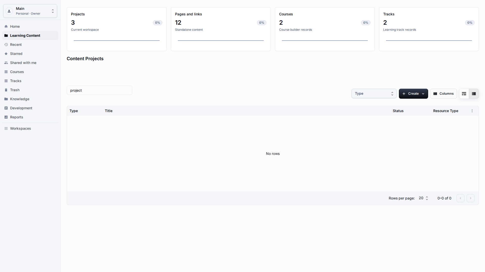
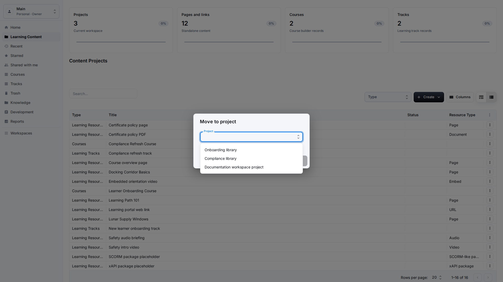
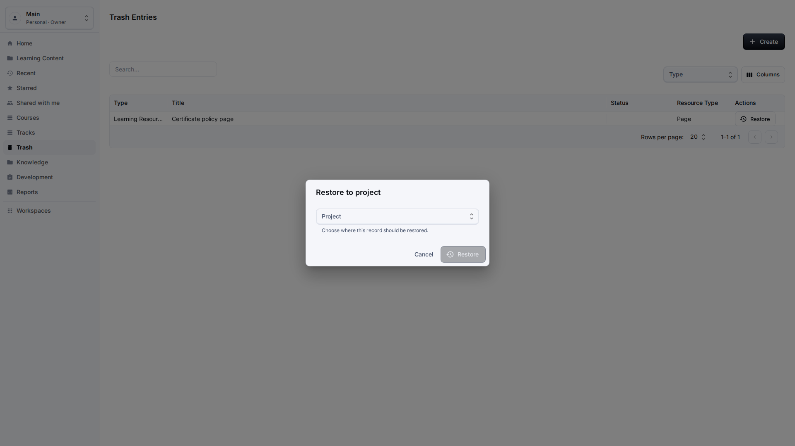

# Projects

**Role:** Teacher, content author, or workspace owner.

**Goal:** Create project containers and keep content grouped without confusing projects with platform workspaces.

## What You Need

-   Open Learning Content in the correct workspace.
-   Decide the project title and short purpose before creating it.
-   Confirm whether content should stay in the current project or move to another one.

## Workflow

1. Open Create and choose Project.
   
2. Enter a clear project title and description that other authors can recognize.
   
3. Save the project and confirm that the Projects summary increases in the current workspace.
   
4. Open the item actions menu and choose Move to project; the new project should appear by name in the picker.
   
5. Use Trash and Restore when a project or item was removed by mistake.
   

## Screen Details

| Area              | How to use it                                                                                                                                                         |
| ----------------- | --------------------------------------------------------------------------------------------------------------------------------------------------------------------- |
| Project purpose   | A project groups related resources, courses, and tracks inside the active workspace. Use a clear title that another author can recognize in filters and move dialogs. |
| Create fields     | Fill the localized title and description before saving. The description should explain what belongs in the project and who maintains it.                              |
| Project summary   | After saving, the Projects summary should increase for the current workspace. Use move and restore dialogs to choose a project by readable name.                      |
| Moving content    | Use Move to project from the item actions menu when an item belongs to another project. Choose the destination by title, not by technical value.                      |
| Trash and restore | Deleted projects or items should stay recoverable from Trash. Restore to an existing valid project when the original container is no longer available.                |

## Result

Projects group content inside the selected application workspace.

## What To Check

Moving content should use project names in pickers, not hidden project values.

## Related Pages

-   [Learning Content Library](learning-content-library.md)
-   [Sharing, Recent, Starred, and Trash](sharing-recent-favorites-trash.md)
