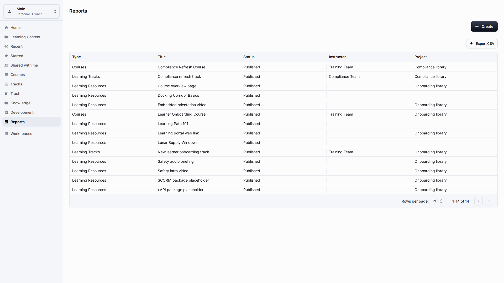
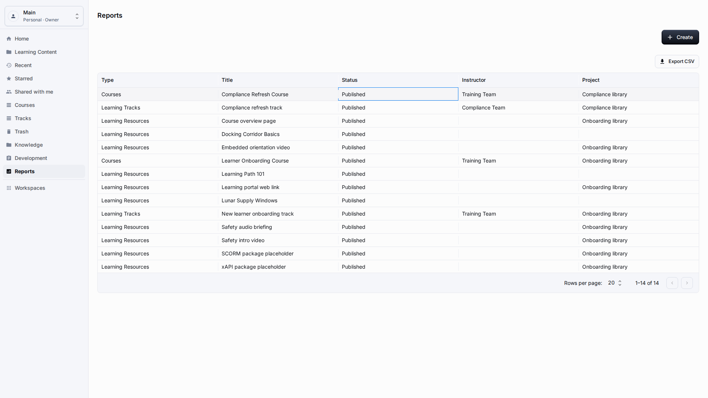
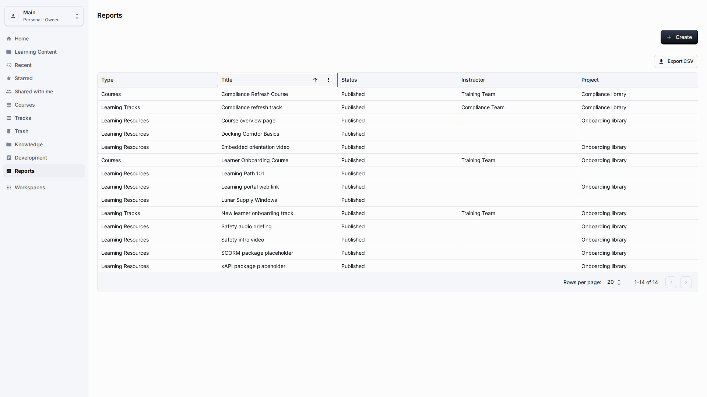
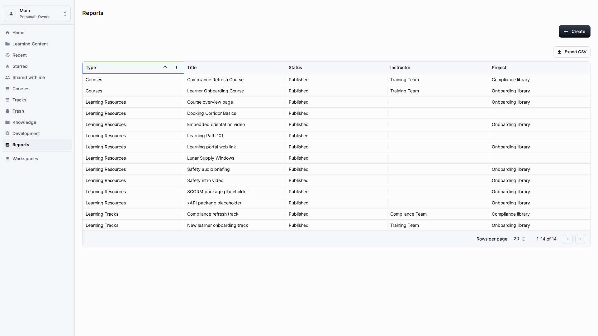
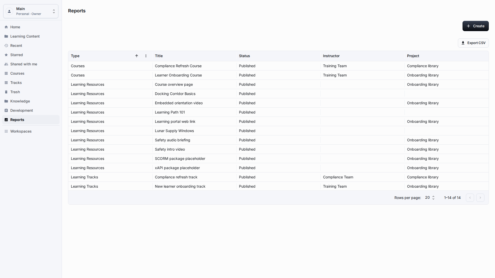
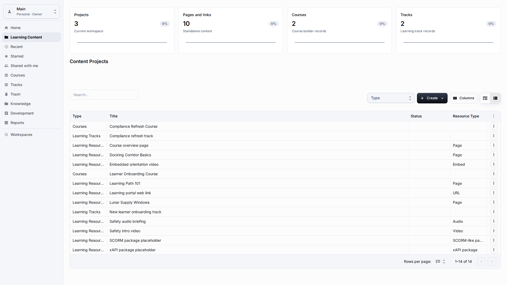

# Reports

**Role:** Workspace owner, teacher, or report viewer.

**Goal:** Use report tables to review Learning Content without exposing technical report details.

## What You Need

-   Open Reports from the sidebar.
-   Confirm that the selected workspace contains the data you want to analyze.
-   Decide whether you only need to read the table or export it.

## Workflow

1. Open Reports from the sidebar and focus the first readable report row after the table finishes loading.
   
2. Review Type, Title, Status, Instructor, and Project columns, and confirm that each row is readable without opening a technical record.
   
3. Click a business column header, such as Type, to sort the table and check that the order matches your review question.
   
4. Focus the Export CSV action and use it only after the on-screen rows contain the data you expect to analyze outside the application.
   
5. Return to Learning Content when a report row points to a course, track, or resource that needs correction, then reopen Reports to verify the result.
   

## Screen Details

| Area             | How to use it                                                                                                                      |
| ---------------- | ---------------------------------------------------------------------------------------------------------------------------------- |
| Report loading   | Wait until the report table finishes loading before reading totals. Empty charts should use localized empty states.                |
| Business columns | Use Type, Title, Status, Instructor, Project, and completion fields as business signals. They should be readable without IDs.      |
| Sorting          | Sort visible business columns before exporting or comparing. The visible order should match the question you are trying to answer. |
| Export use       | Use export for offline analysis only after the on-screen report looks correct. Do not export raw debugging fields.                 |
| Correction loop  | When a report exposes wrong content data, return to the source content page and fix the business record there.                     |

## Result

Reports show user-facing rows that can be sorted and exported without leaking saved report configuration. A correction should be made in the source content area, then checked again from Reports.

## What To Check

Report tables and CSV exports should show labels, not technical relation values or hidden report definitions.

## Related Pages

-   [Learning Content Library](learning-content-library.md)
-   [Courses](courses.md)
-   [Learning Tracks](learning-tracks.md)
