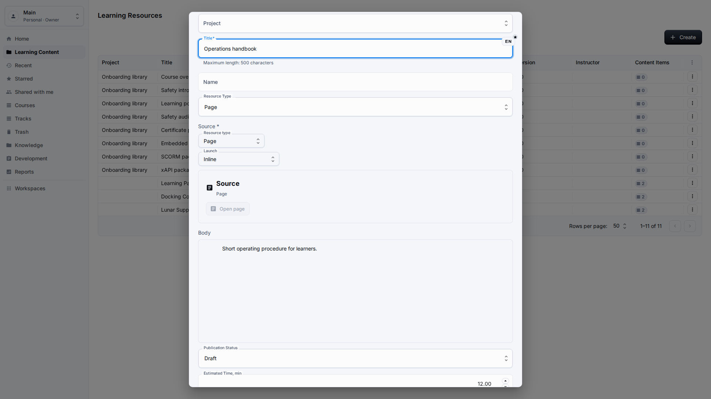
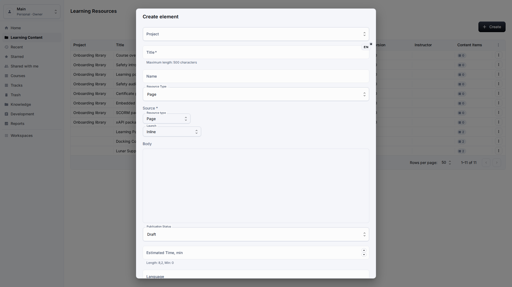
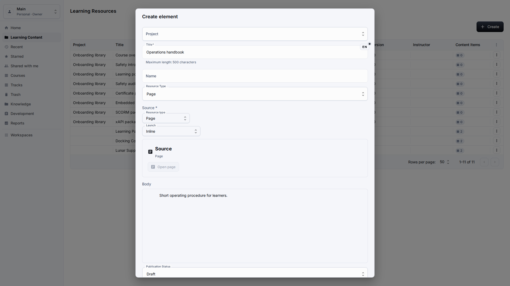
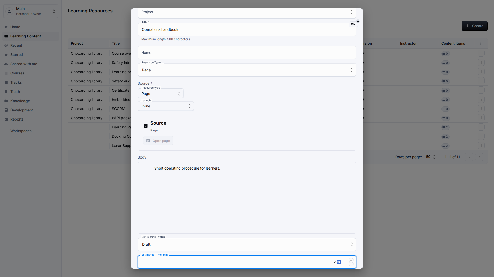
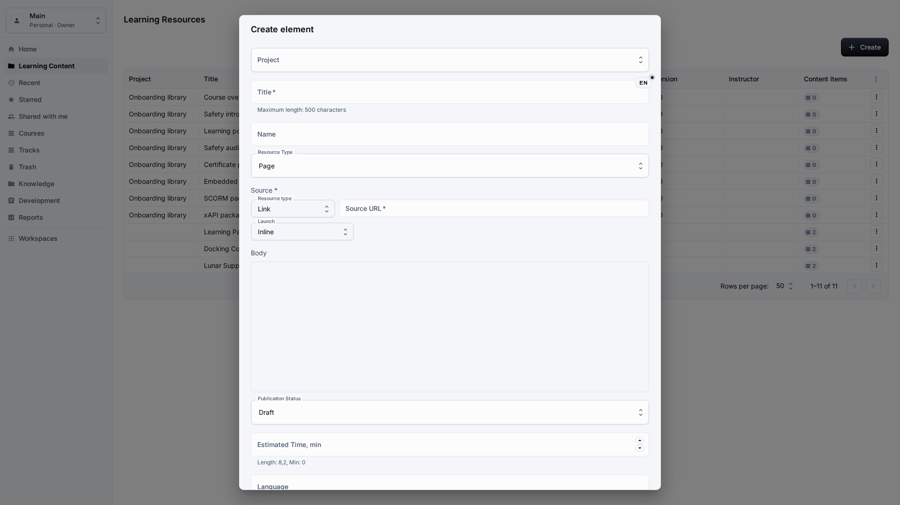
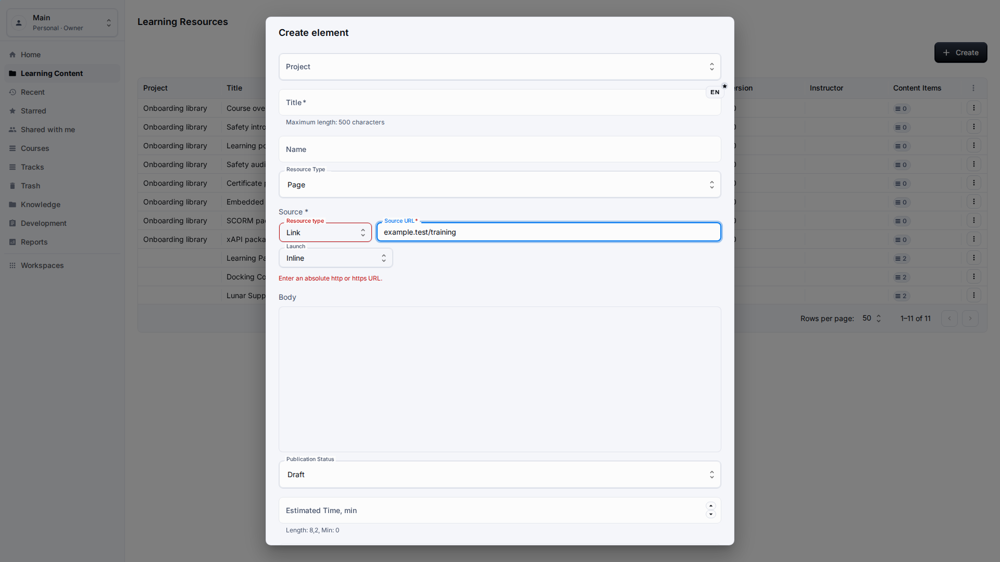

# Page and Link Resources

**Role:** Teacher or content author.

**Goal:** Create page content in the block editor and validated web links without editing technical resource details.

## What You Need

-   Open Learning Content and choose the target project if needed.
-   Prepare the title, body copy, and source URL or page content.
-   Use public web URLs only when creating a link resource.

## Workflow

1. Open Create and choose Page when you want content authored with the block editor.
   
2. Fill in the localized title and write the content body in the editor area.
   
3. Use the resource summary to confirm the page content before saving.
   
4. Open Create and choose Link when the learning item points to an external web page.
   
5. Test validation with an incomplete address, read the localized message, then replace it with a full `https://` URL before saving.
   

## Screen Details

| Area             | How to use it                                                                                                                                              |
| ---------------- | ---------------------------------------------------------------------------------------------------------------------------------------------------------- |
| Page resources   | Use a page resource when the learning material is authored directly in the block editor. The title should be localized and short enough to scan in tables. |
| Content body     | Write the body as learner-facing material, not as implementation notes. Long text fields should be multiline and comfortable to edit.                      |
| Resource summary | The resource summary confirms whether the item is a page, link, embedded resource, or document-style resource before saving.                               |
| Link resources   | Use a link resource for approved external pages. Enter a complete http or https address and avoid temporary or private links.                              |
| Validation       | Validation messages must be localized and actionable. The screenshot shows the error state intentionally; correct the address before saving the resource.  |

## Result

Authors manage page and link resources through normal controls instead of technical fields.

## What To Check

Source, body, and validation surfaces should not expose unreadable technical values or unclear validation messages.

## Related Pages

-   [Learning Content Library](learning-content-library.md)
-   [Troubleshooting](troubleshooting.md)
