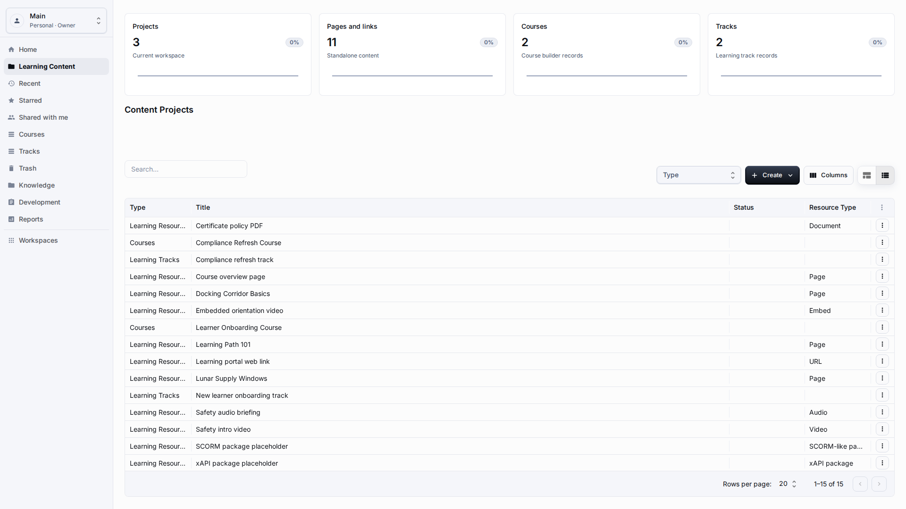
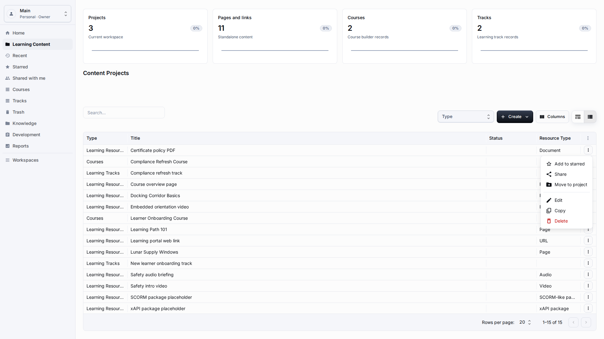
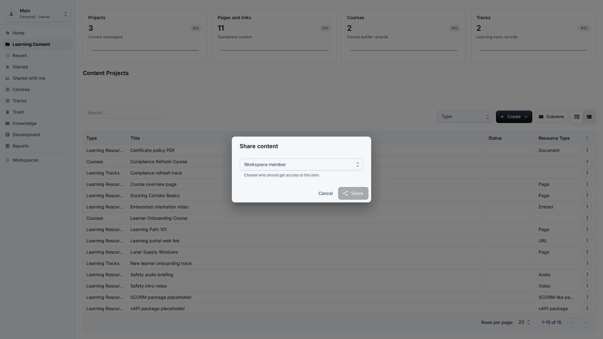
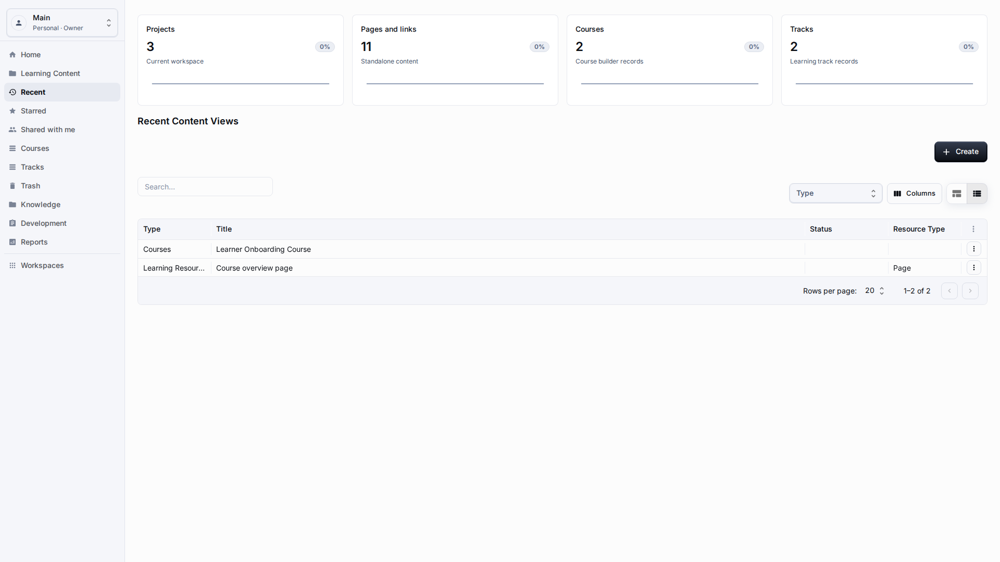
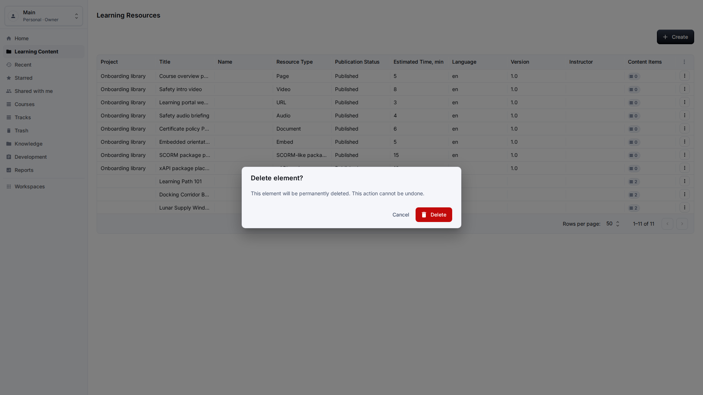
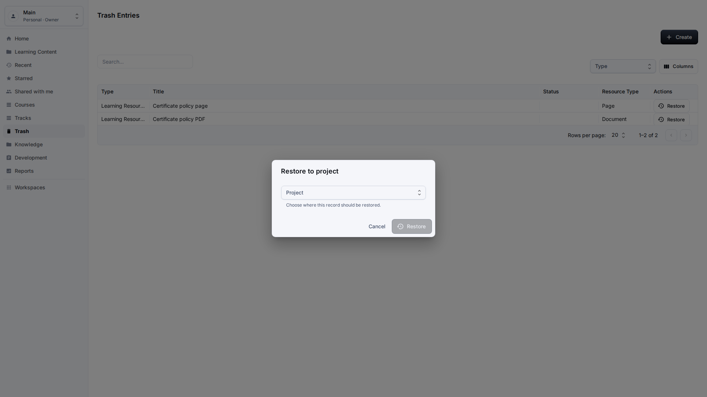

# Sharing, Recent, Starred, and Trash

**Role:** Teacher, content author, or workspace owner.

**Goal:** Keep personal and shared content views useful while preserving safe delete and restore behavior.

## What You Need

-   Open Learning Content or the dedicated Recent, Starred, Shared with me, or Trash section.
-   Confirm that the item actions menu belongs to the item you intend to change.
-   Use restore only when you understand where the item should return.

## Workflow

1. Open a content row and use Star when you want it in your personal starred list.
   
2. Use Share when another workspace member needs access to the item.
   
3. Use Recent to return to content you opened or completed earlier.
   
4. Use Delete when the item should leave active lists but may still need restore.
   
5. Open Trash, choose Restore, and select a valid project if the original container is no longer available.
   

## Screen Details

| Area    | How to use it                                                                                                                                  |
| ------- | ---------------------------------------------------------------------------------------------------------------------------------------------- |
| Starred | Starred records are personal shortcuts. Use them for records you review often, not as a substitute for project organization.                   |
| Sharing | Share only with workspace members who need access. Confirm the recipient by readable name and role before saving.                              |
| Recent  | Recent helps you return to content opened or completed earlier. It should show readable titles and should not expose session IDs.              |
| Delete  | Delete removes an item from active lists but should keep a recoverable record in Trash when policy allows it.                                  |
| Restore | Restore should ask for a valid destination when the original project is unavailable. Verify the item appears in the active list after restore. |

## Result

Content lifecycle actions stay reversible where the platform supports restore.

## What To Check

Share, move, delete, and restore dialogs should use readable names and fail closed on invalid targets.

## Related Pages

-   [Learning Content Library](learning-content-library.md)
-   [Projects](projects.md)
-   [Troubleshooting](troubleshooting.md)
