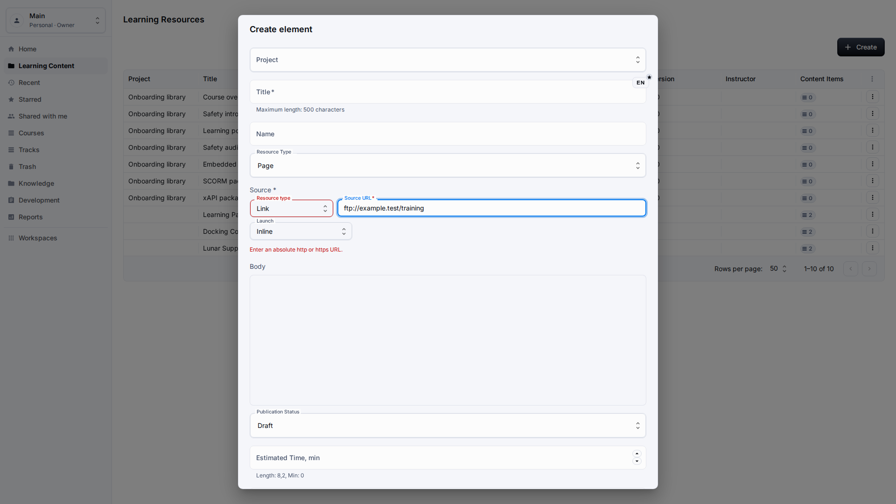
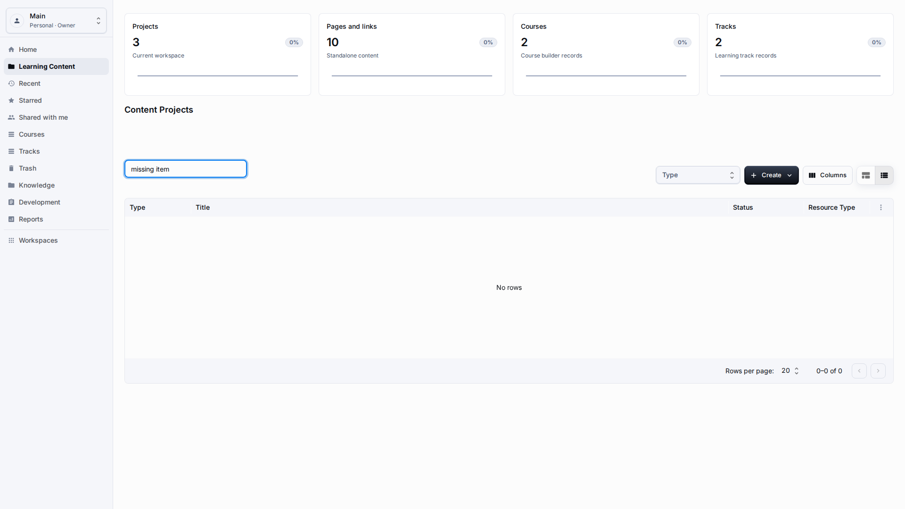
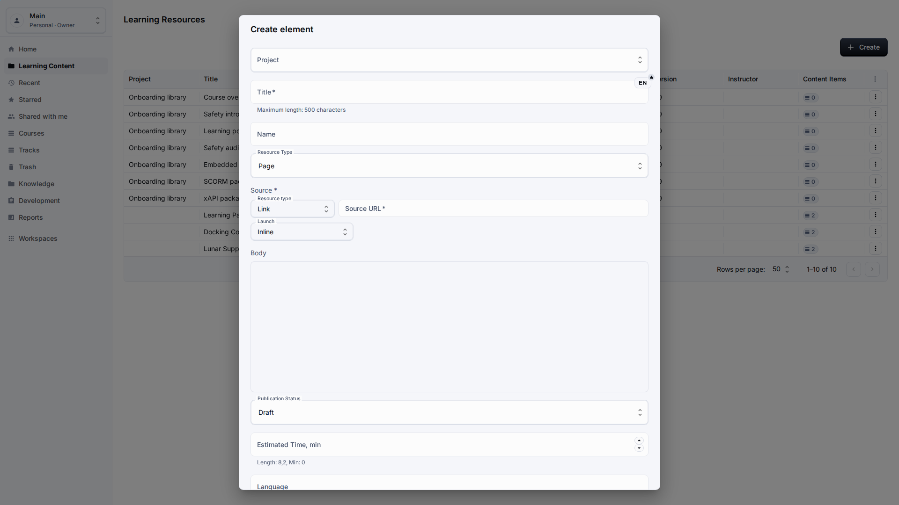
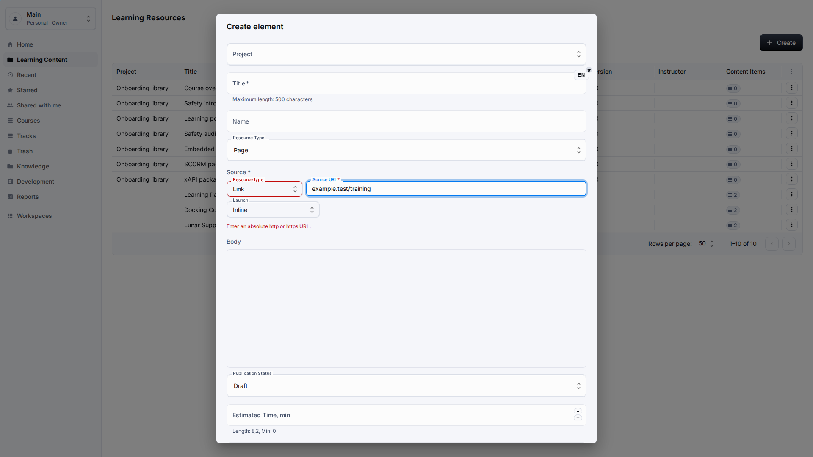
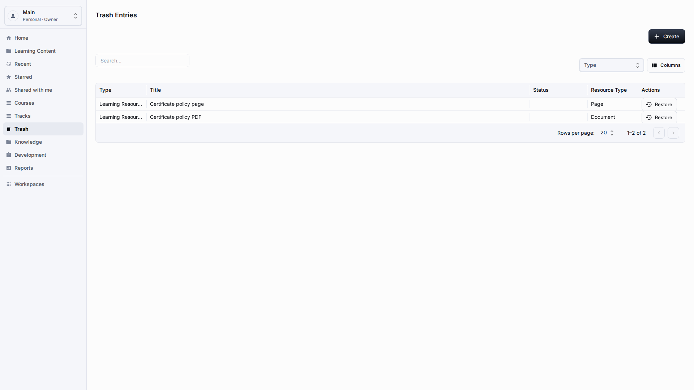
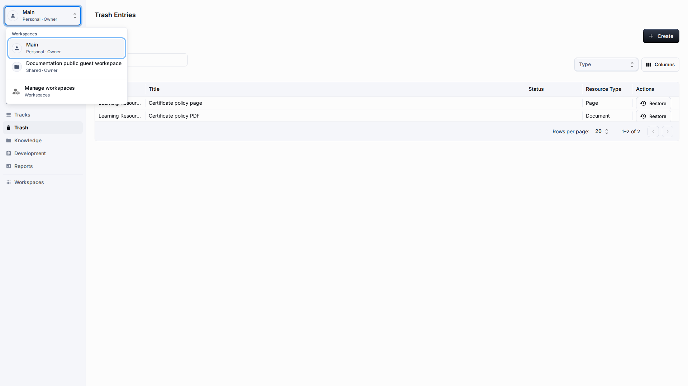

# Troubleshooting

**Role:** Any LMS user before escalating to an administrator.

**Goal:** Resolve common issues without changing application setup or editing hidden fields.

## What You Need

-   Stay inside the published application unless an administrator asks you to open setup screens.
-   Write down the visible message and the section where it appears.
-   Do not copy technical values or hidden fields into normal content fields.

## Workflow

1. If content is missing, confirm the workspace menu and active filters first.
   
2. If a save button is disabled, check localized validation messages near the field.
   
3. If a link resource fails validation, replace it with an absolute http or https URL.
   
4. If a row was deleted, open Trash and restore it to a valid project.
   
5. If the page scrolls horizontally or shows unreadable technical values, capture the visible screen and report it as a product defect.
   

## Screen Details

| Area            | How to use it                                                                                                                                             |
| --------------- | --------------------------------------------------------------------------------------------------------------------------------------------------------- |
| Missing content | Check workspace, search text, type filter, and trash before assuming a record is gone. Many issues are caused by context mismatch.                        |
| Disabled save   | Look for localized validation near the field. Required titles, invalid links, and missing relations should explain what to fix.                           |
| Invalid link    | A link resource must use a complete http or https address. Replace partial addresses before saving.                                                       |
| Deleted rows    | Use Trash for recovery. Restore should use a valid destination when the original project no longer exists.                                                |
| Visual defects  | Report page-level horizontal scrolling, unreadable technical values, incorrectly formatted dates, or untranslated messages with a full-window screenshot. |

## Result

Most user-level problems can be diagnosed from visible workspace, filter, validation, and trash state.

## What To Check

A normal user should never need to solve LMS issues by editing unreadable technical values, hidden fields, or administrator-only labels.

## Related Pages

-   [Getting Around](getting-around.md)
-   [Learning Content Library](learning-content-library.md)
-   [Guest Access](guest-access.md)
