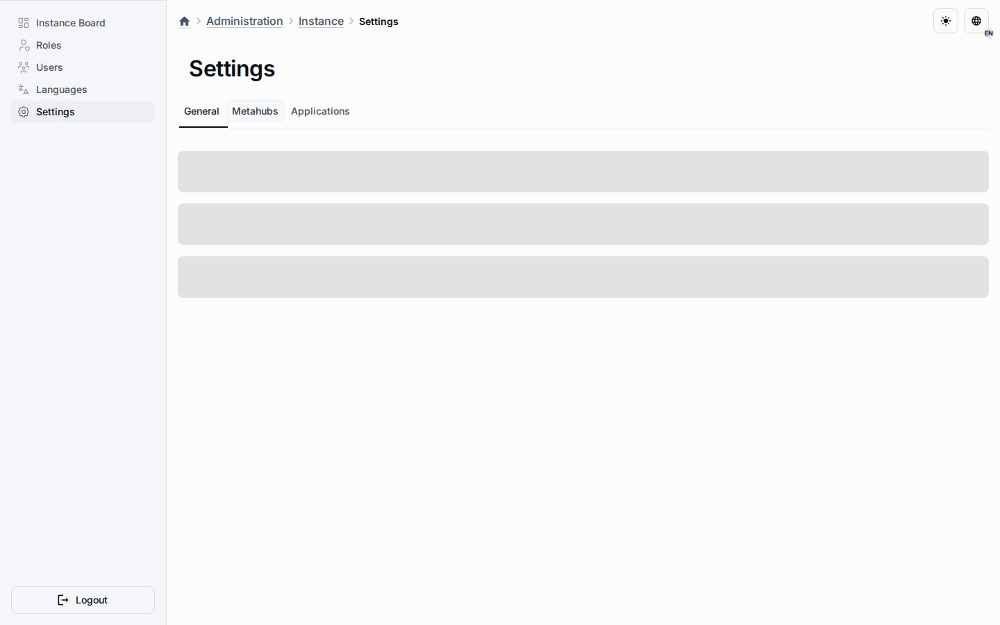

# Analytics and Observability

Analytics in Universo Platformo currently means operational signals that help
verify requests, migrations, publications, applications, and access boundaries.

## Current Repository Signals

The repository already emphasizes request handling, access control, migrations,
validation, OpenAPI exposure, and admin flows. Those are prerequisites for any
credible analytics or observability layer.

## Current Boundaries

- Operational metrics for platform modules and installations.
- Better visibility into publication and application behavior.
- Feedback loops for planning, governance, and execution quality.
- Shared definitions that make analytics portable across stacks.

This keeps analytics tied to platform operations and execution quality.

