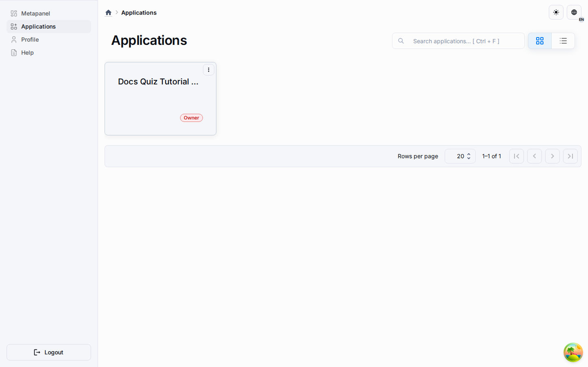
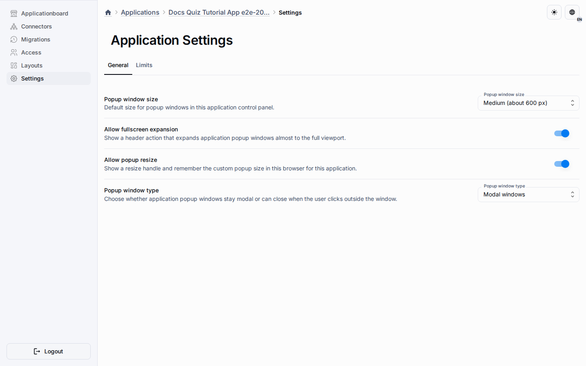

# Applications

Applications are the executable delivery surface of the platform.
A metahub authors the source model, a publication freezes a release candidate, and an application turns that published contract into a managed runtime.

## What An Application Owns

- the linked publication reference used for runtime delivery;
- connector and schema-sync state;
- runtime members and access boundaries;
- application-control-panel settings;
- the final runtime route at `/a/:applicationId`.

## Main Surfaces

| Surface | Purpose |
| --- | --- |
| Overview | Status cards and high-level health for the linked runtime. |
| Connectors | Manage publication linkage and schema sync. |
| Migrations | Review runtime schema state and history. |
| Settings | Configure application-specific control-panel behavior and workspace limits. |
| Runtime | Serve the published end-user surface. |

## Control-Panel Settings

The application settings page now contains a real General settings contract instead of placeholder copy.
Those settings are stored in `applications.cat_applications.settings` and are returned by application list, detail, and update flows.

| Setting | Meaning |
| --- | --- |
| Dialog size preset | Default control-panel dialog width for application-admin dialogs. |
| Allow fullscreen | Whether dialogs can expand to fullscreen. |
| Allow resize | Whether the resize handle is available. |
| Close behavior | Whether dialogs stay strict-modal or allow outside-click close. |
| Visibility | Whether the application is closed or public. Changing public to closed blocks new direct joins and public runtime link resolution. |
| Workspace mode | Read-only after creation because it controls runtime schema structure. |
| Workspace limits | Per-workspace row limits for supported catalogs. |

## Scope Boundary

Application dialog settings affect the application control panel under `/a/:applicationId/admin`.
They do not change the public runtime on `/a/:applicationId`.
They also do not replace metahub authoring settings or the global `/admin` dialog settings.

## Workspace-Aware Runtime Model

When `workspacesEnabled` is on, runtime working data is scoped to the user's current workspace.
Owners and members receive a personal workspace during bootstrap or access grant, can create shared workspaces, and owners of a shared workspace can add active application members by email.
Runtime rows are resolved inside the selected workspace, and supported catalog limits are enforced per workspace rather than globally.
This keeps applications aligned with the broader platform goal of collaborative ERP and CMS style runtime data management.

## Delivery Flow

1. Link the application to a publication.
2. Run schema sync or create the runtime schema when needed.
3. Open Application Settings to tune control-panel behavior and workspace limits.
4. Use connectors, migrations, and other control-panel dialogs under the saved presentation contract.
5. Open the final runtime route to verify the published user experience.

## Quiz Example

In the quiz tutorial flow, the metahub owns the widget script and layout placement, while the application owns runtime delivery and control-panel ergonomics.
That means the quiz questions and widget placement come from the publication, but the size and close behavior of connector dialogs come from the application settings record.
The copy flow preserves those application settings so copied applications keep the same control-panel dialog behavior.

## Relationship To Admin

The admin surface can define global platform policies, but application settings remain local to each application.
Use admin when you need platform-wide governance.
Use application settings when you need one application control panel to behave differently from another.

Continue with [Quiz Application Tutorial](../guides/quiz-application-tutorial.md) for the concrete end-to-end browser flow.
