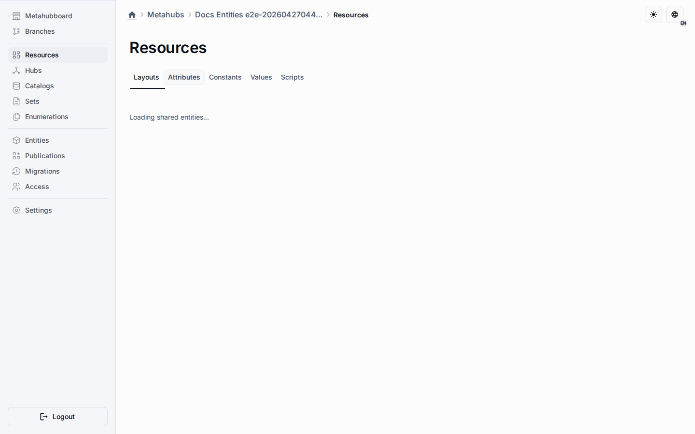

# Exclusions

Exclusions are sparse target-specific overrides, not cloned copies of shared rows.
They let one shared source stay central while selected targets opt out of inheriting it.

## How It Works

- The shared source row stays in the shared pool inside the Resources workspace.
- Target-specific override rows record exclusion, active-state, and sort-order differences.
- Clearing the override returns the target to inherited default behavior.
- Target lists read the merged result instead of editing the shared source in place.

## Operator Rules

- Configure exclusions from the Resources workspace while editing the shared row, not from the inherited target row.
- Use exclusions only when `sharedBehavior.canExclude` still allows the target opt-out.
- Keep local-only entities local instead of creating a shared row and excluding it everywhere.
- Verify the included and excluded targets before publication when a shared row affects critical runtime behavior.

## Related Reading

- [Shared Attributes](shared-field-definitions.md)
- [Shared Constants](shared-fixed-values.md)
- [Shared Values](shared-option-values.md)
- [Shared Behavior Settings](shared-behavior-settings.md)
