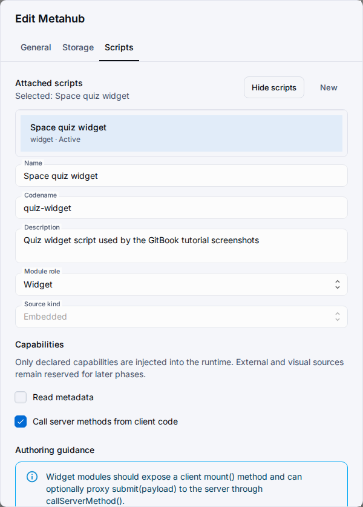

# Module Scopes

Metahub modules uses one manifest contract, but attachment scope decides where a module can live and how it is used.
Choose scope first, then choose the compatible module role and runtime behavior.

## Scope Matrix

| Scope | Allowed roles | Direct runtime entrypoint | Typical use |
| --- | --- | --- | --- |
| `general` | `library` only | No | Resources workspace shared helpers imported through `@shared/<codename>`. |
| `metahub` | `module`, `lifecycle`, `widget` | Yes | Metahub-level runtime logic and widgets. |
| `hub` / `object` / `set` / `enumeration` / `component` | `module`, `lifecycle`, `widget` | Yes | Object-attached consumers close to one design surface. |

## Selection Rules

- Choose `general/library` when the code should be reused and imported by other modules.
- Choose executable scopes when the module must attach to a metahub or one object and participate in runtime delivery.
- Keep decorators and runtime ctx access out of `library` code.
- Publish and sync before validating how the selected consumer behaves in the linked application.

## Related Reading

- [Shared Modules](shared-modules.md)
- [Metahub Modules](modules.md)
- [Metahub Modules Guide](../../guides/metahub-modules.md)
- [Modules System](../../architecture/modules-system.md)
