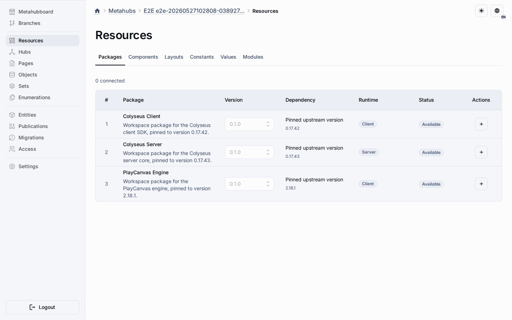

# Metahub Packages

Packages are reusable workspace libraries that a metahub can declare as runtime dependencies for its modules.

The first MVP registry contains three built-in workspace wrappers:

-   `@universo-react/colyseus-client`
-   `@universo-react/colyseus-server`
-   `@universo-react/playcanvas-engine`

The project-local MMOOMM skills under `.agents/skills/` use these wrappers as
their version source of truth: PlayCanvas Engine guidance targets
`playcanvas@2.18.1`, Colyseus client guidance targets `@colyseus/sdk@0.17.42`,
and Colyseus server guidance targets `@colyseus/core@0.17.43`.

## Resources Tab

Open **Metahub → Resources → Packages** to see the available registry packages and the packages connected to the current metahub.

The tab shows the user-facing package name, workspace import name, selected version, upstream library, supported runtime target, and connection status. You can connect a package, disconnect it, or switch the connected version when another registered version exists.

## Runtime Publication

When a metahub is published, connected packages are included in the publication snapshot and synchronized into the application runtime metadata table `_app_packages`. Runtime modules can then declare allowed package imports and import the connected package by its workspace name.

## Current Scope

This foundation does not install packages from external repositories, expose package sharing or ACL settings, publish a public marketplace catalog, or reuse metahub content as packages. The registry is seeded by platform bootstrap and is not edited from the runtime UI.
