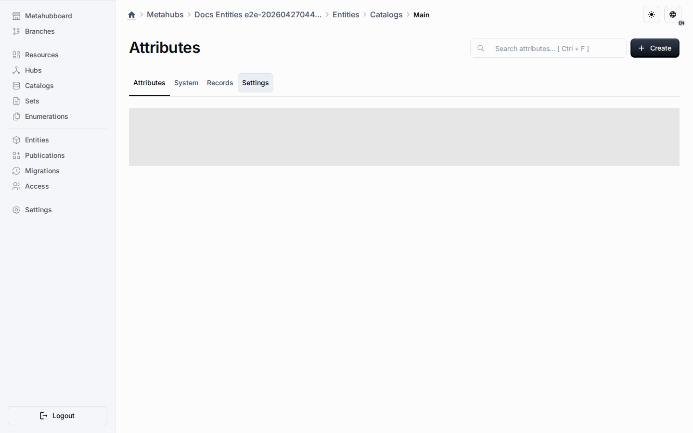

# Shared Components

Shared components live in the Components tab of the Resources workspace and belong to the virtual shared object pool instead of one object row.
They let one component definition fan out to multiple entity types with `dataSchema` without copying the authoring source.

Target object instances show the inherited component list through the same entity-owned route model.

## Design-Time Rules

- Create the component from the Components tab when it should appear in more than one object or custom entity type that exposes the same capability.
- Keep component behavior in the entity settings and sparse target changes in override rows.
- Use target objects only to inspect the merged inherited result, not to edit shared config directly.
- Keep local-only components inside the object route when they should not be inherited.

## Target Controls

- Exclusions hide the shared component from selected target objects without deleting the base row.
- Active-state overrides can disable the component per target object when the shared behavior allows deactivation.
- Position overrides can reorder the inherited row only when the shared behavior is not locked.
- Target lists keep shared rows read-only and show the merged inherited state.

## Publication And Runtime

Publication keeps shared components as first-class shared sections in the design snapshot.
Application sync materializes them into ordinary runtime field metadata so runtime tables stay flat.

## Related Reading

- [Exclusions](exclusions.md)
- [Shared Behavior Settings](shared-behavior-settings.md)
- [Resources Workspace](common-section.md)
- [Metahubs](../metahubs.md)
