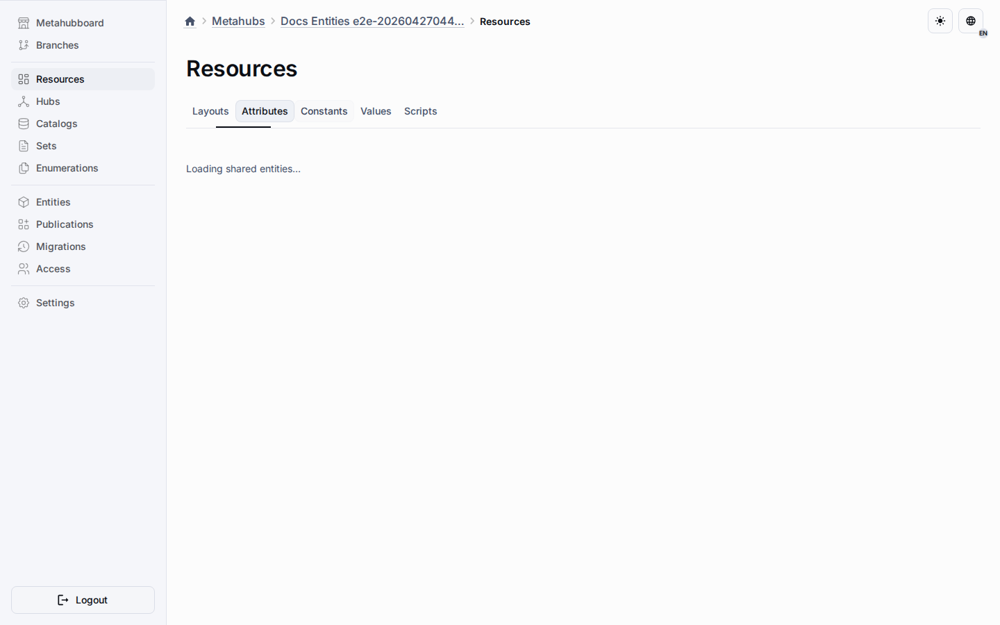
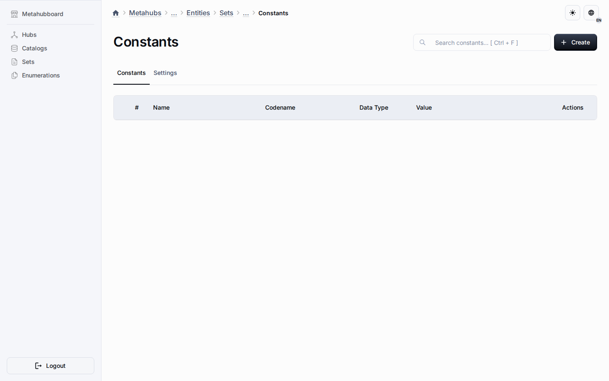

# Shared Constants

Shared constants live in the Constants tab of the Resources workspace and belong to the virtual shared set pool instead of one set.
They let one constant definition stay central while multiple set-compatible entity types inherit the same design-time source.

Target set instances show inherited and local constants in the focused fixed-values view.

## Design-Time Rules

- Create the constant from the Constants tab when more than one set or compatible entity type should reuse it.
- Keep shared behavior on the constant itself and sparse target changes in override rows.
- Inspect inherited state from the target route, but edit the base shared row from the Constants tab.
- Use local constants only when the value should not spread across targets.

## Target Controls

- Exclusions remove the inherited constant from selected targets without deleting the shared source.
- Active-state overrides disable the constant per target only when the shared behavior allows it.
- Position overrides reorder the inherited constant only when the shared behavior is not locked.
- Target lists keep shared constants read-only and display the merged inherited state.

## Publication And Runtime

Publication exports shared constants in their own snapshot section.
Runtime keeps constants on the existing snapshot constant and setConstantRef path instead of introducing a new runtime table.

## Related Reading

- [Exclusions](exclusions.md)
- [Shared Behavior Settings](shared-behavior-settings.md)
- [Resources Workspace](common-section.md)
- [Metahubs](../metahubs.md)
