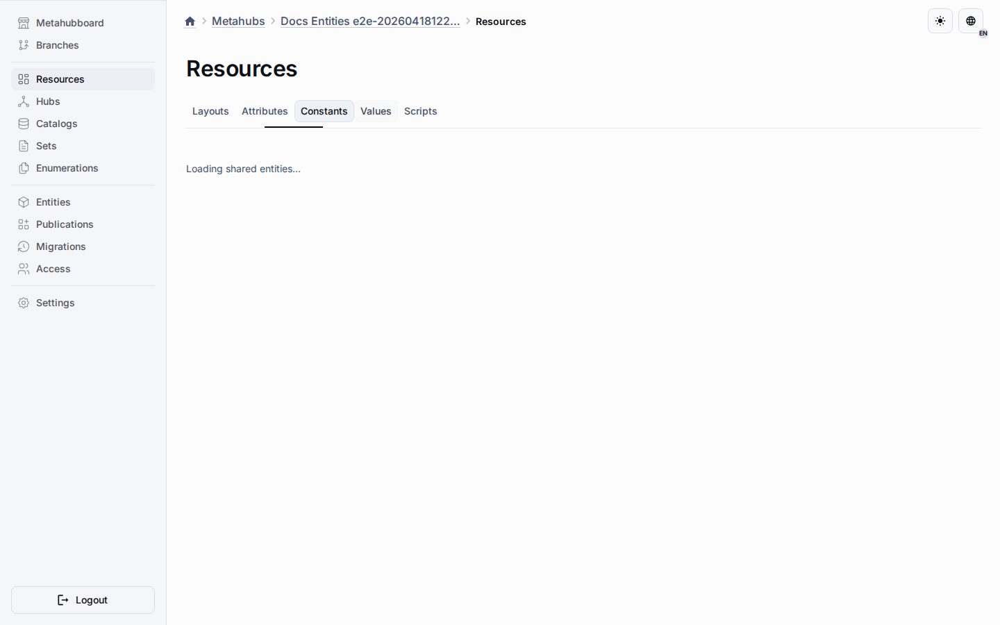

# Shared Values

Shared values live in the Values tab of the Resources workspace and belong to the virtual shared enumeration pool instead of one enumeration.
They let one value definition stay reusable while multiple enumeration-compatible entity types inherit the same source row.

## Design-Time Rules

- Create the value from the Values tab when the same meaning must appear in more than one enumeration or compatible entity type.
- Keep shared behavior on the shared row and sparse target changes in override rows.
- Use target enumerations to inspect inherited state, but keep the base shared authoring flow in the Values tab.
- Use local enumeration values only when one enumeration needs a value that others must not inherit.

## Target Controls

- Exclusions hide the inherited value from selected targets without deleting the shared source.
- Active-state overrides disable the inherited value only when the shared behavior allows deactivation.
- Position overrides reorder the inherited value only when the shared behavior is not locked.
- Target lists keep shared values read-only and display the merged inherited result.

## Publication And Runtime

Publication exports shared values in their own snapshot section.
Runtime normalizes duplicated inherited value ids per target enumeration so runtime metadata and seeded refs stay deterministic.

## Related Reading

- [Exclusions](exclusions.md)
- [Shared Behavior Settings](shared-behavior-settings.md)
- [Resources Workspace](common-section.md)
- [Metahubs](../metahubs.md)
