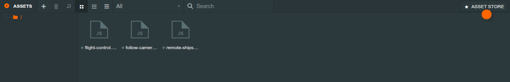
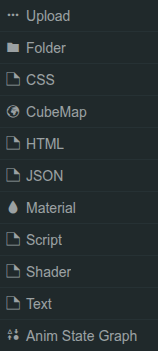
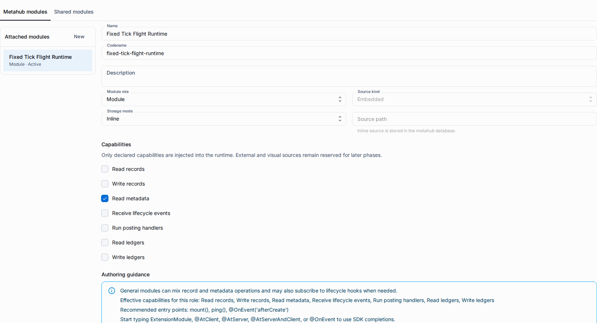

# PlayCanvas Editor Assets

The PlayCanvas Editor Assets panel is backed by the metahub project
compatibility surface. It supports a bounded, authenticated asset workflow for
folders, text-like files, metadata, script attributes, and published script
artifacts.

## Asset model

-   An asset summary contains the Editor document id, name, type, numeric path, parent id, and creation time. The internal project row remains a UUID v7 and is never used as a normal user-facing identifier.
-   Folders are ordinary asset rows. Their hierarchy is derived from `virtualPath`, so creating a folder does not add a schema migration or a separate DDL structure.
-   Editor document metadata keeps `data`, `meta`, `tags`, `preload`, `source`, and `createdAt` together with the asset file reference and publication flag.
-   Every operation is scoped to the selected metahub and project and requires current metahub-management access. Local storage paths are not exposed to the browser.

## Supported types

| Type                                             | Storage           | Behavior                                                                                |
| ------------------------------------------------ | ----------------- | --------------------------------------------------------------------------------------- |
| `folder`                                         | Metadata row      | Creates a tree node and can contain child assets.                                       |
| `script`                                         | File-backed       | Accepts `.js` or `.mjs`; parsed attributes are mirrored into the script-asset record.   |
| `json`, `css`, `html`, `text`, `shader`          | File-backed       | Stores UTF-8 content with the type-specific MIME value.                                 |
| `material`, `texture`, `model`, `audio`, `other` | Metadata-only row | Keeps Editor metadata without claiming that binary conversion or delivery is available. |
| `scene`, `generatedScript`                       | Managed records   | Produced by scene and publication flows rather than the ordinary file upload path.      |

## Create and delete flows

1. Open a connected PlayCanvas project and choose a destination folder in the Assets panel.
2. Use the **+** action. The compatibility backend accepts one multipart file, bounded fields, and JSON `data`/`meta` values. File-backed content is limited to 5 MiB and the supported extension/MIME allow-list.
3. The create response keeps the upstream `{id}` shape. The bridge then refreshes the tree and receives an `asset.new` messenger event for the new document.
4. Deleting a folder removes the folder and its descendants. The operation returns `204` only after the selected project rows and files are confirmed removed; invalid or unknown targets fail closed.

The bridge maps the Editor's create, delete, raw-file, and unsupported re-upload
requests to the scoped compatibility namespace. Unsupported `PUT /assets/:id`
re-uploads and unknown asset calls return typed JSON errors, never an HTML
application fallback.

Metahub copy is the clone boundary for this surface: it copies project rows and
the local project file tree, then remaps project-local identifiers and roots.
The Assets panel does not expose a per-asset clone action, and it does not copy
ShareDB operation history or collaborative sessions. When access is copied, the
source metahub owner is represented as an administrator of the new metahub;
the copier remains its only owner.

## Script assets and attributes

Editor `.js` and `.mjs` assets are parsed by the Editor worker. The realtime
`pipeline` frame stores the parsed attributes and loading state in the asset
document, mirrors a `_mhb_playcanvas_script_assets` row, and reports the
`scriptAttrsFinished:<job>` messenger event. The backend does not execute or
parse arbitrary JavaScript on the request path.

At publication time, a ready script source is checksum-checked and compiled to
an ESM artifact. `playcanvas` stays external for the document import map;
`@shared/<codename>` library imports are inlined in dependency order, and any
other bare import fails closed. The published manifest records `scriptName`,
attribute definitions, bound attribute values, the target
`sceneEntityStableId`, the artifact URL, and its lowercase hexadecimal
`artifactHash`.

The runtime loader fetches each artifact without a cache, verifies its SHA-256
hash, re-blobs it as `text/javascript`, imports it on the main thread, registers
the exported class in the application script registry, and attaches it to the
matching scene entity. The canvas exposes `data-scripts-loaded` as `true`,
`failed`, or `none`; a failed verification or missing entity prevents runtime
startup.

## Folder and path rules

-   A child asset must name an existing folder parent. Directory names and file names cannot contain hidden segments, parent traversal, path separators, or NUL characters.
-   File-backed assets are stored below the project `assets` namespace. Their physical file references remain server-side and are validated against the selected project before reads.
-   Folder document ids are deterministic for their project path, while durable metadata rows continue to use UUID v7 ids. This keeps a regenerated tree stable without making a derived Editor id a database primary key.
-   The current surface accepts small text and image files only. It does not perform model/audio/texture conversion or expose arbitrary binary upload paths.

## Limitations

-   The compatibility boundary is single-user ShareDB-compatible snapshot persistence; it is not PlayCanvas Cloud parity or collaborative operation history.
-   Binary processing, S3 providers, cloud build jobs, code-editor sourcefile documents, and broad asset import pipelines remain outside this slice.
-   Multipart overwrite is intentionally unsupported (`501` JSON). Field edits continue through the existing ShareDB document path.
-   The accepted content view is the authenticated raw file endpoint used by the Editor parser. Full Code Editor documents and editable source history are outside this slice.
-   Runtime artifacts are immutable published data URLs with checksums. Mutable authoring paths and local filesystem locations never enter a runtime manifest.

The Resources page now presents one **Modules** tab with a localized scope
switcher for metahub modules and shared modules.

The asset workflow keeps the project schema and metahub template versions at
their current values. Folders are derived data, not a new schema version.

## Related

-   [PlayCanvas Editor Package](./playcanvas-editor.md) — iframe boot, bridge security, and package boundaries.
-   [PlayCanvas Projects](./playcanvas-projects.md) — project storage, snapshots, and publication manifests.
-   [Shared Modules](./metahubs/shared-modules.md) — reusable `@shared/<codename>` libraries used during script compilation.
