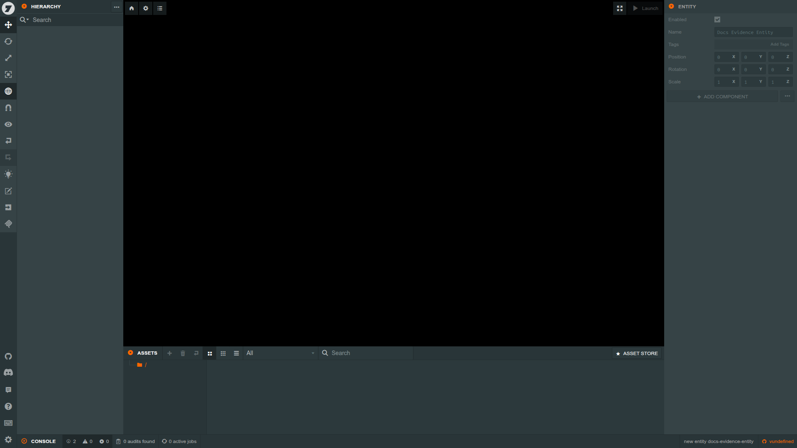
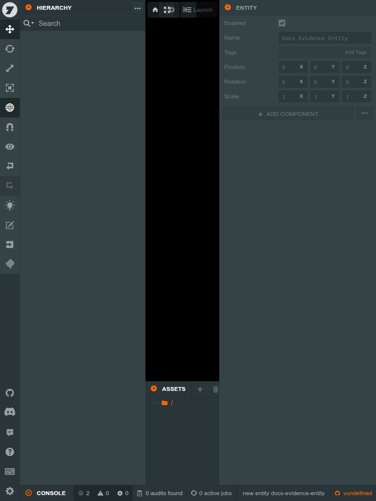
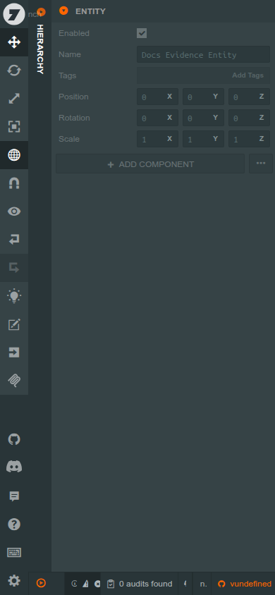
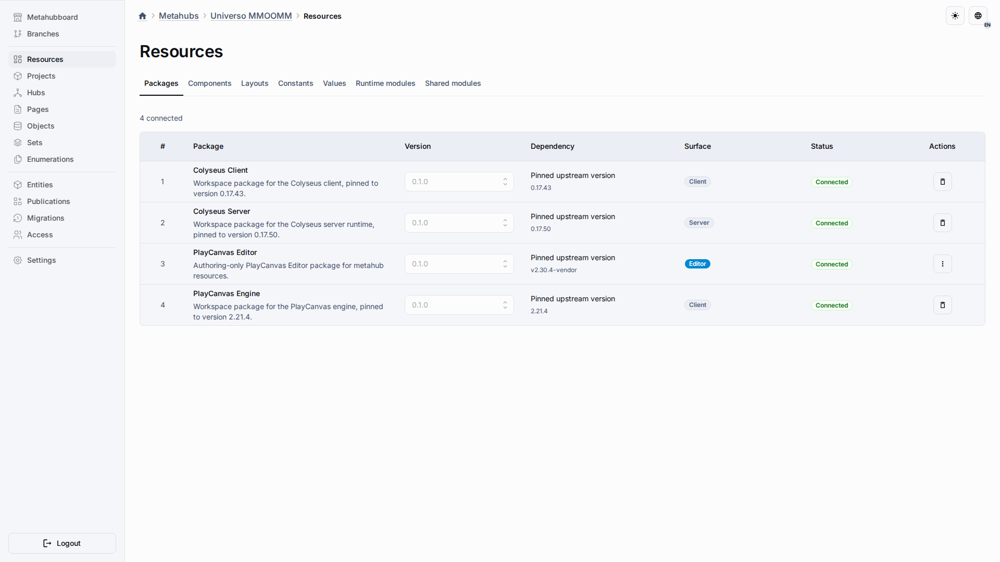
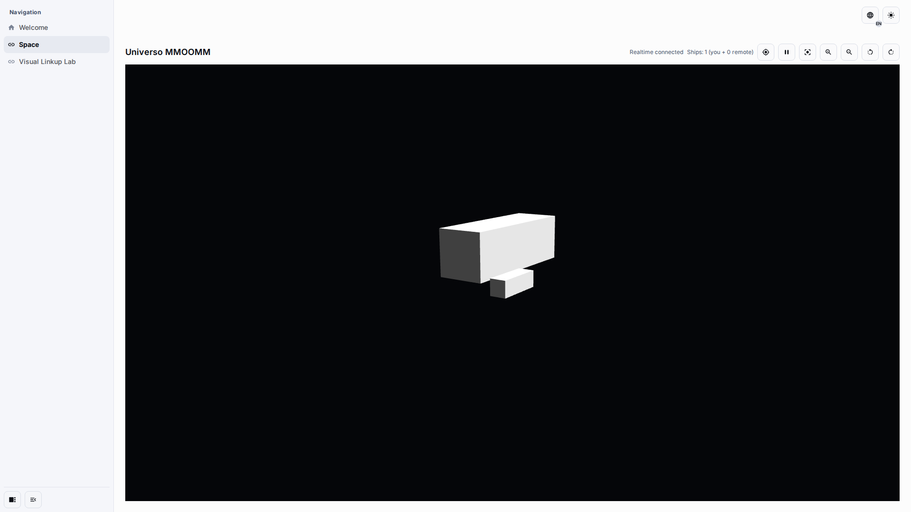
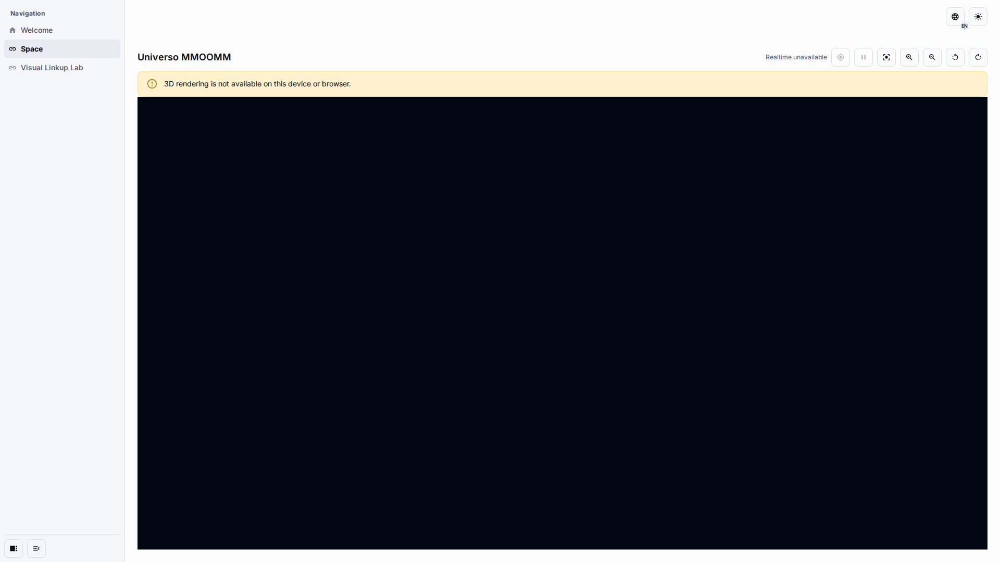
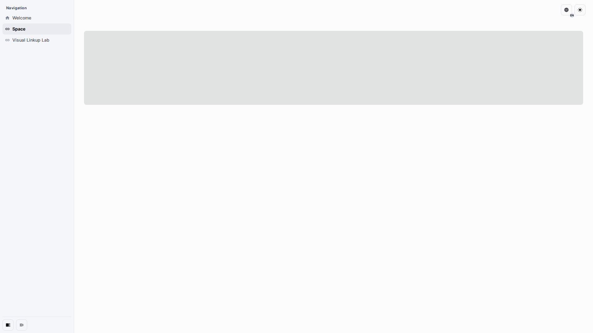

# PlayCanvas Editor v2.30.4 — Universo Compatibility Matrix

Scope: upstream PlayCanvas Editor vendored at tag `v2.30.4` (commit
`cf296bcb669bdcb168778bf2979160a9fe8f67de`), running in the
`universo-full-upstream-ui` mode inside `apps-template-mui`. This matrix is the
capability decision record referenced as **D4** by plan steps P5.3/P5.4.

Schema catalog version: **1** (`PLAYCANVAS_EDITOR_SCHEMA_CATALOG_VERSION = 1`,
generated at
`packages/universo-react-playcanvas-editor-backend/src/config/generated-schema-catalog.json`,
documents: `asset`, `scene`, `settings`).

## Artifact token lifetime constants

| Constant                                               | Value | Meaning                                                                                                                                                               |
| ------------------------------------------------------ | ----- | --------------------------------------------------------------------------------------------------------------------------------------------------------------------- |
| `PLAYCANVAS_EDITOR_COMPATIBILITY_TOKEN_TTL_MS` (types) | 5 min | Compatibility REST access-token TTL.                                                                                                                                  |
| `artifactTokenTtlMs` (`editorArtifactTokenService.ts`) | 5 min | Artifact subresource-token TTL minted per editor session.                                                                                                             |
| `artifactTokenGraceWindowMs`                           | 5 min | Server-side grace window: an expired artifact token is still accepted while its bound bridge session is alive, covering in-flight subresource loads racing a renewal. |
| `artifactTokenAbsoluteTtlMs`                           | 12 h  | Absolute cap measured from the ORIGINAL `issuedAt`; renewals slide the short TTL but can never extend total artifact-token lifetime past this cap.                    |

## Page variants (P5.3)

The full-boot config carries a required, Zod-validated `pages` descriptor
(`playCanvasEditorFullBootPagesDescriptorSchema` in
`packages/universo-react-types/src/common/playcanvasEditorCompatibility.ts`):

| Key                  | Variant                  | Reason key                                 |
| -------------------- | ------------------------ | ------------------------------------------ |
| `fullEditor`         | `{ kind: 'fullEditor' }` | —                                          |
| `codeEditor`         | unavailable              | `shareDbDocumentsCollectionNotImplemented` |
| `launchPage`         | unavailable              | `launchSurfaceDeferred`                    |
| `blankProjectPicker` | unavailable              | `sessionsAreProjectPinned`                 |
| `fontImport`         | unavailable              | `fontGenerationWorkerStubbed`              |

Fail-closed rules:

-   The backend always populates `pages`; configs without it are rejected
    by the schema (strict transition, documented by
    `packages/universo-react-types/src/__tests__/playcanvasEditorBridge.test.ts`).
-   The host page re-validates the descriptor with
    `playCanvasEditorFullBootPagesDescriptorSchema.safeParse` and renders the
    existing localized error Alert instead of booting on mismatch.
-   The artifact bootstrap (`assertFullBootConfig` in
    `packages/universo-react-playcanvas-editor-frontend/scripts/lib/playcanvas-editor-artifact.mjs`)
    refuses to boot when `pages.fullEditor`, `codeEditor`, or `launchPage`
    descriptors are missing or contradict D4.
-   `url.launch` is set to the internal placeholder `/universo-surface-unavailable`
    (`PLAYCANVAS_EDITOR_SURFACE_UNAVAILABLE_PATH`). It deliberately does NOT
    contain the literal `/disabled`: the existing Zod rule forbidding `/disabled`
    in full-boot URLs is kept unchanged (now also applied to `url.launch`), and
    the artifact guard that rejects `/disabled` realtime endpoints stays intact.

## Surface matrix (P5.4)

| Surface                                                                      | Verdict                    | User-facing behavior                                                                                                                                                                                                                                 | Enforcing mechanism / file                                                                                                                                                                                                 |
| ---------------------------------------------------------------------------- | -------------------------- | ---------------------------------------------------------------------------------------------------------------------------------------------------------------------------------------------------------------------------------------------------- | -------------------------------------------------------------------------------------------------------------------------------------------------------------------------------------------------------------------------- |
| Main Editor shell (scene graph, hierarchy, inspector, assets panel)          | Supported                  | Full upstream UI boots project-pinned; scene save/assets flow through the compatibility REST + ShareDB bridge.                                                                                                                                       | `packages/universo-react-playcanvas-editor-backend/src/routes/index.ts`; bridge bootstrap `writeBridgeBootstrap`                                                                                                           |
| Blank/CMS project picker (`picker-project-main`, project management pickers) | Deferred                   | Sessions are always pinned to one metahub project; attempts to switch/create projects are refused with a localized message.                                                                                                                          | `pages.blankProjectPicker` descriptor (D4); host Alert key `packages.editorHost.blankPickerUnavailable` in `metahubs.json` (en/ru)                                                                                         |
| Code Editor (`/editor/code/:projectId`, sourcefiles IDE)                     | Intentionally disabled     | Toolbar deep link is intercepted before navigation; the user sees a localized warning instead of a raw 404 or a broken IDE. ShareDB `documents` collection is NOT implemented; the collection allowlist stays `scenes\|assets\|settings\|user_data`. | `window.open` guard `UniversoSurfaceGuardedOpen` in `writeBridgeBootstrap` (artifact lib, never vendor); `documents.codeEditorSourcefiles` protocol descriptor; host Alert key `packages.editorHost.codeEditorUnavailable` |
| Launch page (scene preview outside the editor)                               | Deferred / hidden          | Launch navigation targets resolve to `/universo-surface-unavailable*`; the guard blocks the window and reports back; localized warning shown.                                                                                                        | `url.launch` sentinel from `createPlayCanvasEditorFullBootConfig`; same `window.open` guard; host Alert key `packages.editorHost.launchUnavailable`                                                                        |
| Font import (font generation worker)                                         | Hidden / fail-closed       | Import actions fail closed: the font-generate worker is stubbed and throws, so no partial font asset can be produced. No vendor-surgery hiding was applied (see report note below).                                                                  | Stubbed worker in vendor build pipeline; `pages.fontImport` descriptor; host Alert key `packages.editorHost.fontsUnavailable` when reported                                                                                |
| MCP integration                                                              | Out of scope               | Not shipped; no CSP widening for MCP endpoints.                                                                                                                                                                                                      | Excluded from vendor build selection; no routes registered                                                                                                                                                                 |
| Version control (branches/checkpoints)                                       | Deferred (cloud-only)      | Upstream VCS panels operate against cloud APIs that are stubbed no-ops.                                                                                                                                                                              | `cloudOnly.branchesCheckpoints` descriptor; `createCloudOnlyNoOp` responses                                                                                                                                                |
| Build & publish                                                              | Deferred (cloud-only)      | Publishing dialogs reach stubbed cloud-only endpoints returning structured no-op responses.                                                                                                                                                          | `cloudOnly.publishing` / `cloudOnly.jobs` descriptors; `packages.editorHost.*` status alerts                                                                                                                               |
| Store / asset pipeline / collaboration users                                 | Deferred (cloud-only)      | Same stubbed no-op contract.                                                                                                                                                                                                                         | `cloudOnly.store` / `assetPipeline` / `usersCollaboration` descriptors                                                                                                                                                     |
| ShareDB collections `scenes`, `assets`, `settings`, `user_data`              | Supported (session-scoped) | Persisted via the document-op/snapshot port with metahub project storage.                                                                                                                                                                            | `shareDb.requiredCollections` tuple in the full-boot protocol descriptor                                                                                                                                                   |
| ShareDB collection `documents`                                               | Explicitly denied          | Any attempt to sync code-editor sourcefile documents is rejected; only the four allowlisted collections exist.                                                                                                                                       | `documents.codeEditorSourcefiles: { status: 'disabled', ... }` in the protocol descriptor; ShareDB allowlist in the realtime runtime                                                                                       |

## Report note: patch-layer decision

Hiding the font-import action and picker menu items inside the built upstream
bundle would require DOM surgery against unstable PCUI class names generated at
build time. Per P5.4(c) the cheap, string-contract-safe path was taken instead:
the bridge bootstrap intercepts `window.open` (our own script, zero vendor
diffs), and every unavailable surface additionally fails closed through the
typed descriptor + localized host Alerts above.

## Interface evidence

The upgraded v2.30.4 workspace across the supported viewport matrix, captured
from the standalone artifact boot (see
`docs:playcanvas-editor-upgrade:screenshots`):

## Release evidence

Release frames for the upgraded package set, captured at a fixed 1920×1080
desktop viewport in both EN and RU through
`docs:playcanvas-editor-upgrade:release-screenshots`: the metahub Resources
page with the four connected packages, the published MMOOMM application with a
painted runtime canvas and realtime connection, the localized terminal state
shown when WebGL2 is unavailable, and the lazy-loading skeleton frame.

