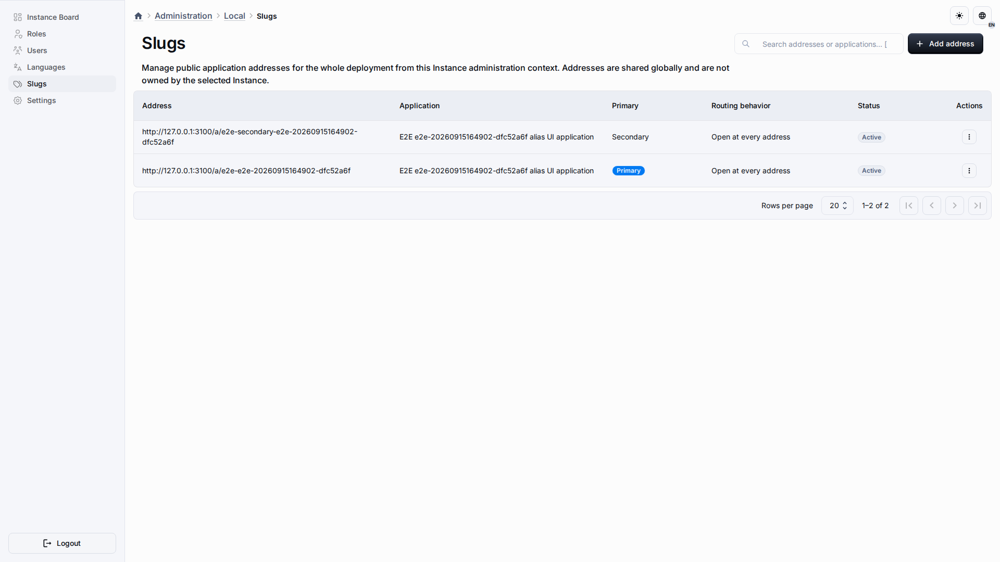

# Public applications and aliases

An application can expose a published marketing page to anonymous visitors. The public entry is resolved from either the immutable application UUID or a deployment-wide alias:

```text
/a/<application-uuid>
/a/<alias>
```



The UUID remains a stable technical address. An alias is a mutable lowercase routing name with a maximum length of 63 characters. Aliases cannot contain slashes, percent escapes, control characters, non-ASCII characters, reserved route words, or UUID-shaped values.

## Public runtime boundary

The browser asks the dedicated public endpoint:

```text
GET /api/v1/public/applications/:applicationRef/runtime?locale=en|ru
GET /api/v1/public/applications/:applicationRef/runtime?locale=en|ru&targetKind=page|object&entityTypeId=<uuid-v7>
GET /api/v1/public/applications/:applicationRef/runtime?locale=en|ru&targetKind=page|object&entityTypeCodename=<codename>
```

The request is sent without credentials. The server resolves the UUID or alias, verifies that the application is public and published, checks that its installed runtime materialization is coherent, and returns an allowlisted renderer payload. Unknown, private, archived, or not-ready applications use the same unavailable response so the route does not disclose application state. The public request never chooses a workspace or sends a `workspaceId`.

An optional entity selector resolves an active page- or object-scoped layout inside that same ready public application. Set `targetKind` to `page` or `object` and provide exactly one UUID v7 `entityTypeId` or `entityTypeCodename`; without a selector, the resolver uses the global scope. The selector does not change application visibility, access policy, or workspace.

For Marketing Page rendering, that allowlist includes the registered header position (`fixed` or `flow`) so the public renderer matches the effective Application layout. Older payloads default to `fixed`.

Anonymous navigation keeps the same non-enumerating contract: every reference that is not a ready public application leads to the login page, uniformly for closed, unknown, archived, unpublished, and not-ready addresses. The redirect never depends on which private cause was hit, so it cannot be used to probe whether a private application exists. Authenticated administrators continue through the normal membership and guard path.

The authenticated control panel remains under the protected application administration route. A public URL therefore does not make application CRUD, runtime mutations, connectors, members, or unpublished layout data anonymous. Marketing runtime actions are still constrained by the published, read-only renderer contract.

## Alias management

Users with the `applicationAliases` permission can open **Administration → Instance → Slugs** (application addresses). Root `Superuser` access uses the existing superuser bypass; a new `Superadmin` role is not required. The same permission is assignable to existing or custom roles through the normal permission governance rules.

The application editor exposes an **Addresses** tab when the current administrator has the capability. It shows the technical UUID address, active aliases, the routing policy, and actions for creating, renaming, selecting a primary alias, and releasing an alias. The central instance page provides the same operations across applications and uses an application selector instead of requiring administrators to know UUIDs.

Aliases are deployment-global and are reserved while unreleased, including after an application is archived. Database uniqueness and a per-application transaction lock protect create, rename, primary selection, release, and routing-policy changes under concurrent requests.

Two routing policies are available:

| Policy    | Behavior                                                                                                                        |
| --------- | ------------------------------------------------------------------------------------------------------------------------------- |
| Direct    | Every active alias resolves to the application runtime.                                                                         |
| Canonical | The primary alias is the public address; other active aliases redirect to it while preserving the path suffix and query string. |

The stable UUID address remains usable in both policies. Canonicalization uses same-origin SPA navigation with history replacement, so a mutable alias does not create a permanent external redirect.

## Marketing image widget

The `marketing-page` layout places the central image through the typed `marketing.image` widget, while the image URL, alternative text, decorative flag, and display dimensions are owned by the `MarketingPageImage` Object record. The template seeds a default 1600×900 image. Bindings are edited in layout authoring; content is edited through the standard Object record form. The first version accepts a URL resource; upload, cropping, processing, and image generation are outside this feature.

## Brand name and logo

The `marketing.brand` widget places brand identity sourced from the `MarketingPageSiteSettings` Object record. That record owns the localized brand name and logo resource; the same source also provides site-wide settings consumed by the footer. Layout authoring manages the binding, while standard Object record authoring manages the content. Applications can adjust presentation and actions, but do not duplicate or override the brand content.

The built-in template and the 73rd Meridian fixture seed the MUI dashboard image URL in the `MarketingPageImage` Object record. Replace product image content by editing that entity record.

## 73rd Meridian Consortium fixture

The product snapshot is generated through the existing Playwright authoring and export APIs rather than assembled by hand. The generator is:

```bash
pnpm run test:e2e:73rd-meridian-fixture-gate:local-supabase
```

The contract checks every semantic marketing record in both locales, the absence of demo pricing, fake logos, fabricated testimonials and unverified demo destinations, the presence of the approved footer contacts (Telegram channel, email, phone), and disabled lead/auth/newsletter actions. The drift gate compares the generated snapshot with the committed fixture after normalizing transport IDs, hashes, and timestamps, while requiring exactly one `dashboard.jpg` occurrence in the hero `marketing.image` resource. The browser flow imports the committed fixture, publishes a linked public application, and verifies anonymous UUID and alias runtime resolution in direct and canonical modes with path suffix and query preservation.

The generator uses bilingual content constants checked into the repository. It also verifies the SHA-256 of the original Russian draft when that optional working copy is available; clean checkouts can generate and validate the fixture without the external draft.
