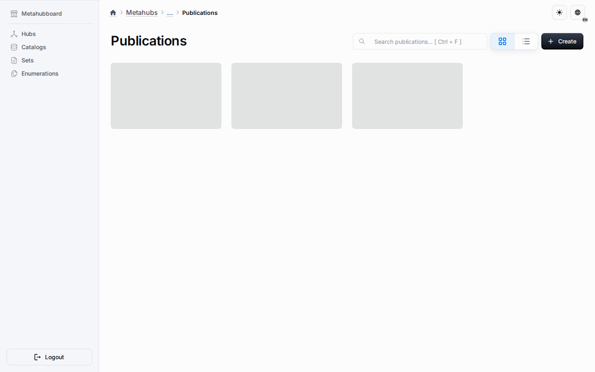
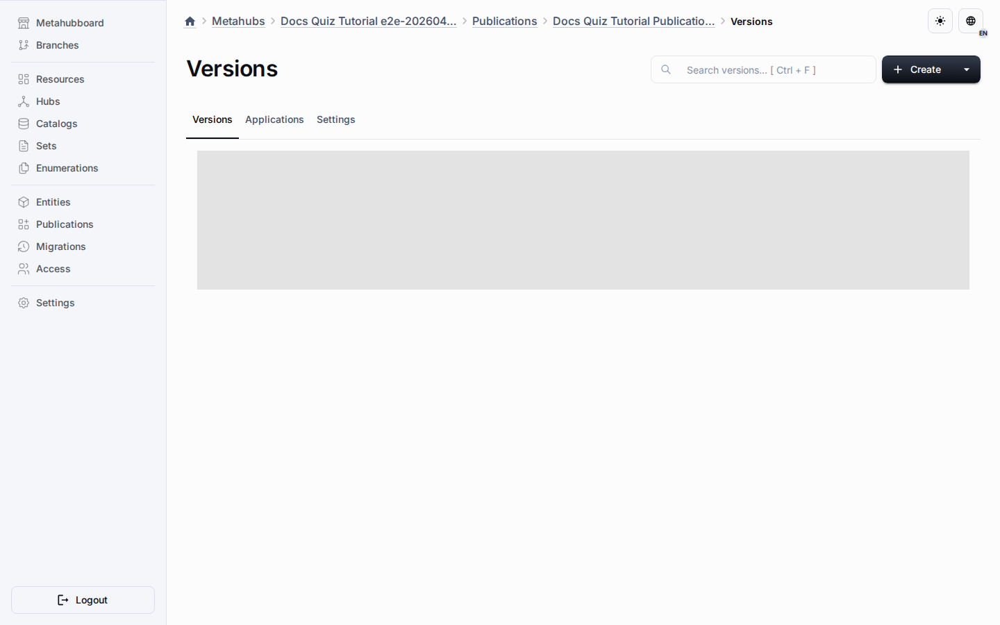

# Publications

Publications are the release-facing side of design-time structures. They make it
possible to move curated content, definitions, or application-linked artifacts
from collaborative editing flows toward distributable runtime surfaces.

## Current Implementation

The repository already includes publication entities, versions, links to
metahubs and applications, route-level management, and related persistence or
access-control logic.

## Why Publications Matter

- They separate editing from release surfaces.
- They support explicit versions and controlled release updates.
- They help bridge design-time structures and runtime applications.
- They create a base for export and synchronization.

This is a core platform capability, not just a content-sharing add-on.
